# Minimum Spanning Tree(最小生成树)

## ***What is Minimum Spanning Tree(最小生成树)?*** 

A *minimum spanning tree (MST)* or minimum weight spanning tree for a weighted, connected, undirected graph is a spanning tree with a weight less than or equal to the weight of every other spanning tree. The weight of a spanning tree is the sum of weights given to each edge of the spanning tree. – https://www.geeksforgeeks.org/kruskals-minimum-spanning-tree-algorithm-greedy-algo-2/

A single graph can have many different spanning trees, but we want the one that has the minimum sum of weight given to each edge of the spanning tree. If we want to find this manually, then we have to list out all possible spanning tree. 

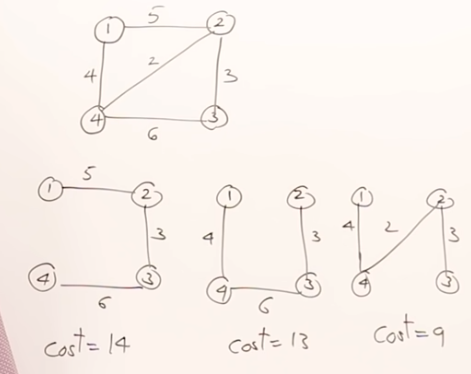

Imaging if we have a graph with 6 vertice and 7 edge amount then, then that would take C(7, 5) = 7! / (5! * (7-5)! ) = 7 * 6 / 2 = 21 

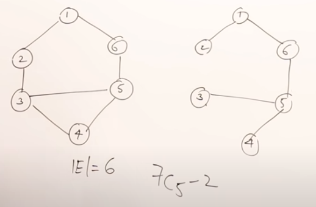

==> this can be pretty cumbersome and time-consuming ==> So, here are two algorithm that can help use to find MST: 1) Kruskal algorithm, and 2) Prim’s Algorithm

(picture taken from this video, https://www.youtube.com/watch?v=4ZlRH0eK-qQ&list=PLDN4rrl48XKpZkf03iYFl-O29szjTrs_O&index=44)

Properties:

- MST is a type of greedy algorithm, with O(E^2) time complexity
- Used for undirected graph
- Return a subgraph that with (V-1) edge
- 对DP方也可以找出MST（当然，所有greedy algo能做的，DP都可以）。但是greedy algo的效率更高。但麻烦的一点就是greedy algo不保证正确性，所以在使用之前必须要证明他能给出optimal solution.  这题的具体证明可以看这里，[Introduction to Algorithms 6.046J/18.401J - LECTURE 16 Greedy Algorithms (and Graphs)](https://ocw.mit.edu/courses/electrical-engineering-and-computer-science/6-046j-introduction-to-algorithms-sma-5503-fall-2005/video-lectures/lecture-16-greedy-algorithms-minimum-spanning-trees/lec16.pdf) 或者我cse2331的笔记，https://drago1234.github.io/Knowledge_Bank/docs/2019_fall/cse2331/scanned_file/13_MST_and_Shortest_path.pdf

MST Optimalism Proof


## Kruskal MST Algorithm

**Kruskal MST Algorithm** – ==Always selected the minimum weighted edge amount all unvisited_set, that’s min(Edge<vi, vj>), <u>that doesn’t form a cycle</u>==


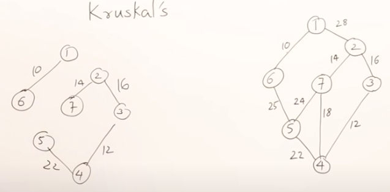


Some Properties:

- Work for disjointed graph –> It will find the MST for each graph.


**Time Complexity:**

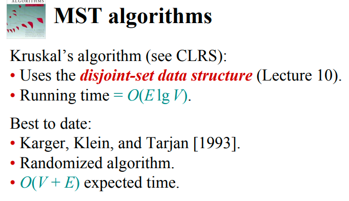

– Reference, [MIT Algorithm](https://ocw.mit.edu/courses/electrical-engineering-and-computer-science/6-046j-introduction-to-algorithms-sma-5503-fall-2005/video-lectures/lecture-16-greedy-algorithms-minimum-spanning-trees/lec16.pdf)

**具体实现：**

Krustal Algorithm often is implemented with disjoined-set, here is a python version, https://www.geeksforgeeks.org/kruskals-minimum-spanning-tree-algorithm-greedy-algo-2/

- Adjacent List: O(V^2)
- Disjointed union: O(E logV)


## Prim’s MST Algorithm

**Prim’s MST Algorithm:** ==Always selected the edge that has minimum weight between MST set and unvisited_set, that’s min( (U - G.V), U), where U is the unvisited_set and is initialized as (G.V - v1), and (U - G.V) is the MST that we need to construct.==

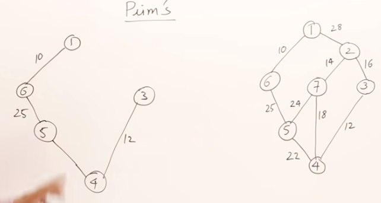

- start with empty tree
- Maintain two set of vertices: 1) a set of vertices that already included in MST (aka explored_set, visited_set, or MST_set); 2) contains a set of vertices that has not yet included.
- Consider all edges connect two set, and picks the minimum weighted edge, and move the endpoint of the edge to the first set that containing MST


**Time Complexity:**

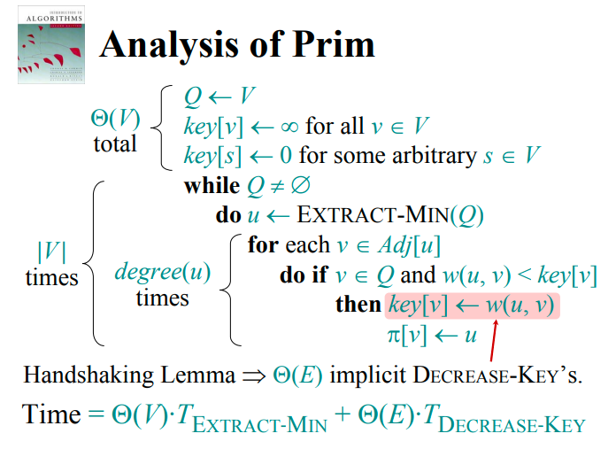

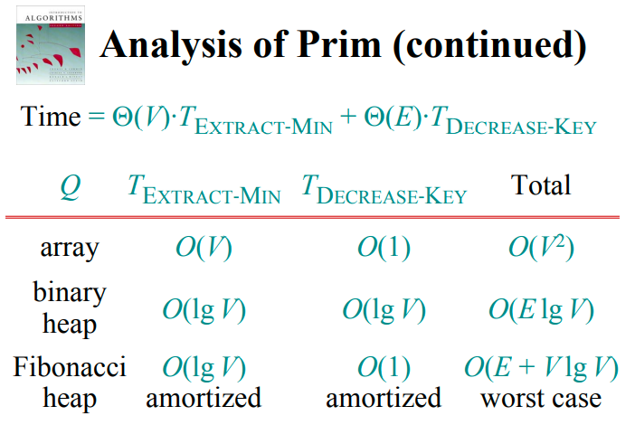

– Reference, [MIT Algorithm](https://ocw.mit.edu/courses/electrical-engineering-and-computer-science/6-046j-introduction-to-algorithms-sma-5503-fall-2005/video-lectures/lecture-16-greedy-algorithms-minimum-spanning-trees/lec16.pdf)


**具体实现：**

- Adjacent list:  ==>  

There is a Python version, that use adjacent list to implement it, link here, https://www.geeksforgeeks.org/prims-minimum-spanning-tree-mst-greedy-algo-5/ 

```text
# G is graph, G.V = set of vertices of graph G, 
procedure PrimMST(G):
	U= G.V - {v1}	# let U be all the vertices that hasn't visited yet
	v1.MSTparent = Null	# let's the parent of root to be None 
	while U!=0 and there is an edge from (G.V - U) to U:	# while there is an vertices that we hasn't visited and there exist a path from explored world to that edge
		(vi, vj) = minimum weight edge from (G.V - U) to U	# Find the lowest cost path, and visited it
		vj.MSTparent = vi	# add to the explored world
		U = U - {vj}		# remove that vertices from queue/stack
	end while
	

# m = number of vertices of G
# n = number of edges of G
# Time Complextity: O(n^2 + m) = O(n^2)
```

- with Fibonacci heap
- With priority Queue, or binary heap

**Psudocode:**

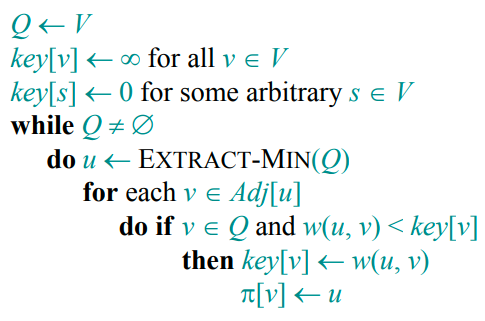

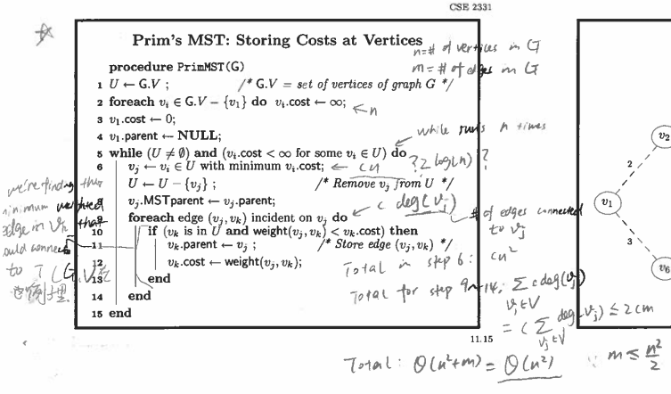

(Watch this video if you still don’t understand,)

**Reference:** 

- Prim’s Minimum Spanning Tree (MST) | Greedy Algo-5, https://www.geeksforgeeks.org/prims-minimum-spanning-tree-mst-greedy-algo-5/
- Kruskal’s Minimum Spanning Tree Algorithm | Greedy Algo-2, https://www.geeksforgeeks.org/kruskals-minimum-spanning-tree-algorithm-greedy-algo-2/
- YouTube Video,  [3.5 Prims and Kruskals Algorithms - Greedy Method](https://www.youtube.com/watch?v=4ZlRH0eK-qQ&list=PLDN4rrl48XKpZkf03iYFl-O29szjTrs_O&index=44)
- MIT Course Slide, [Introduction to Algorithms 6.046J/18.401J - LECTURE 16 Greedy Algorithms (and Graphs)](https://ocw.mit.edu/courses/electrical-engineering-and-computer-science/6-046j-introduction-to-algorithms-sma-5503-fall-2005/video-lectures/lecture-16-greedy-algorithms-minimum-spanning-trees/lec16.pdf) 


# Shortest Paths

## Bellman–Ford Algorithm

**Intro:** <u>Bellman-Ford is a type of DP algorithm, with O(VE) of time complexity</u> 

**Goal:** <u>Given a graph and a source vertex *src* in graph, find shortest paths from *src* to all vertices in the given graph.</u>

**Property:**

- <u>allow the graph contain **negative weighted edge**</u>(负环)

- 什么是负环？ ==> The weight of a cycle is negative, e.g., 如下图，what is the shortest path for dist[A]? ==> 负无穷，why？因为最短的方式就是不停的绕圈，你没绕一次圈(A->B->C->D), dist[A] -= 1 ==》 这也是为什么Bellman-Ford可以用来检测负环的原因。当所有的edges, 都跑了V-1次，但最后再跑一次，你发现还有地方可以optimize，or relax, that means there is the negative cycle.

/My_Website/Drago1234.github.io/images/2021-08-16-pyhton-read-excel-content-and-send-automatic-email/image-20210818002510739.png)

**Idea:**

**Algorithm** 
Following are the detailed steps.
***Input:*** Graph and a source vertex *src* 
***Output:*** Shortest distance to all vertices from *src*. If there is a negative weight cycle, then shortest distances are not calculated, negative weight cycle is reported.
**1)** This step initializes distances from the source to all vertices as infinite and distance to the source itself as 0; ==> Create an array dist[] of size |V| with all values as infinite except dist[src] where src is source vertex.
**2)** This step calculates shortest distances. Do following |V|-1 times where |V| is the number of vertices in given graph. 
…..**a)** Do following **for each edge u-v** 
………………If dist[v] > dist[u] + weight of edge uv, then update dist[v] 
………………….dist[v] = dist[u] + weight of edge uv
**3)** This step reports if there is a negative weight cycle in graph. Do following for each edge u-v 
……If dist[v] > dist[u] + weight of edge uv, then “Graph contains negative weight cycle” 
The idea of step 3 is, step 2 guarantees the shortest distances if the graph doesn’t contain a negative weight cycle. If we iterate through all edges one more time and get a shorter path for any vertex, then there is a negative weight cycle

***How does this work?*** Like other Dynamic Programming Problems, the algorithm calculates shortest paths in a bottom-up manner. It first calculates the shortest distances which have at-most one edge in the path. Then, it calculates the shortest paths with at-most 2 edges, and so on. After the i-th iteration of the outer loop, the shortest paths with at most i edges are calculated. There can be maximum |V| – 1 edges in any simple path, that is why the outer loop runs |v| – 1 times. The idea is, assuming that there is no negative weight cycle, if we have calculated shortest paths with at most i edges, then an iteration over all edges guarantees to give shortest path with at-most (i+1) edges (Proof is simple, you can refer [this](http://courses.csail.mit.edu/6.006/spring11/lectures/lec15.pdf) or [MIT Video Lecture](http://www.youtube.com/watch?v=Ttezuzs39nk))

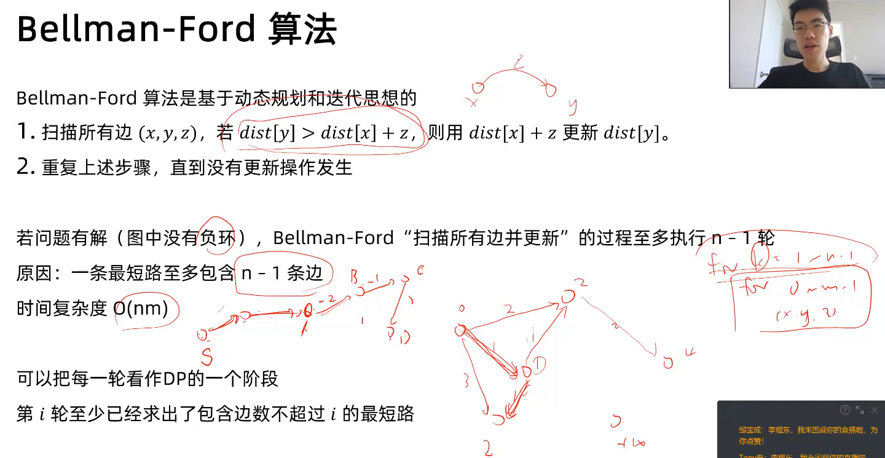

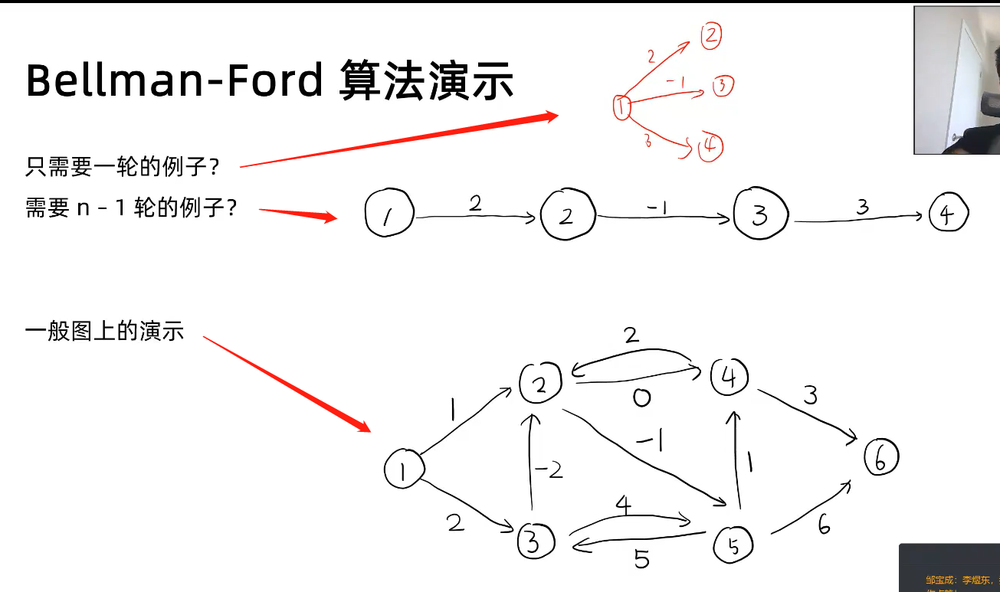


- 什么时候只需要一轮？(Extreme case)

When you have 4 vertice, and 3 vertice all connect to same one.

e..g, edges =[[1, 2], [1, 3], [1, 4] ], cost = [-2, -1, 3]

==> No matter the order, you always only need one iteration to get the result

- When we need n-1 iteration? (Extreme case)

When all vertice are line up in a line, and the edge were given in reverse order. (Rare, and extreme case)

e.g., edges = [ ([3, 4], 3), ([1, 2], 2), ([2, 3], -1)] 	# 一般你不知道edge 给的顺序， 所以这是可能发生的

==> Draw the process yourself, and you will see that you need n-1 iteration to get the final result.

 **具体实现**

- use a dist[i] array to keep track the optimium distance from root to node i.
- Initialize all node with value float(“inf”), except 0 for root node
- Traversal all edges, for V-1 times. For each edge [x, y], if dist[x] + weight[x, y] < dist[y], then update dist[y] = dist[x] + weight[x, y]  # Because we found a better approach/path ==> Some textbook call this **Relaxation Step**
  - That’s why the time complexity is O((V-1)*E)

**实战例题：**

- [网络延迟时间](https://leetcode-cn.com/problems/network-delay-time/)（Medium）半年内出题频次：

Question:


Idea:


C++ Code:


Python Code:

```python
class Solution:
    def networkDelayTime(self, times: List[List[int]], n: int, k: int) -> int:
        """
            方法一：Bellman-ford
            这道题要找的就是，从root到最远那个点所需要的时间。==》                       
        """
        # Initialize the cost of all node as float('inf'), except for root as 0
        dist = [2**31 for i in range(n+1)]    # Note: start from 1, not 0 (check the range of k and n)
        # In here, why we should use 2^31 instead of float('inf')? ==> because we want to avoid stack overflow(for operation, dist[u] + w). Note:  The signed version goes from -2^31-1 to 2^31, which is –2,147,483,648 to 2,147,483,647 or about -2 billion to +2 billion
        dist[k] = 0

        # Bellman-ford algo
        for i in range(n-1):
            flag = False
            for edge in times:
                u = edge[0]
                v = edge[1]
                w = edge[2]
                # Relaxation Step
                if dist[u] + w < dist[v]:
                    dist[v] = dist[u] + w
                    flag = True

            # If no more update happen, we can exit the loop
            if flag == False:
                break
        
        # Find the ans: Check the time cost for each node, and save the max as final result
        ans = 0
        for i in range(1, n+1):
            ans = max(ans, dist[i])
        # For the case that there is a negative circle
        if ans == 2**31:
            ans = -1
        return ans
```


**Reference:**

- Bellman–Ford Algorithm | DP-23, https://www.geeksforgeeks.org/bellman-ford-algorithm-dp-23/
- [Bellman-Ford vs Dijkstra: Under what circumstances is Bellman-Ford better?](https://stackoverflow.com/questions/19482317/bellman-ford-vs-dijkstra-under-what-circumstances-is-bellman-ford-better)


## Dijkstra’s shortest path algorithm(迪杰斯特拉)

- Dijkstra’s algorithm is a Greedy algorithm and time complexity is O( V logE) with Priority Queue Implementation, where V is number of vertices, and E is the number of edges. Because the push() and pop() operation take Log(E), and we need to explored V number of vertices, so the cost is V log(E)
- 思路和bellman-ford是一摸一样的，唯一不同的是在遍历的方法上进行了优化(这也是为啥dijkstra会更快). So, instead of traversal all edge for V-1 times, we traverse all node 1 time. 每次遍历，我们在unexplored node里，找dist[x]最小的来进行下一次遍历。==> 有点像BFS traversal

**Property:**

- Dijkstra doesn’t work for Graphs with negative weight edges (because it applys greedy algorithm)
- 每个点只会被标记一次
- 一旦被取出来了（或标记了），就不会再扩展
- 所以，每次取得是没被标记的， dist[x]最小的节点。扫描他所有的出边，更新一遍dist[y] (where, x is visited node, y is unvisited node)
- Traversal through each Eage[x, y], if dist[x] + weight[x, y] < dist[y], then update dist[y] = dist[x] + weight[x, y]  # Because we found a better approach/path ==> Some textbook call this **Relaxation Step**


**Idea:**

- 初始化dist[1] = 0, and 其余节点的dist[i] = float(‘inf’)
- 找出一个没被标记的，dist[x]最小的节点，然后标记节点x
- 扫描节点x的所有出边(x, y, w), 若dist[x] + w > dist[y], 则更新dist[y]
- 重复上述2~3步骤，直到所有节点都被标记过了


Code 模板：

- [ Dijkstra 求最短路 II ](https://www.acwing.com/problem/content/852/)（Easy）（ACWing）

```python
from heapq import *

if __name__ == "__main__":
    n, m = map(int,input().split())
    
    ver = [[] for i in range(n + 1)] # 0~n
    edge = [[] for i in range(n + 1)] # 0~n
    dist = [1e9] * (n + 1)
    v = [False] * (n + 1)
    
    # 出边数组建图
    for i in range(m):
        x, y, z = map(int,input().split())
        ver[x].append(y)  # 另一端点
        edge[x].append(z) # 边权

    heap = []
    heappush(heap, (0, 1)) # (距离, 点)
    dist[1] = 0

    # Dijkstra 算法
    while heap:
        distance, x = heappop(heap)
        if v[x]:
            continue
        v[x] = True

        for i in range(len(ver[x])):
            y, z = ver[x][i], edge[x][i]
            if dist[y] > dist[x] + z:
                dist[y] = dist[x] + z
                heappush(heap, (dist[y], y))

    print(dist[n] if dist[n] != 1e9 else -1)

```


**实战例题：**

- [网络延迟时间](https://leetcode-cn.com/problems/network-delay-time/)（Medium）半年内出题频次：

Question:


Idea:


Python Code:

```python
class Solution:
    def networkDelayTime(self, times: List[List[int]], n: int, k: int) -> int:  
        """
            方法二：Dijkstra’s (迪杰斯特拉)
            其实就是bfs的实现方法
        """
        # 建图：
        V =[[] for i in range(n+1)]  # Save 出边数组, each V[i] return a list of vertices that connect to it
        E = [[] for i in range(n+1)]     # the len/cost/weight of edge, each E[i] return the length of a list of edges that connect to V[i]
        for edge in times:
            x, y, z = edge
            V[x].append(y)
            E[x].append(z)

        print(f"V: {V}, E: {E}")
        dist = [2**31 for i in range(n+1)]
        dist[k] = 0
        visited = [False for i in range(n+1)]

        q = BinaryHeap()    # store a pair<length: int, id: int>
        q.push((dist[k], k))
        # Dijsktra algo
        while q.size() != 0:
            length, x = q.pop() # x is the idx
            if visited[x]: # 每个点只需要扩展一次，如果explord过了，就跳过，没必要在扩展了
                continue
            visited[x] = True
            # print(f"length: {length}, x: {x}")
            # Explored V[x] -- 访问所有的出边，尝试更新（or relex)
            for i in range(len(V[x])):    # x, y indicate idx, and z is the cost, or length of edge
                y = V[x][i]   # V[x][i] ==> y, 可以看出V[x]存的是所有连接x的点，i是每个点遍历的idx
                z = E[x][i]   # E[x][i] ==> z, 可以看出E[x]存的是所有连接x的边，i是edge[x, y]的长度/cost/weight
                if dist[x] + z < dist[y]:
                    dist[y] = dist[x] + z
                    q.push((dist[y], y))
            
        # print(dist)
        ans = 0
        for i in range(1, n+1):
            ans = max(ans, dist[i])
        if ans == 2**31:
            ans = -1
        return ans

        
# Good Reference: 1) https://leetcode-cn.com/problems/design-twitter/solution/dui-you-xian-dui-lie-by-hw_wt-tb9g/
class BinaryHeap():
    def __init__(self):
        self.minHeap = []   # start 
    def __repr__(self):
        return self.minHeap.__repr__()
    def __str__(self):
        return self.minHeap.__str__()
    
    def leftChild(self, i):
        return 2*i+1

    def rightChild(self, i):
        return 2*i + 2
    
    def parent(self, i):
        return (i-1)//2

    def swap(self, id1, id2):
        self.minHeap[id1], self.minHeap[id2] = self.minHeap[id2], self.minHeap[id1]

    def size(self):
        return len(self.minHeap)
    
    def peak_top(self):
        return self.minHeap[0]

    # Just append it to the end, and perform a heapifyUp
    def push(self, node):
        self.minHeap.append(node)
        i = len(self.minHeap)-1
        # Heapify Up: 把新来的放到最后，然后不停的向上调整
        while i>0:
            fa = self.parent(i)
            if self.minHeap[i][0] < self.minHeap[fa][0]:    # 因为这heap里存的是一个pair, 这比较的是pair里的第一个元素
                self.swap(i, fa)
                i = fa
            else:
                break
    
    # Extract the first one and return as the answer, and replace the first spot with the last one, and perform heapify Down
    def pop(self):
        if len(self.minHeap)==0:
            return 
        ans = self.minHeap[0]
        self.minHeap[0] = self.minHeap[-1]
        self.minHeap.pop()
        # Heapify Donw
        j = 0
        flagDone = False
        while flagDone!= True:
            smallest = j
            L = self.leftChild(smallest)
            R = self.rightChild(smallest)
            if L < len(self.minHeap) and self.minHeap[L][0] < self.minHeap[smallest][0]:
                smallest = L
            if R < len(self.minHeap) and self.minHeap[R][0] < self.minHeap[smallest][0]:
                smallest = R
            if smallest != j:
                self.swap(j, smallest)
                j = smallest
            else:
                flagDone = True 
        return ans
```

Question: Why is Bellman-ford running faster than Dijsktra?


==> 这和测试数据大小有关

bellman-ford 的time complexity is something between V*E(Worse case，a chain linked list graph) and V+E（Best case, a two layer graph with one node at root), 如果数据小，那V \* E 也不大，而且还有可能在V+E的情况下通过

but, the Dijsktras is always O(V logE), 所以如果给的数据规模小，且随机，那平均下来就会比bellman-ford 慢。只有在网络图非常大的情况下，才能体现出这个O(V logE)的价值。

**Reference:** 

- Dijkstra’s shortest path algorithm | Greedy Algo-7, https://www.geeksforgeeks.org/dijkstras-shortest-path-algorithm-greedy-algo-7/
- 


# 弗洛伊德


# Summary:

- MST(minimum spanning tree, or 最小生成树): 这个找的是所有spanning tree 里，the one with the minimum sum of weight. 要考虑整条path上edge的weight, or cost， 所以可以用greedy的思路来实现。
  - **Kruskal MST Algorithm** – ==Always selected the minimum weighted edge amount all unvisited_set, that’s min(Edge<vi, vj>), that doesn’t form a cycle==
  - **Prim’s MST Algorithm:** ==Always selected the edge that has minimum weight between MST set and unvisited_set, that’s min( (U - G.V), U), where U is the unvisited_set and is initialized as (G.V - v1), and (U - G.V) is the MST that we need to construct.==
- Shortesting path: 这个考虑的是任意一点到起点的最短距离， 所以必须要用DP的思路来实现


Dijkstra is however generally considered better in the absence of negative weight edges, as a typical binary heap priority queue implementation has O((|E|+|V|)log|V|) time complexity [A Fibonacci heap priority queue gives O(|V|log|V| + |E|)], while the Bellman-Ford algorithm has O(|V||E|) complexity