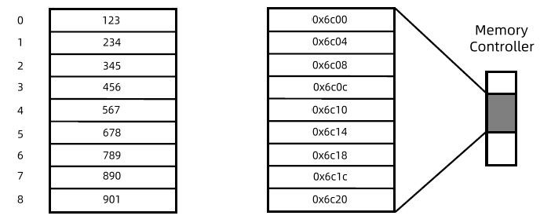
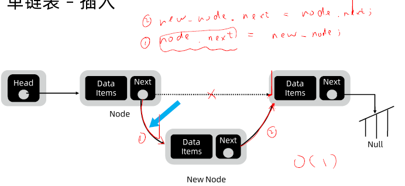
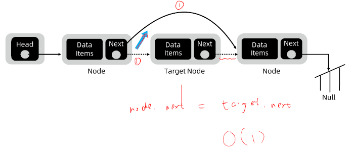
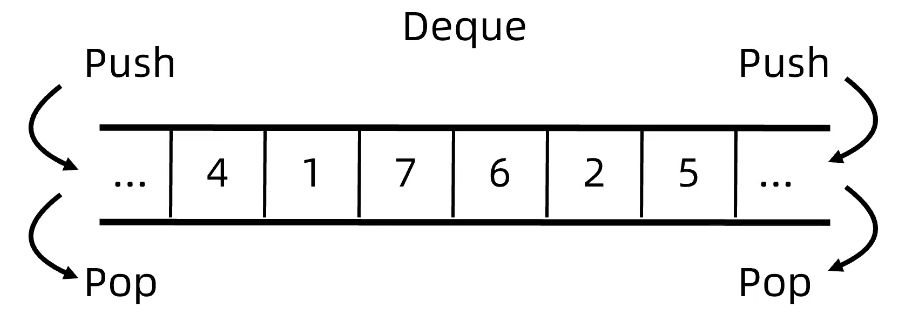
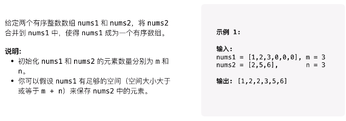
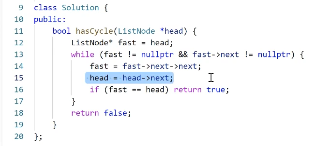
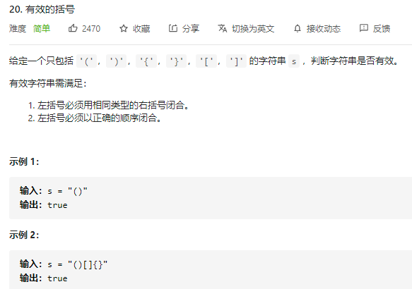
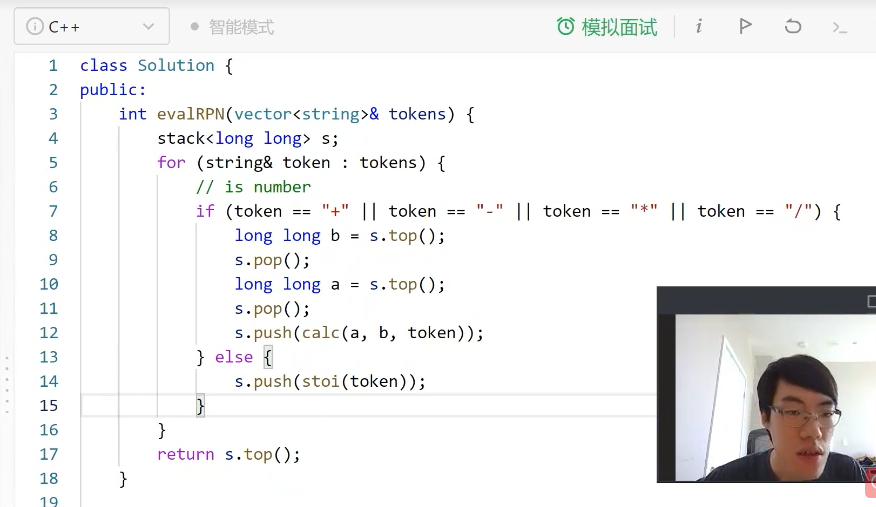

[TOC]

# 第一周：链表、栈、队列

## 1. 数组



==数组操作时间复杂度：==

- Look up  	>>  O(1)
- Insert          >>  O(n)
- Delete         >>  O(n)
- Append (push back)       >>   O(1)
- Prepend (push front)      >>  O(n)

### vector可变长动态数组

**==特点：==**

- 连续存储，空间可动态扩展
- 随机访问`[]`或`vector.at()`
- 节省空间，但通常并不是满存
- <u>内部插入、删除操作效率低，基本禁止</u>。Vector 被设计成只能在后端进行追加和删除操作，其原因是vector 内部的实现是按照顺序表的原理，即只能push back 和pop back ，不能push front, pop front ；
- 当动态添加的数据超过vector 默认分配的大小时要进行内存的重新分配、拷贝与释放，这个操作非常消耗性能。 所以要vector 达到最优的性能，最好在创建vector 时就指定其空间大小。
- <u>通常用户需要的是一个可以存放任意多个元素的数组，但编译器不可能申请无限内存，它又不知道用户到底想要多少，所以设计时你要从编译器的角度思考问题。比如，你开了一个空array，往里面push四个值，你调用size返回的肯定是4，但编译器可能会给你预留好更多的空间（比如6），这个就是capacity，但是对你不可见的</u>。
- Python有啥方法可以查看capacity不？
  - 有的, 你可以import sys, 然后sys.getsizeof(aList), 你可以看到他跟len的结果是不一样的 你试试？(哦getsizeof是字节数，你可能得除以元素的长度才能得到capacity. Python的int好像8字节, 除以8)

**==如何实现一个可变长数组==？**

- 请你设计一个class，支持末尾插入，末尾删除，访问第i个元素，问实现方法要求能支持Indexing and随机访问

Assumption

- 用户declared 这个list后，肯定要储存至少一个element是吧 ==》但你作为executor, 你不可能用户每append 一个element, 你就要allocate a new memory, copy old data to new memory, then free old memory(重新分配、拷贝与释放这几个操作很浪费时间的，因为涉及到system call, I/O communication，memory scheduling) ==> 因此，在一开始你就要给用户预留些空间（e.g., 100byte, then when reach that limit, you are going to create a new space  that is twice larger, say 200 byte or 50% of old memory space — up to you, and copy all data to the new allocated memory space) 
  - 
- 理论上空间上可以push无数多个element，如果电脑内存足够大的话
- 一个数组的容量, or memory space,（对用户不可见) 和用户实际使用大小是不一样的。 For example, in python, you can use check that sys.getsizeof(aList) != len(aList), https://stackoverflow.com/questions/17574076/what-is-the-difference-between-len-and-sys-getsizeof-methods-in-python
  - 

需要思考的问题：

- **分配多长的连续空间？**
  - 空数组，<u>分配常数空间</u>
- **Push back空间不够用怎么处理？** （比如说，一个当用户所使用的list）
  - <u>重新申请2倍大小连续空间 >> 拷贝数据到新的空间 >>  释放free old memory space</u>
  - 在空数组中连续插入n个元素，需要总插入、拷贝次数：n+n/2+n/4+n/8+… <2n （note, it’s geometric series, so $$S = 1+r+r^2 + r^3…= \frac{1}{1- r}, where 0<r<1$$
- **Pop back空间剩余很多如何收回？**
  - <u>如果空间利用率不到25%（也就是75%都没用到），释放一半的空间</u>

==时间复杂度：==

- 均摊O(1)
- 插入、删除O(n)

==思考：若释放空间阀值设为50%，会怎么样==

- 当空间占用为临界阀值附近时，会在扩容和减半操作之间来回震荡

==声明初始化一个vector==

```C++
#include<vector>

vector<int> vec;		//声明一个int型向量
vector<int> vec(5);		//声明一个初始大小为5的int向量
vector<int> vec(10, 1);	//声明一个初始大小为10且值都是1的向量
vector<int> vec(tmp);	//声明并用tmp向量初始化vec向量
vector<int> tmp(vec.begin(), vec.begin() + 3);	//用向量vec的第0个到第2个值初始化tmp
int arr[5] = {1, 2, 3, 4, 5};	
vector<int> vec(arr, arr + 5);		//将arr数组的元素用于初始化vec向量
//说明：当然不包括arr[4]元素，末尾指针都是指结束元素的下一个元素，
//这个主要是为了和vec.end()指针统一。
vector<int> vec(&arr[1], &arr[4]); //将arr[1]~arr[4]范围内的元素作为vec的初始值

```

==基本操作==

(1). 容量

* 向量大小： vec.size();
* 向量最大容量： vec.max_size();
* 更改向量大小： vec.resize();
* 向量真实大小： vec.capacity();
* 向量判空： vec.empty();
* 减少向量大小到满足元素所占存储空间的大小： vec.shrink_to_fit(); //[shrink_to_fit](http://www.cplusplus.com/reference/vector/vector/shrink_to_fit/)

(2). 修改

* 多个元素赋值： vec.assign(); //类似于初始化时用数组进行赋值
* 末尾添加元素： vec.push_back();
* 末尾删除元素： vec.pop_back();
* 任意位置插入元素： vec.insert();
* 任意位置删除元素： vec.erase();
* 交换两个向量的元素： vec.swap();
* 清空向量元素： vec.clear();

(3)迭代器

* 开始指针：vec.begin();
* 末尾指针：vec.end(); //指向最后一个元素的下一个位置
* 指向常量的开始指针： vec.cbegin(); //意思就是不能通过这个指针来修改所指的内容，但还是可以通过其他方式修改的，而且指针也是可以移动的。
* 指向常量的末尾指针： vec.cend();

(4)元素的访问

* 下标访问： vec[1]; //并不会检查是否越界
* at方法访问： vec.at(1); //以上两者的区别就是at会检查是否越界，是则抛出out of range异常
* 访问第一个元素： vec.front();
* 访问最后一个元素： vec.back();
* 返回一个指针： int* p = vec.data(); //可行的原因在于vector在内存中就是一个连续存储的数组，所以可以返回一个指针指向这个数组。这是是C++11的特性。

==算法==

```C++
// 遍历
vector<int>::iterator it;
for (it = vec.begin(); it != vec.end(); it++)
    cout << *it << endl; // meanue1
for (size_t i = 0; i < vec.size(); i++) {
	cout << vec.at(i) << endl; // meanuel2
}
// 元素翻转
#include <algorithm>
reverse(vec.begin(), vec.end());
// 元素排序
#include <algorithm>
sort(vec.begin(), vec.end()); //采用的是从小到大的排序
//如果想从大到小排序，可以采用上面反转函数，也可以采用下面方法:
bool Comp(const int& a, const int& b) {
	return a > b;
}
sort(vec.begin(), vec.end(), Comp);
```


## 2.  链表

#### 单链表


- 插入
- 
- 删除
- 
- Note:

知识点简单，主要是多联系熟悉一下。

数组插入删除很贵O(n)，引入链表

首先加入保护节点，哨兵节点

```C++
ListNode protect = new ListNode(0, head); // (value, ->next)
```

#### 双链表


- 双向链表，双保护节

- ==时间复杂度：==
  - look up >> O(n)
  - Insert >> O(1)
  - Delete >> O(1)
  - Append(push back) >> O(1)
  - Prepend(push front) >> O(1)

## 3. 栈stack

**What is Stack?**

- First in, Last out
- 

**==时间复杂度==**

- push 入栈 : O(1)
- pop 出栈 : O(1)
- Access 访问栈顶 ： O(1)

只能访问、push、pop顶部的元素

**==操作==**

* top()：返回一个栈顶元素的引用，类型为 T&。如果栈为空，返回值未定义。
* push(const T& obj)：可以将对象副本压入栈顶。这是通过调用底层容器的 push_back() 函数完成的。
* push(T&& obj)：以移动对象的方式将对象压入栈顶。这是通过调用底层容器的有右值引用参数的 push_back() 函数完成的。
* pop()：弹出栈顶元素。
* size()：返回栈中元素的个数。
* empty()：在栈中没有元素的情况下返回 true。
* emplace()：用传入的参数调用构造函数，在栈顶生成对象。
* swap(stack<T> & other_stack)：将当前栈中的元素和参数中的元素交换。参数所包含元素的类型必须和当前栈的相同。对于 stack 对象有一个特例化的全局函数 swap() 可以使用。

```c++
# include <stack>
#include<iostream> 

stack<int> mystack1;
stack<int, vector<int> > mystack2;

```


## 4. 队列queue

**What is queue？**

- (FIFO)First in, First out
- 

**双端队列**

- 两边都可以进和出, e.g., Python list
- 

**优先队列（priority queue)**

- 给一个优先级的定义(e.g., Time)， 用来判定进出的顺序
- 很多数据结构都可以用来实现，e.g., 二叉堆，二叉平衡树等
- 每个语言都有自己的包
  - C++: 
    - stack, queue, deque, priority_queue
    - 官方文档，https://www.cplusplus.com/reference/deque/deque/
  - Java: 
    - Stack
    - Queue, Deque, or LinkedList
    - PriorityQueue
    - 官方文档，https://docs.oracle.com/javase/7/docs/api/java/util/PriorityQueue.html
  - Python: 
    - 栈，队列，双端队列都可以用list实现
    - Priority Queue可以用heapq的package
    - 官方文档，https://docs.python.org/3/library/heapq.html

**==时间复杂度==**

- push 入栈 : O(1)
- pop 出栈 : O(1)
- Access 访问队头 ： O(1)
- For PriorityQueue:
  - insert: O(logN), some advance data structure can achieve O(1), e.g., 配对堆，斐波那契堆
  - Min/Max: O(logN)

```python
# Python use "min heap", so smallest item will return after pop
import heapq
    
# initializing list 1
li1 = [5, 7, 9, 4, 3]
# using heapify() to convert list into heap
heapq.heapify(li1)

# Pop and return the smallest item from the heap, maintaining the heap invariant.
heapq.heappop(heap)

# Push the value item onto the heap, maintaining the heap invariant.
heapq.heappush(heap, item)

```

**==操作==**

* front()：返回 queue 中第一个元素的引用。如果 queue 是常量，就返回一个常引用；如果 queue 为空，返回值是未定义的。
* back()：返回 queue 中最后一个元素的引用。如果 queue 是常量，就返回一个常引用；如果 queue 为空，返回值是未定义的。
* push(const T& obj)：在 queue 的尾部添加一个元素的副本。这是通过调用底层容器的成员函数 push_back() 来完成的。
* push(T&& obj)：以移动的方式在 queue 的尾部添加元素。这是通过调用底层容器的具有右值引用参数的成员函数 push_back() 来完成的。
* pop()：删除 queue 中的第一个元素。
* size()：返回 queue 中元素的个数。
* empty()：如果 queue 中没有元素的话，返回 true。
* emplace()：用传给 emplace() 的参数调用 T 的构造函数，在 queue 的尾部生成对象。
* swap(queue<T> &other_q)：将当前 queue 中的元素和参数 queue 中的元素交换。它们需要包含相同类型的元素。也可以调用全局函数模板 swap() 来完成同样的操作。

## 5. 双端队列deque

==时间复杂度==O(1)


一般队列以“时间”为顺序（先进先出）

优先队列按照元素的“优先级”取出

- ”优先级“可以使自己定义的一个元素属性

许多数据结构可以用来实现优先队列，例如二叉堆、二叉平衡树等

==deque的API==
- 1.1deque构造函数
  deque<T> deqT;//默认构造形式

  deque(beg, end);//构造函数将[beg, end)区间中的元素拷贝给本身。

  deque(n, elem);//构造函数将n个elem拷贝给本身。

  deque(const deque &deq);//拷贝构造函数。

- ==1.2 deque赋值操作
  assign(beg, end);//将[beg, end)区间中的数据拷贝赋值给本身。

  assign(n, elem);//将n个elem拷贝赋值给本身。

  deque& operator=(const deque &deq); //重载等号操作符

  swap(deq);// 将deq与本身的元素互换

- 1.3 deque大小操作
  deque.size();//返回容器中元素的个数

  deque.empty();//判断容器是否为空

  deque.resize(num);//重新指定容器的长度为num,若容器变长，则以默认值填充新位置。如果容器变短，则末尾超出容器长度的元素被删除。

  deque.resize(num, elem); //重新指定容器的长度为num,若容器变长，则以elem值填充新位置,如果容器变短，则末尾超出容器长度的元素被删除。

```C++
//遍历容器
void printDeque(const deque<int> &d)
{
    for(deque<int>::const_iterator it = d.begin(); it != d.end(); it++)
    {
        cout<<*it<<" ";
    }
    cout<<endl;
}
```

==2.1 deque双端插入和删除操作==
push_back(elem);//在容器尾部添加一个数据

push_front(elem);//在容器头部插入一个数据

pop_back();//删除容器最后一个数据

pop_front();//删除容器第一个数据

==2.2 deque数据存取==
at(idx);//返回索引idx所指的数据，如果idx越界，抛出out_of_range。

operator[];//返回索引idx所指的数据，如果idx越界，不抛出异常，直接出错。

front();//返回第一个数据。

back();//返回最后一个数据

==2.3 deque插入操作==
insert(pos,elem);//在pos位置插入一个elem元素的拷贝，返回新数据的位置。

insert(pos,n,elem);//在pos位置插入n个elem数据，无返回值。

insert(pos,beg,end);//在pos位置插入[beg,end)区间的数据，无返回值。

==2.4 deque删除操作==
clear();//移除容器的所有数据

erase(beg,end);//删除[beg,end)区间的数据，返回下一个数据的位置。

erase(pos);//删除pos位置的数据，返回下一个数据的位置。

## 6. 优先队列priority queue

==时间复杂度==

- 访问最值：O(1)

- 插入：一般是O(logN)

- 去最值：O(logN)

定义：priority_queue<Type, Container, Functional>
Type 就是数据类型，Container 就是容器类型（Container必须是用数组实现的容器，比如vector,deque等等，但不能用 list。STL里面默认用的是vector），Functional 就是比较的方式，当需要用自定义的数据类型时才需要传入这三个参数，使用基本数据类型时，只需要传入数据类型，默认是大顶堆

```C++
// 升序队列
priority_queue <int,vector<int>,greater<int> > q;
// 降序队列
priority_queue <int,vector<int>,less<int> >q;
// greater和less是std实现的两个仿函数（就是使一个类的使用看上去像一个函数。其实现就是类中实现一个operator()，这个类就有了类似函数的行为，就是一个仿函数类了）

//对于基础类型 默认是大顶堆
priority_queue<int> a; 
//等同于 priority_queue<int, vector<int>, less<int> > a;

```

==和队列基本操作相同:==

* top 访问队头元素
* empty 队列是否为空
* size 返回队列内元素个数
* push 插入元素到队尾 (并排序)
* emplace 原地构造一个元素并插入队列
* pop 弹出队头元素
* swap 交换内容


## 实战

### 数组

#### 88.合并有序数组 easy

- 88.合并有序数组 easy, https://leetcode-cn.com/problems/merge-sorted-array/

Question:



Answer: 逆向双指针

* 两个数组从后往前的指针开始比较，谁大放谁，放入后并----相应的指针
* 因为给定数组nums1 给预留了空间，所以可以从后开始放最大的, 避免开创result 数组，优化空间复杂度

Code:

* ```python
  class Solution:
      def merge(self, nums1: List[int], m: int, nums2: List[int], n: int) -> None:
          p1, p2 = m-1, n-1
          # for i in range(len(nums1)-1, 0, -1): # Traver from tail to the head
          i = m+n-1
          while p1>=0 or p2>=0:
              if p1 == -1: # If p1 reach the head of nums
                  nums1[i] = nums2[p2]
                  p2-=1
              elif p2 == -1:
                  nums1[i] = nums1[p1]
                  p1-=1
              elif nums1[p1]> nums2[p2]:
                  nums1[i] = nums1[p1]
                  p1 -= 1
              else:
                  nums1[i] = nums2[p2]
                  p2-=1
              i-=1
          return nums1
  # 复杂度分析
  # - 时间复杂度：O(m+n)。指针移动单调递减，最多移动 m+n 次，因此时间复杂度为 O(m+n)。
  # - 空间复杂度：O(1)O(1)。直接对数组nums1原地修改，不需要额外空间。
  
  # Good Reference, https://leetcode-cn.com/problems/merge-sorted-array/solution/he-bing-liang-ge-you-xu-shu-zu-by-leetco-rrb0/
  ```

* ==边界问题==

  ```c++
  //一个数什么时候要的模板(重复)
  int n = 0;
  for (int i = 0; i < nums.size(); i++){
      if (i == 0 || nusm[i] != nums[i - 1]){
          nums[n] = nums[i];
          n++;
      }
  }
  ```

#### 26.去重 easy
https://leetcode-cn.com/problems/remove-duplicates-from-sorted-array/

* **Question**：

  * **Input**: nums = [0,0,1,1,1,2,2,3,3,4]
  * **Output**: 5, nums = [0,1,2,3,4,_,_,_,_,_]
  * **Explanation**: Your function should return k = 5, with the first five elements of nums being 0, 1, 2, 3, and 4 respectively.
    It does not matter what you leave beyond the returned k (hence they are underscores).

* **思考**

  * 前后指针
  * 建立循环， 前指针每次都++：
  * 当前指针=后指针，后指针不变
  * 前指针！=后指针，后指针 = 前指针，后指针++
  * 边界问题，注意考虑前后指针都为0的情况

* **Code:**

  * ```python
    class Solution:
        def removeDuplicates(self, nums: List[int]) -> int:
            # 思考1: 什么时候要这个数？==》1)当它和前面的数不一样的时候，2)当它是第一个数时
            # 思考2：如果时in-place, 这array可不可以覆盖，什么时候可以？==》这个题可以覆盖，因为n的位置是永远less than or equal to i 的
    
            n = 0   # 跟踪最后一个valid的数。 
            for i in range(len(nums)):
                if i==0 or nums[i] != nums[i-1]: # 第一个肯定要。
                    nums[n] = nums[i]
                    n += 1
            
            return n           
    ```

#### 283.移动零 easy
https://leetcode-cn.com/problems/move-zeroes/

* 主题思路：
     - 什么时候要呢？==》从前往后遍历，不是0就要，指针++
     - 是否可以覆盖呢？==》可以，因为array is sorted, and n is always >= i.
     - Edge case:  如果n小于nums.size()，后面补0；

* 第二种思路：

  * 双指针，快指针每次都++
  * 当快指针扫描到非0，慢指针扫描到0时，交换位置

* Code

  * ```python
    from typing import List
    class Solution:
        def moveZeroes(self, nums: List[int]) -> None:
            """
            Method 2: In place
            Cost: Time: O(len(nums)), Space: O(len（nums)
            Idea:
                
    
            """
            n = 0   # 跟踪最后一个valid的数。 
            for i in range(len(nums)):
                if nums[i] != 0: # 第一个肯定要。
                    nums[n] = nums[i]
                    n += 1
            while n < len(nums):
                nums[n] = 0
                n+=1
    ```

### 链表

#### 临值查找 hard
https://www.acwing.com/problem/content/description/138/

#### 141.环形链表 easy
https://leetcode-cn.com/problems/linked-list-cycle/

* Hashmap解法：
  * 把链表过一遍，每个碰到的node，用一个hashmap来存，没次存的时候检测时候存过了，有相同，则说明有环；如果到最后都没有conflict，就说明无环。==》O(1) time, O(n) space, 
* 快慢指针 ==》O(n) time, O（1）space,
  * 
  * 相遇了则返回有环，不相遇返回无环
  * 有环必定发生套圈（快慢指针相遇），无环不会发生套圈（快指针会先到达null，然后停下来)
  * 跟跑步套圈一样的。两个人跑步，跑得快的到终点了但没套圈，说明跑的时圆形的跑到；但如果套圈了，或再次碰上了，就说明跑的时圆形的跑道。
  * fastNode不一定非得只比head走得快一步，快3步，4步都行，只要成比例就行，但这样写简单些。==》是否有环总能检测出来，差距就是时间的问题。比如A 比 B快两倍，那A就跑到第二圈就会碰上B；但如果A只比B快1.5倍，那两者的最小公倍数是3，所以要经过3圈才能碰上；但如果A比B快3被，那经过1.5圈就能碰上了，但你能多加几个pointer，conditional statement就变长了，没必要自己给自己找麻烦。。。

#### 142.环形链表II mid (不用掌握，就一数学题)
https://leetcode-cn.com/problems/linked-list-cycle-ii/

* 
* 根据：
  fast = 2s （快指针每次2步，路程刚好2倍）
  fast = s + nb (相遇时，刚好多走了n圈）
  推出：slow = nb
  1.第一次相遇，slow = nb
  2.入环点 = a + nb  = slow + a
  所以说想再次到入环点，slow指针还要走a。
  如何知道slow刚好走了a步？ 从head开始，和slow指针一起走，相遇时刚好就是a步

#### 206.反转链表 easy
https://leetcode-cn.com/problems/reverse-linked-list/

* 思路一：迭代

  1. 迭代需要三个指针，pre，cur，nxt，分别按顺序指向三个节点
  2. 三个指针的初始化：pre指向空节点，cur指向头结点head，nxt指向head.next 因为head.next可能不存在，nxt在循环中定义，这样如果head为空就不会进入循环
  3. 迭代过程
     - nxt指向cur.next
     - cur.next指向pre
     - pre移动到cur位置
     - cur移动到nxt位置
  4. 当cur为空时，返回pre

* Code:

  * ```python
    
    class Solution:
        def reverseList(self, head: ListNode) -> ListNode:
            pre = None
            while(head != None):
                print(head.val)
                next_head = head.next
                head.next = pre
                
                # Advance pre, and head
                pre = head
                head = next_head
            return pre
    
    ```

    

  * **复杂度分析**

    - 时间复杂度：O(n)*O*(*n*)
    - 空间复杂度：O(1)*O*(1)

* ==链表访问基本模板==：

  * ```c++
    //遍历链表：
    while (head != nullptr){
        head = head->next // 如果需要更改，新建一个指针暂存
    }
    ```

* Reference

  * [视频图解]206. 反转链表，迭代 + 递归双解法, https://leetcode-cn.com/problems/reverse-linked-list/solution/shi-pin-tu-jie-206-fan-zhuan-lian-biao-d-zvli/

#### 25.K个一组翻转链表 hard
https://leetcode-cn.com/problems/reverse-nodes-in-k-group/

* 思路

  * seperate to k groups, and reverse each group
  * 处理group内部之间的关系 ==> 要看一般的情况，也就是中间部分。头和尾都是特殊的情况，都是细节和边界
  * 处理group headNode与上一组的关系
  * 处理group endNode与下一组的关系 

* 分组，找到每一组的开始、结尾。按组遍历


```python
# Definition for singly-linked list.
# class ListNode:
#     def __init__(self, val=0, next=None):
#         self.val = val
#         self.next = next
class Solution:
    def reverseKGroup(self, head: ListNode, k: int) -> ListNode:
        """
            Idea:
                1. Seperate all nodes to K groups
                    - For each group, the head node points to the end node of next groups 
                2. Reverse nodes inside of each group
                3. handle头，尾node与下一组之间的关系

            Implementation:
                1. group内部之间的关系
                2. group headNode与上一组的关系
                3. group endNode与下一组的关系  
        """
        # Why we need protect_node? ==> 因为第一组的lastNode不存在，所以要建立个保护点（0）指向head，这样就避免了last为None的情况
        protect_node = ListNode(0, head)
        # What is last for? ==> last是用来保存上一组的最后一个点。
        last = protect_node
        while(head!=None):
            thisGroupHead = head # Python is call by reference ==> Actually python is call by sharing, the 
            end = self.__getEnd(thisGroupHead, k)
            if (end==None): # Reached the ending group
                break
            # 保存next group head, 之后本组的新结尾（旧head）要跟下一组建立联系
            nextGroupHead = end.next

            # 处理head到end之间的k-1条边==》反转之后end就是新的head
            thisGroupHead = head
            self.__reverseList(thisGroupHead, end)

            # 让上一组跟本组的新head（旧end）建立联系
            last.next = end

            # 让本组的新结尾（旧head）要跟下一组建立联系
            head.next = nextGroupHead

            # 开始新的分组遍历
            last = head
            head = nextGroupHead
     
        return protect_node.next
```

* Get endNode

 ```python
  # 找到一组k的结尾
      def __getEnd(self, head: ListNode, k: int) -> ListNode:
          # 从一个头开始，往回走k步，然后返回个endNode, 不足k步，就返回None
          # Becareful, There is k element in the group, but you only need to reverse k-1 edge
          while (head != None):
              # Put 'k-=1' first, so we can prevent the case for k==1
              k-=1
              if(k==0): 
                  break
              head = head.next 
          return head
 ```

* 反转一组

```python
    # 不同于206. reverse list的是，这里不是把整个list反转过来，而是从head to end 这个group里的
    def __reverseList(self, head, end):
        """
        :type head: ListNode
        :rtype: ListNode
        """
        # If a group has one node
        if head == end: 
            return
        # 这里暂时不需要处理head与上一组之前的关系，所以advance pre, and head pointer
        pre = head
        head = head.next
        # 改每条边，所以需要访问整个链表
        while(head != end):
            next_node = head.next
            # 改一条边
            head.next = pre
            # Advance pre, and head
            pre = head
            head = next_node
        
        # EndNode points to last one
        end.next = pre

        # Now, head and end all poinst to the largest node of a group ==> But, it doesn't matter, because python is "call by sharing"
        # return head, end
```


* 上一组跟本组的head（旧的end）建立联系

* 让本组的新结尾（end）跟下一组建立联系

* 边界问题

### 栈

#### 20.有效的括号 easy
https://leetcode-cn.com/problems/valid-parentheses/

Question:



**Idea:**

* 建立一个栈
* 左括号push,右括号和top比较。不对应就false，对应就pop
* 注意if嵌套关系，和判断pop后的空栈情况

Code:

```python
class Solution:
    def isValid(self, s: str) -> bool:
        """
        "()[]{}"
        ^
        ( ] 
            ^
        ([)]
        ^
        stack = [(  ]
        [ == ) ==>
        """
        # This can save some computation cost
        if len(s) % 2 == 1:
            return False
        stack = []
        for ch in s:
            if ch == "(" or ch == "{" or ch == "[":
                stack.append(ch)
            else:
                # Somehting is missing
                if len(stack)==0:
                    return False
                else:
                    # 检查最后一个是否是匹配规定的类型
                    top = stack.pop()
                    if ch == ")" and top != "(":
                        return False
                    if ch == "}" and top != "{":
                        return False
                    if ch == "]" and top != "[":
                        return False
        return (len(stack) == 0)
```

#### 155.最小栈 medium
https://leetcode-cn.com/problems/min-stack/

* 新建两个栈，一个正常栈操作，一个使用前缀最小值
* 前缀最小值：新开栈，遍历数组和栈顶比，小于栈顶就进栈，大于就下一个

#### 150.逆波兰式 后缀表达式求值 medium
https://leetcode-cn.com/problems/evaluate-reverse-polish-notation/

* 新建栈
* 遍历数组，是数字进栈，是运算符连续pop两个数字进行运算

#### 227 medium &224 hard 基本计算器 中缀表达式
https://leetcode-cn.com/problems/basic-calculator-ii/
https://leetcode-cn.com/problems/basic-calculator/

* ```C++
  // 字符串转数值模板
  long long val = 0;
  for (char ch : s){
  	if (ch >='0' && ch <= '9'){
  		val = val * 10 + ch - '0';
  	}
  }
  ```

* 定义优先级

* 转后缀，再求解


## 小项目：计算器

表达式

- 前缀表达式（aka 波兰式) 

  - 形如 “op A B ”，其中op是一个运算符，A and B 是两外两个前缀表达式
  - *3 + 1 2 ==> 9

- 后缀表达式(aka 逆波兰式)

  - 形如”A B op“， e.g., 1 2 + 3 * ==> 9
  - 中缀表达式

  - 3*(1+2) ==> 9

- Tip: 什么数据结构和最近相关性有关 ==> stack

- 对应leetcode：一个程序，三道题都可以解决，可以背 模板

  - https://leetcode-cn.com/problems/basic-calculator-ii/
  - 
  - 
  - https://leetcode-cn.com/problems/basic-calculator/
  - 

## homework

### 21.合并两个有序链表 easy
https://leetcode-cn.com/problems/merge-two-sorted-lists/

* 创建哨兵节点，和一个pre指针
* 遍历l1和l2直到有一个为nullptr
* l1和l2的头节点比较，pre->next指向较小的（假如为l1）
* l1递归，l1 = l1->next
* 将l1或者l2剩下的接到最后

### 66.加一 easy
https://leetcode-cn.com/problems/plus-one/

* 从后往前遍历，分三种情况
* 1. 最后一个不是9，直接最后一位+1，break返回
  2. 最后一个是9，变为0，继续往前扫描
  3. 直到第一个数，如果其为9，创建一个新vector长度+1，第一个数为1其余的都为0；不是9的话+1

### 641.设置循环双端队列 medium
https://leetcode-cn.com/problems/design-circular-deque/