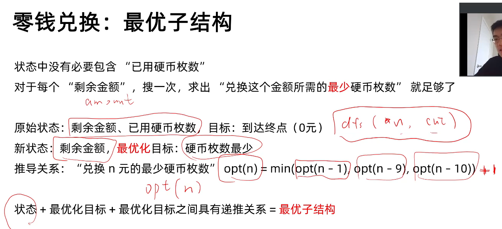

[TOC]


# 动态规划

## 基础知识点

- 其实动态规划就是 DFS + 记忆化
- 动态规划也是一种基于全局，需要考虑整个搜索空间的状态的算法（所以它效率没有贪心高，但保证optimality), 只不过保证每个答案就只计算一次，按照一定的顺序
- 对比下贪心的思想：贪心是选一条路（选一条当前来看最近的路），然后一直走下去走到末尾 ==》 正因为如此，贪心不保证optimality – 就是返回的一定是正确的


# 实战例题


## [零钱兑换](https://leetcode-cn.com/problems/coin-change/)（Medium）

- [零钱兑换](https://leetcode-cn.com/problems/coin-change/)（Medium）半年内出题频次：

| Facebook | 字节跳动 | 微软 | Amazon |
| :------: | :------: | :--: | :----: |
|    4     |    11    |  14  |   12   |

| 高盛集团 | 百度 | Google | 腾讯 |
| :------: | :--: | :----: | :--: |
|    4     |  2   |   6    |  8   |

| Bloomberg | Apple |
| :-------: | :---: |
|     6     |   4   |

Question:


Idea:




Python Code:

```python
class Solution(object):
    def coinChange(self, coins, amount):
        """
        :type coins: List[int]
        :type amount: int
        :rtype: int
        """

        """
        方法一：动态规划 -- Bottom-up的思考方式，用for loop来实现，没有递归。从最底层开始计算，然后利用之前算过的结果来计算下一层。
        思路：用过用递归，或者搜索的话，我们就要遍历整个搜索空间，所有的点，或者状态，才能得到一个解。而这过程我们注意到，一个金额被算了很多次，想要避免这个事情，我们就要计划搜索（或者记忆搜索），使得每个点只算一次。算什么呢？==》 算的是最少拼成一个金额所需的最优解。比如从一个点另一个点，有很多方式，但在一轮搜索中，我们只关心，只记录最优的路径 ==> 因此，这题的思路就是，对于每个amount， ”剩余金额“， 只搜索一次，就是求出”兑换这个金额所需的最少硬币枚数“，就足够了。
            - 目标：到达一个金额，所需的最少硬币个数
            - 状态变量：amount (原始状态：剩余金额; 最终停止状态：amount=0)
            - 另外，这里面有三个要关注的变量，coins，amount, and minimum_count。coins 是给定的，不会变的，所以不用管。minimum_counts 是我们的目标。因此这题的唯一动态变量，就是amount了。
        Note: 还不懂就看着ppt，再看一次
        Note2: 先写程序的主干，再写细节。
        """
        opt = [float("inf")] * (amount+1)   # 因为要找最小值，所以这里得初始一个特别大的值
        opt[0] = 0  # 当amount=0, 只需要0枚
        # 把每一个状态都for 一遍
        for i in range(amount+1):
            # 然后把，当前状态可以选择的决策都for一遍（就像回溯问题，dfs/bfs一样）, 也就是题目规定的所有面值，或者找钱的方法都for一遍. e.g., coins = [10, 9, 1], and amount = 18, than we want opt(18) = min（opt(18-1), opt(18-9), opt(18-10)) ==> 找最优解，并记录下来
            for j in range(len(coins)):
                if i - coins[j] >= 0:   # 比如当前amount是10， coins[j]=9, 那这种情况我们需要避免
                    opt[i] = min(opt[i], opt[i-coins[j]] + 1)       # 找最优解，并记录下来
        print(f"opt is {opt}")
        # 找出，且返回题目所要求的amount
        if opt[amount] == float("inf"):
            return -1
        else:
            return opt[amount]

    """
        总结：动态规划的思路，就是用一个数组来存储最优解(为了避免重复运算），然后用这些解决过的问题来找答案。
            比如 opt(11) = min(opt(11-1), opt(11-2), opt(11-5))     # ==》 有三条路可以走，但我们要找最少的。这有两种实现方法：1）递归实现，把opt当作function，然后用子函数来实现。2）把opt当作数组, that is min(opt[11-1], opt[11-2],  opt[11-5]). 所以在计算opt[11], 我们要先计算它前面的路径 -- 又有点像cse5525 里的 forward-and-backward。 你先forward一遍，把所有点的最优解算出来，然后再backward需按照你要的答案. 
            接下来那实例一为例子
        As final result, we have opt = [0, 1, 1, 2, 2, 1, 2, 2, 3, 3, 2, 3]

        min(0) ==> 0    # 表示没有答案, 一开始时要注意初始化这个为0
        min(1) ==> min(opt[1], opt[1-1]+1) = 1  # 因为opt[1]初始为 INF, 所以答案是opt[0]+1 = 1
        min(2）==> min(opt[2], opt[2-1]+1, opt[2-2]+1)=min(INF, 2, 1)=1
        min(3) ==> min(opt[3], opt[3-1]+1, opt[3-2]+1)=min(INF, 2, 2) = 2
        ....

        min(10) ==> min(opt[10], opt[10-1]+1, opt[10-2]+1, opt[10-5]+1) = min(INF, 4，4, 2)=2
        min(11)  ==> min(opt[11], opt[11-1]+1, opt[11-2],  opt[11-5]) = min(INF, 3, 4, 3) = 3 # 这有两个路径(5+6, or 10+1)，但结果是一样的
    """

class Solution2(object):
    def coinChange(self, coins, amount):
        """
            记忆化搜索的实现方式: 递归来实现，也就是Up-Down， 自顶向下的思考方式。只考虑顶层如何实现（但要记得consider edge case), 剩下的都用递归的方式来完成。 
        """
        self.coins = coins
        self.opt = [-1] * (amount+1)
        ans = self.calc(amount)
        return ans if ans < 1e9 else -1
    def calc(self, amount):
        if amount == 0:
            return 0
        if amount < 0:
            return 1e9
        if self.opt[amount] != -1:
            return self.opt[amount]
        self.opt[amount] = 1e9
        for coin in self.coins:
            self.opt[amount] = min(self.opt[amount], self.calc(amount- coin)+1)
        return self.opt[amount]

# Note: 以上两种实现方式的思想是一样的，但推荐第一种。因为用递归的话，是借用了function stack, each time you make a function call, you need some extra space and time to push and pop stack, that has some extra cost. 所以不管是时间上，还是空间上，第一种都要更高效一些。
```


## [不同路径 II ](https://leetcode-cn.com/problems/unique-paths-ii/)（Medium）

- [不同路径 II ](https://leetcode-cn.com/problems/unique-paths-ii/)（Medium）半年内出题频次：

| Facebook | 字节跳动 | 微软 | Amazon |
| :------: | :------: | :--: | :----: |
|    4     |    13    |  4   |   7    |

| 华为 | Bloomberg | Google |
| :--: | :-------: | :----: |
|  2   |     2     |   4    |

Question:


Idea:


Python code:

```python
```


## [最长公共子序列](https://leetcode-cn.com/problems/longest-common-subsequence/)（Medium）

- [最长公共子序列](https://leetcode-cn.com/problems/longest-common-subsequence/)（Medium）半年内出题频次：

| Facebook | 字节跳动 | 美团 | Amazon |
| :------: | :------: | :--: | :----: |
|    2     |    14    |  4   |   5    |

| Google | 腾讯 | 百度 |
| :----: | :--: | :--: |
|   5    |  5   |  3   |


Question:


Idea:


Python code:

```python

```


## [最长递增子序列](https://leetcode-cn.com/problems/longest-increasing-subsequence/)（Medium）

- [最长递增子序列](https://leetcode-cn.com/problems/longest-increasing-subsequence/)（Medium）半年内出题频次：

| 华为 | 字节跳动 | 微软 | Amazon |
| :--: | :------: | :--: | :----: |
|  4   |    20    |  7   |   6    |

| Twitter | 百度 | Google | 腾讯 |
| :-----: | :--: | :----: | :--: |
|    3    |  4   |   7    |  4   |

| Bloomberg | Apple |
| :-------: | :---: |
|     3     |   4   |

Question:


Idea:


Python code:

```python

```


## [最大子序和](https://leetcode-cn.com/problems/maximum-subarray/)（Easy）

- [最大子序和](https://leetcode-cn.com/problems/maximum-subarray/)（Easy）半年内出题频次：

| Facebook | 字节跳动 | 微软 | Amazon |
| :------: | :------: | :--: | :----: |
|    7     |    20    |  16  |   19   |

| LinkedIn | Bloomberg | Google | 腾讯 |
| :------: | :-------: | :----: | :--: |
|    13    |     4     |   6    |  2   |

| eBay | Apple |
| :--: | :---: |
|  4   |  12   |

Question:


Idea:


Python code:

```python

```


## [乘积最大子数组](https://leetcode-cn.com/problems/maximum-product-subarray/)（Medium）

- [乘积最大子数组](https://leetcode-cn.com/problems/maximum-product-subarray/)（Medium）半年内出题频次：

| Facebook | 字节跳动 | 微软 | Amazon |
| :------: | :------: | :--: | :----: |
|    5     |    10    |  2   |   8    |

| 美团 | Shopee | Google | LinkedIn |
| :--: | :----: | :----: | :------: |
|  2   |   2    |   6    |    12    |

| Apple |
| :---: |
|   3   |

Question:


Idea:


Python code:

```python

```


