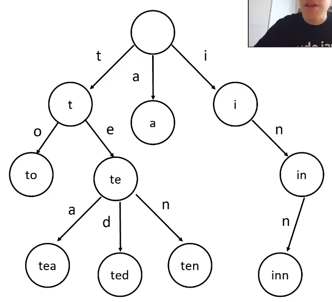
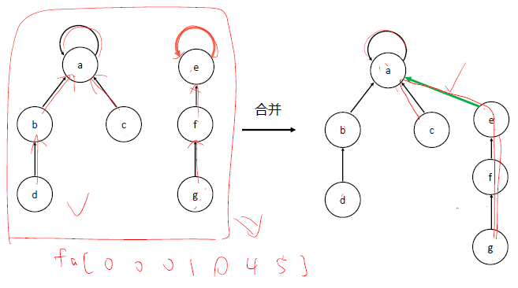
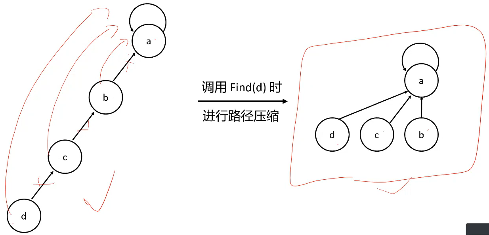
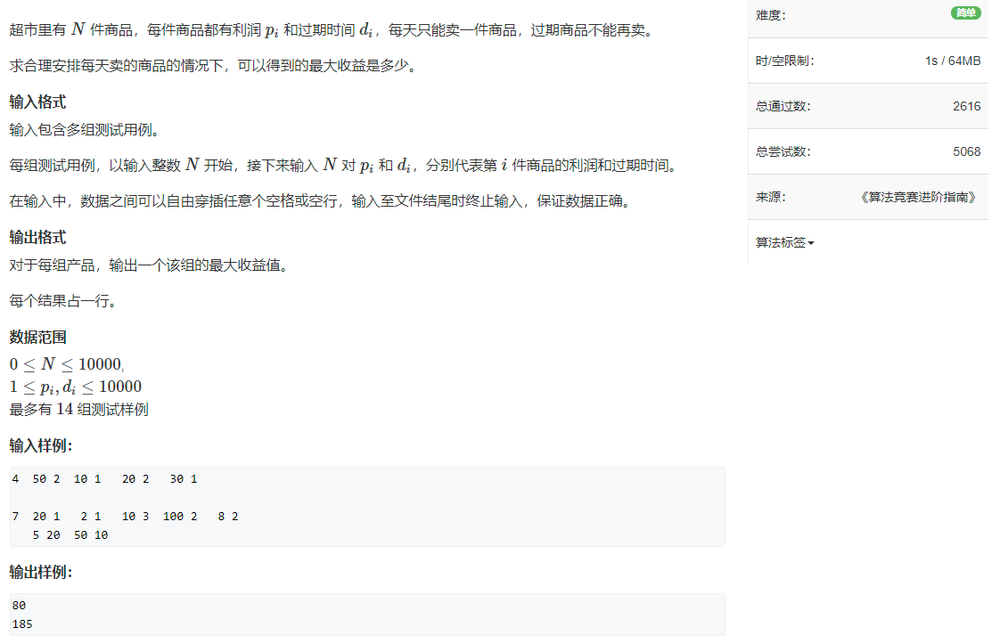

# 字典树




**基本性质：**

它有3个基本性质：

1. <u>根节点不包含字符（结点用于储存单词的额外信息，例如频次</u>）, 除根节点外每一个节点都只包含一个字符 (不保存完整单词)； 
2. 从根节点到某一节点，路径上经过的字符连接起来，为该节点对应的字符串 or 单词； 
3. 每个节点出发到叶子结点，所代表的字符都不相同

**插入字符串**

我们从字典树的根开始，插入字符串。对于当前字符对应的子节点，有两种情况：

1. 子节点存在。沿着指针移动到子节点，继续处理下一个字符。
2. 子节点不存在。创建一个新的子节点，记录在 children 数组的对应位置上(或者你开一个HashMap, Dictionary 来记录也行)，然后沿着指针移动到子节点，继续搜索下一个字符。
   重复以上步骤，直到处理字符串的最后一个字符，然后将当前节点标记为字符串的结尾。

**查找前缀**

我们从字典树的根开始，查找前缀。对于当前字符对应的子节点，有两种情况：

1. 子节点存在。沿着指针移动到子节点，继续搜索下一个字符。
2. 子节点不存在。说明字典树中不包含该前缀，返回空指针。

重复以上步骤，直到返回空指针或搜索完前缀的最后一个字符。

若搜索到了前缀的末尾，就说明字典树中存在该前缀。此外，若前缀末尾对应节点的 `isEnd `为真，则说明字典树中存在该字符串。

**内部实现**（一种以空间换时间的数据结构)

- **字符集数组法（简单)**：<u>每个结点保存一个长度固定为字符集大小</u>（例如26个英文字母，所以这方法适合英文，不适合中文这种有很大的字符集大小) 的数组，以字符为下标，**保存**指向的结点复杂度为O(结点数*字符集大小)，<u>**查询的**时间复杂度为O(单词长度),</u> 适用于较小的字符集，或者单词短，分布稠密的字典
- **字符集映射法(优化):** 把每个结点上的字符集数组改为一个映射(词频统计：HashMap, 排序：ordered map）， 空间复杂度为 O（文本字符总数), 查询的时间复杂度为O(单词长度)， 但常数稍大一些，适用性更广。


搜索字典项目的实现方法

1. 从根结点开始一次搜索；
2. 取得要查找关键词的第一个字母，并根据该字母选择对应的子树并转到该子树继续进行检索；
3. 在相应的子树上，取得要查找关键词的第二个字母,并进一步选择对应的子树进行检索。
4. 迭代过程……
5. 在某个结点处，关键词的所有字母已被取出，则读取附在该结点上的信息，即完成查找。


**应用：**

- 常用于统计和排序大量的字符串，经常被搜索引擎系统用于文本词频统计
- **串的快速检索：**给出N个单词组成的熟词表，以及一篇全用小写英文书写的文章，请你按最早出现的顺序写出所有不在熟词表中的生词。在这道题中，我们可以用数组枚举，用哈希，用字典树，先把熟词建一棵树，然后读入文章进行比较，这种方法效率是比较高的。
- **“串”排序：** 给定N个互不相同的仅由一个单词构成的英文名，让你将他们按字典序从小到大输出。用字典树进行排序，采用数组的方式创建字典树，这棵树的每个结点的所有儿子很显然地按照其字母大小排序。对这棵树进行先序遍历即可。
- **最长公共前缀：** 对所有串建立字典树，对于两个串的最长公共前缀的长度即他们所在的结点的公共祖先个数，于是，问题就转化为当时公共祖先问题。

**代码实现**

```python
class Trie:
    # 初始化
    def __init__(self):
        self.root = {}
        self.end = "#"

    # 添加单词
    def add(self, word: str):
        node = self.root
        for char in word:
            node = node.setdefault(char, {})
        node[self.end] = None
 
    # 搜索单词是否存在
    def search(self, word):
        node = self.root
        for char in word:
            if char not in node:
                return False
            node = node[char]
        return self.end in node
```


**优点：** 

- <u>最大限度地减少无谓的字符串的储存和比较</u>

- 效率比hashTable 高

**核心思想**

- 字典树的核心思想就是空间换时间。
- 无论是保存树的结构，字符集数组，还是字符集映射，都需要额外的空间
- 利用字符串的公共前缀来降低查询时间的开销已达到提高效率的目的。
- 分组思想–前缀相同的字符串在同一子树中


# 并查集

## 应用：

- 用于处理不相交集合（disjointed sets)的合并和查询问题，比如 friendship network, are these two people might know each other?
- 处理分组问题
- 维护无序二元关系

## 基本操作

MakeSet(x): Create a new set containing element x. 

- 内部实现：


```python
class DisjointSet:
    def __init__(self, n):
        self.fa = [i for i in range(n)]
```


UnionSet(x, y): Union of the sets containing x and y. 如果x and y 相交则无需合并。 

- 内部实现：



```python
    # 合并x and y 所在的集合
    def unionSet(self, x, y):
        root_x = self.find(x)
        root_y = self.find(y)
        if root_x != root_y:	# 如果他两不是在同一个结合，合并两子集
            self.fa[root_x] = root_y
```


Find(x): Return a reference to a representative element of the set containing x。找到x元素所在的集合代表。该操作也可以用于判断两个元素是否位于同一个集合，只要将它们各自的代表比较一下就可以了。 

- 内部实现：


```python
def find(self, x):
        if x == self.fa[x]:	# 只有root‘s fa 指向他自己
            return x
        self.fa[x] = self.find(self.fa[x])	# 递归回来的结果就是root，回溯时赋值root到每个经过的节点，实现路径压缩
        return self.fa[x]
```


## Find + 路径压缩

目的：减少路径查询的时间。在find的途中，经过的每一个点，断掉他们以前的边，直接把他们的father and root相连。==》 这样每个节点和root之间就是O(1）的距离了。



Note: **只要加了路径压缩这一步，那么并查集的这些操作, e.g., find(x), unionSet(x, y) 都是O(1)**

## 内部实现

- 每个集合是一个树形结构
- 每个节点只需要保存一个值：它的父亲节点
- 最简单的实现是只用一个int数组fa，fa[x] 表示编号为x的节点的父亲节点。


Python Code

```python
class DisjointSet:
    def __init__(self, n):
        self.fa = [i for i in range(n)]
    
    # Return the representative node of x (e.g., root node)
    def find(self, x):
        if x == self.fa[x]:	# 只有root‘s fa 指向他自己
            return x
        self.fa[x] = self.find(self.fa[x])	# 递归回来的结果就是root，回溯时赋值root到每个经过的节点，实现路径压缩
        return self.fa[x]
    
    # 合并x and y 所在的集合
    def unionSet(self, x, y):
        x = self.find(x)
        y = self.find(y)
        if x != y:	# 如果他两不是在同一个结合，合并两子集
            self.fa[x] = y
            
class DisjoinSet:
    def __init__(self, n):
        self.fa = [i for i in range(n)]
       
    def find(self, x):
        if x == self.fa[x]:
            return x
        self.fa[x] = self.find(self.fa[x])
        return self.fa[x]
    
   	def unionSet(self, x, y):
        x = self.find(x)
        y = self.find(y)
        if x != y:
            self.fa[x] = y
```


# 实战例题

## 第 14 课 字典树（Trie）

### [实现 Trie (前缀树) ](https://leetcode-cn.com/problems/implement-trie-prefix-tree/)（Medium）

- [实现 Trie (前缀树) ](https://leetcode-cn.com/problems/implement-trie-prefix-tree/)（Medium）半年内出题频次：

| 网易 | 字节跳动 | 微软 | Amazon |
| :--: | :------: | :--: | :----: |
|  2   |    4     |  2   |   8    |

| Apple | Google | eBay | Twitter |
| :---: | :----: | :--: | :-----: |
|   3   |   7    |  2   |    5    |

Question:


Idea:


Python code:

```python
class Trie:

    def __init__(self):
        """
        Initialize your data structure here.
        """
        self.root = [0, {}]  # [count--词频，记录这个字符出现的次数, child--a hashMap<ch: char, nodes: []> 记录所有的孩子结点
        

    def insert(self, word: str) -> None:
        """
        Inserts a word into the trie.
        """
        # self.find(word, True, True)
        # Or 
        curr = self.root
        for ch in word:
            if ch not in curr[1]:
                curr[1][ch] = [0, {}]
            curr = curr[1][ch]
        curr[0]+=1


    def search(self, word: str) -> bool:
        """
        Returns if the word is in the trie.
        """
        # return self.find(word, True, False)
        # Or 
        curr = self.root
        for ch in word:
            if ch not in curr[1]:
                return False
            curr = curr[1][ch]
        return curr[0]>0


    def startsWith(self, prefix: str) -> bool:
        """
        Returns if there is any word in the trie that starts with the given prefix.
        """
        # return self.find(prefix, False, False)
        # Or 
        curr = self.root
        for ch in prefix:
            if ch not in curr[1]:
                return False
            curr = curr[1][ch]
        return True

    def find(self, s, exact_match, insert_if_not_exist):
        curr = self.root
        for ch in s:                # 如果所有的ch都不存在(都是第一次见到），那就全都新建一个--走一个边，建一个点
            if ch not in curr[1]:   # 如果字符ch不存在于child 里，那就把他加进去， 
                if not insert_if_not_exist: # 如果不存在的话不需要存储，就直接返回搜索结果
                    return False
                curr[1][ch] = [0, {}]
            curr = curr[1][ch]      # 并且更新curr node继续往下走（就像linked list一样，每个ch就是一个node, 但这使用hashTable 来实现套娃的)
        if insert_if_not_exist:     # 走到底之后（如果这单词不存在的话需要存储的话），在底部词频+1， 表示这个单词出现了一次
            curr[0] += 1
        return curr[0] > 0 if exact_match else True # 词频大于0，表示这个单词存在 or 插入过

# Your Trie object will be instantiated and called as such:
# obj = Trie()
# obj.insert(word)
# param_2 = obj.search(word)
# param_3 = obj.startsWith(prefix)
```


### [单词搜索 II ](https://leetcode-cn.com/problems/word-search-ii/)（Hard）

- [单词搜索 II ](https://leetcode-cn.com/problems/word-search-ii/)（Hard）半年内出题频次：

| Twitter | 字节跳动 | 微软 | Amazon |
| :-----: | :------: | :--: | :----: |
|    3    |    3     |  17  |   24   |

| Apple | Google |
| :---: | :----: |
|   5   |   8    |

Question:


Idea:


Python code:

```python
class TrieTree: # 字典树
    def __init__(self):
        self.root = TreeNode('')

    def insert(self, word):
        p = self.root
        for char in word:
            if char not in p.child:
                p.child[char] = TreeNode(char)
            p = p.child[char]
        p.word = word

class TreeNode:
    def __init__(self, value):
        self.val = value
        self.child = {}
        self.word = None
            
class Solution:
    def findWords(self, board: List[List[str]], words: List[str]) -> List[str]:
        # 不理解的话，就画个图；还是不懂就回头看视频吧
        # direction vector
        self.dx = [0, 1, 0, -1]
        self.dy = [1, 0, -1, 0]

        # 需要一个2D共享数组来记录访问历史记录: m is # of row, and n is # of column
        m = len(board) 
        n = len(board[0])
        self.visited = [[False] * n for i in range(m)]

        # Insert each word into Trie
        tree = TrieTree()
        for word in words:
            tree.insert(word)

        # Iteratively perform dfs on each element on board, and search for the word that matched in the wordList
        self.ans = []   # 来记录最终要返回的答案
        for i in range(m):
            for j in range(n):
                self.visited[i][j] = True   
                self.dfs(board, i, j, tree.root)
                self.visited[i][j] = False  # 一定要记得还原现场， for any shared variable
        
        return self.ans
    
    # 先用dfs写出遍历所有的单词的组合，然后利用字典树来查是否满足要求(or 何时可以跳过一些不合法的路径)，缩小搜索范围，减小时间和空间复杂度
    def dfs(self, board, x: int, y: int, curr_node):
        # Base case:
        ch = board[x][y]
        if ch not in curr_node.child:   # 当前的字符并不在current Node的child nodes里，说明路径不对，直接返回
            return 
        
        fa = curr_node                  # 用于优化
        curr_node = fa.child[ch]        # 到这里，说明ch是潜在的目标单词里的，那就可以继续往下搜索
        if curr_node.word != None:      # 到了结尾，如果发现了一个符合的单词，直接存起来作为答案。
            self.ans.append(curr_node.word)
            curr_node.word = None       # 一个单词用完就没用了，可以直接清零：因为题目说不允许重复的答案，e.g., ["oa","oa","oaa"]这是不允许的。

        if len(curr_node.child)==0:     # 优化1：当一个点既不是结尾，它的child又被判空，那就可以直接删掉了  ==》 有这一步后，速度会可以提高20倍
            fa.child.pop(ch)

        for i in range(4):
            nx = x + self.dx[i]
            ny = y + self.dy[i]
            # 如果出界了，也直接返回
            if nx < 0 or ny < 0 or nx >= len(board) or ny >= len(board[0]): # x is row, y is column
                continue
            # 如果访问过了，就直接返回
            if self.visited[nx][ny]:
                continue
            # 没问题的，就开始四个方向的遍历
            self.visited[nx][ny] = True
            # self.dfs(board, nx, ny, curr_node, string+board[nx][ny])
            self.dfs(board, nx, ny, curr_node)
            self.visited[nx][ny] = False

# Good reference: https://leetcode-cn.com/problems/word-search-ii/solution/python3tiretreeqian-zhui-jian-zhi-by-luoyifan/
```


## 第14课 并查集

### [省份数量](https://leetcode-cn.com/problems/number-of-provinces/)（Medium）

- [省份数量](https://leetcode-cn.com/problems/number-of-provinces/)（Medium）半年内出题频次：

| Google | 华为 | Amazon |
| :----: | :--: | :----: |
|   3    |  6   |   54   |

Question:


Idea:


Python code:

```python
class Solution:
    def findCircleNum(self, isConnected: List[List[int]]) -> int:
        """
            思路：并查集
            这提问的就是有多少个不相邻的set, or disjointed set ==> 最快的方法就是并查集了
            Time complexity: O(n^2)
        """
        # 城市初始化：一开始每个城市都是单独的root
        self.fa = [i for i in range(len(isConnected))]
        # 如果两者之间有联系，unionTwoSet
        for i in range(len(isConnected)):
            for j in range(i+1, len(isConnected)):
                if isConnected[i][j] == 1:
                    self.UnionSet(i, j)
        # Finally, return number of set, where it's father is node itself
        ans = 0
        for i in range(len(self.fa)):
            if self.fa[i] == i:
                ans+=1
        return ans
    
    def find(self, x):
        # Base case: where father node is root node itself
        if self.fa[x] == x:
            return x
        self.fa[x] = self.find(self.fa[x])  # 路径压缩
        return self.fa[x]

    def UnionSet(self, x, y):
        x = self.find(x)
        y = self.find(y)
        if x != y:      # 记得要考虑the case where x and y are in same set 
            self.fa[x] = y
```


### [被围绕的区域](https://leetcode-cn.com/problems/surrounded-regions/)（Medium）

- [被围绕的区域](https://leetcode-cn.com/problems/surrounded-regions/)（Medium）半年内出题频次：

| Google | 字节跳动 | 百度 | Amazon |
| :----: | :------: | :--: | :----: |
|   7    |    2     |  6   |   4    |

| 华为 |
| :--: |
|  3   |

Question:


Idea:


Python code:

```python
class Solution:
    def solve(self, board: List[List[str]]) -> None:
        """
        Do not return anything, modify board in-place instead.
        """
        """
            思路：并查集
            我们的思路是把所有边界上的 OO 看做一个连通区域。遇到 OO 就执行并查集合并操作，这样所有的 OO 就会被分成两类
                - 和边界上的 OO 在一个连通区域内的。这些 OO 我们保留。
                - 不和边界上的 OO 在一个连通区域内的。这些 OO 就是被包围的，替换。
            由于并查集我们一般用一维数组来记录，方便查找 parents，所以我们将二维坐标用 node 函数转化为一维坐标。

            Step 1: 搭建并查集。每一个格子都是单独的, disjointed set ==> 除此之外要加一个特别的external set. 因为任何在board边上的“O”都不会填充为“X”，所以他们都可以当作是一伙的。因为每次碰到这种走格子题，肯定要用到dx, dy 走方向数组，因此可以假设外围又一圈"O", 边上的这些“O”都和外围的属于同一个disjointed set. ==> 所以需要 m*n + 1 个set.

            Step 2: 每个格子遍历。就像dfs/bfs搜索一样，没碰到一个“O”，就把所有和它相邻的“O"画作同一个disjointed set --> 最后所有不和external "O" 在一组的都改成 "X" 就完了
        """
        self.dx = [1, 0, -1, 0]
        self.dy = [0, -1, 0, 1]
        m, n = len(board), len(board[0])
        self.m, self.n = m, n
        self.fa = [i for i in range(m*n+1)]
        for i in range(m):
            for j in range(n):
                self.fa[self.encoder(i, j)] = self.encoder(i,j)
        self.fa[m*n] =  -1  # 特殊定义，与外部边界相邻的“O”为一个特定子集 (不一定非得是-1，任何数都可以，只要不在1~m*n内)
        print(self.fa)

        for i in range(m):
            for j in range(n):
                if board[i][j] == "O":
                    for k in range(4):
                        ni = self.dx[k] + i
                        nj = self.dy[k] + j
                        if ni < 0 or nj < 0 or ni >= m or nj >= n:  # 说明 board[i][j]为边界上的点, 那就直接把那个店的父亲节点标记为-1 （means external node)
                            self.unionSet(self.encoder(i, j), self.encoder(m, n))
                            # self.fa[self.find(self.encoder(i, j))] = self.find(m*n)
                        elif board[ni][nj] == "O":    # 说明下一个点是和 board[i][j] 相邻的点，那就把他和board[ni][nj]放在同一个 set里    
                            self.unionSet(self.encoder(i, j), self.encoder(ni, nj))
        
        # 最后, 所有不与外部边界相邻的“O”，都要标记为“X”
        for i in range(m):
            for j in range(n):
                if board[i][j] == "O" and self.find(self.encoder(i, j)) != self.find(m*n):
                    board[i][j] = "X"

    def unionSet(self, x, y):
        x = self.find(x)
        y = self.find(y)
        if x != y:
            self.fa[x] = y

    # 2D数组 ==》 transform to 1D 数组 （这个很重要，你可以打印出来看，e.g., given a 2D array, matrix[2][2]; then it will become things like, nums[4] = [0, 1, 2, 3, 4]）
    def encoder(self, i, j):
        if i == self.m and j == self.n:
            return self.m * self.n # for element m*n + 1
        else:
            return i * self.n + j
    
    def find(self, x):
        if x == self.fa[x]:
            return x
        self.fa[x] = self.find(self.fa[x])
        return self.fa[x]
```


### ACWing: 145. 超市

Question:



Idea:


C++ Code:

```c++
#include<iostream>
#include<cstdio>
#include<algorithm>
using namespace std;
// profit, day
pair<int,int> a[10000];
int fa[10001];
int n;

int find(int x) {
    if (x == fa[x]) return x;
    return fa[x] = find(fa[x]);
}

int main() {
    while (cin >> n) {
        for (int i = 0; i < n; i++)
            cin >> a[i].first >> a[i].second;
        sort(a, a + n);
        for (int i = 0; i <= 10000; i++) fa[i] = i;
        
        int ans = 0;
        for (int i = n - 1; i >= 0; i--) {
            int profit = a[i].first;
            int day = a[i].second;
            int lastAvailableDay = find(day);
            if (lastAvailableDay > 0) {
                ans += profit;
                fa[lastAvailableDay] = lastAvailableDay - 1;
            }
        }
        cout << ans << endl;
    }
}
```

