[TOC]

# 第2课 | 前缀和、差分、双指针扫描

## 1 前缀和

### 基本知识点

- 一维数组A
  - 
  - 通常将其下标变为1～n，在前面补一个0，防止计算S[r]-S[l-1]时越界
  - `nums = [0] + nums;`
- ==**前缀和数组S**==：
  - $s[i]=\sum^i_{j=1}A[j]$ 	#==> O(n), 遍历数组A的方式来求前i个数之和 ==>这把所有的计算的存储起来了, 之后使用的话就不需要从新计算
  - $s[i] = s[i-1] + A[i]$    #==> O(1), 即可求得前i个数之和
- **子段和**
  - $sum(l,r) = \sum^r_{i=l}A[i]=S[r]-S[l-1]$   #==> 求A中第l个数到第r个数的和
- A中都是非负数时，前缀和数组S单调递增
- 固定外层循环变量，考虑内层满足什么条件

**一定要记得处理边界问题, where S[i-1] =s[-1]**:

### 模板

Python前n项数组和模板

```python
nums = [0] + nums	# Why padding 0, we iterate from 1~len(nums)
s = [0]*len(nums)
for i in range(1, len(nums)):
	s[i] = s[i-1] + nums[i]
```

### 实战例题

- 1248. 统计「优美子数组， https://leetcode-cn.com/problems/count-number-of-nice-subarrays/ ，  ==**老师给的模板**==，https://shimo.im/docs/R8SmKYMs7KsfK45Y/read


#### !! 1248-统计【优美子数组】[medium]

https://leetcode-cn.com/problems/count-number-of-nice-subarrays/

Question: 

- 给你一个整数数组 `nums` 和一个整数 k。如果某个 连续 子数组中恰好有 k 个奇数数字，我们就认为这个子数组是「优美子数组」。请返回这个数组中「优美子数组」的数目。

- 示例 1：

  > 输入：nums = [1, 2, 3], k = 1
  > 输出：4
  > 解释：包含 4 个奇数的子数组是 [1], [3], [1, 2], [2, 3]。
  
- 示例 2：

- > 输入：nums = [1,1,2,1,1], k = 3
  > 输出：2
  > 解释：包含 3 个奇数的子数组是 [1,1,2,1] 和 [1,2,1,1] 。

Answer:

两变量循环，首先分离

- 根据奇偶性将元素转化为0/1
- 判断优美子数->>有多少子段和为k
- 前缀和加count计数的方式
- 滑动窗口

```python
class Solution:
    def numberOfSubarrays(self, nums: List[int], k: int) -> int:
        """
            6/23: 第一次做思路：暴力解题，A[i, j], if i<=z<=j, and z%2==0, k+=1 ==》 O(N^2)
        """
        # nums = [1, 1, 2, 1, 1]  # 取2的模（%）
        # nums = [1, 1, 0, 1, 1]  # 只有1和0
        # s	   = [1, 2, 2, 3, 4]
        # 把统计k的奇数，变成了统计子段和是k

        # 先把r,l两个循环变量分离。
        # for r = 1 ~ n:
        #     for l = 1 ~ r: # 取 [l,r]这个子段
        #         if s[r] - s[l-1] == k:
        #             ans+=1
       
        """
        6/23: 优化后的思路：
           	- 用前缀和公式==》然后再转化成统计问题来优化
            复杂度分析：
            - 时间复杂度：O(N)，这里N是数组的长度；
            - 空间复杂度：O(N)。
        """
        # 计算出数组nums的前缀和,S
        nums_copy = nums
        nums = [i%2 for i in nums]
        nums = [0] + nums
        s = [0]*len(nums)
        for i in range(len(nums)):
            s[i] = s[i-1] + nums[i]

        # 先固定外层循环变量，考虑内存满足什么条件
        # 考虑数学模型 ==> 对于每个r(1~n),考虑有几个l(1~r),能使得s[r]-s[l-1]=k 
        #
        # 实现上的优化(or 问题的转化):
        # 对于每个r(1~n),考虑有几个l(0~r-1),能使得s[r]-s[l]=k  
        #                                         i    j 
        # 对于每个i(1~n),考虑有几个j(0~i-1),能使得s[i]-s[j]=k  
        # 对于每个i(1~n),考虑有几个j(0~i-1),能使得s[j]=s[i]-k
        # 即，在一个数组（s）中统计“某个数S[i]"的数量，e.g., 
        # s = [0, 1, 1, 2]
        # count = [1, 1, 2]
        # 1个0，1个1，1个2
        # 
        # 这里使用的是array来计数，但你也可以用HashMap来记
        count = [0] * len(s)
        for i in range(0, len(s)):  # for i = 0 ~ n
            count[s[i]]+=1

		# 对于每个i(1~n),考虑有几个j(0~i-1),能使得s[j]=s[i]-k（这就是统计计算，不用理解)
        ans = 0
        for i in range(1, len(s)):
            if s[i]-k >=0:
                ans+=count[s[i]-k]
        return ans
    
        # Note1：这方法的亮点就在用利用了统计数的方法，将时间复杂度从O(n^2) reduced to O(n)
        # Note2: 因为这里的数组都是0or1, 所以sum[i]的值最大不会超过n, 也就不用担心count[S[i]]>len(s)，out of range的问题。但如果sum[i]的值很大的话，再用数组计数的方式，数组会很稀疏，空间使用率就不高了。
```

好的题解：

- 【动画模拟】一文秒杀七道题, https://leetcode-cn.com/problems/count-number-of-nice-subarrays/solution/de-liao-wo-ba-qian-zhui-he-gei-ba-de-gan-ymzz/

知识点总结：

- 如何遍历得到前缀和数组？

```python
for i in range(len(nums)):
    presum[i+1] = nums[i] + presum[i]
```


## 1.2 二维前缀和
### 基本知识点

- 二维数组A
  
  - 矩阵里S[i,j]的值： 就是已[i,j]为右下角，上方所有单位的和
  
- 前缀和数组
  - 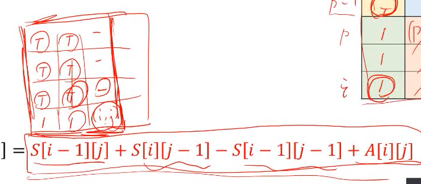
  - $s[i][j]= \sum^i_{x=1} \sum^j_{y=1}A[x][y]=s[i-1][j]+s[i][j-1]-s[i-1][j-1]+A[i][j]$

- 子矩阵和——$(p,q)$到$(ij)$

  - 
  - $$
    sum(p,q,i,j)=\sum^i_{x=p}\sum^j_{y=q}A[x][y]=s[i][j]-s[i][q-1]-s[p-1][j]+s[p-1][q-1]
    $$

### 实战例题：

- 304. 二维区域和检索 - 矩阵不可变， https://leetcode-cn.com/problems/range-sum-query-2d-immutable/ ， ==**老师给的模板**==，https://shimo.im/docs/vufyatCV6Vo1imT9/read

#### !! 304. 二维区域和检索 - 矩阵不可变

Question:


Answer:


Note: 把图记住，理解好就行了，不用死记公式的

## 2. 差分

### 基本知识点

- 一维数组A

- 差分数组B: $B_1=A_1,B_i=A_i-A_{i-1}(2<=i<=n)$

- B，A，S三个数组的关系和特点（见下图):

  1. S to A的关系即为A to B 的关系 (S是A的前缀和，A是B的前缀和)

  2. B -> A 的关系等价于A -> S的关系，（即B是A的差分数组，A是S的差分数组, 你对A求差分就得到B，对S求差分就可得到A)

  - 

### 差分的作用

讲**前缀和**时，要求的时一个数组subarray之和 ==》只求值，不修改 ==》然而，**差分**用于一些问题是要求修改数组之后，再做求和之类的运算 ==》查用于航班，订票之类的应用。

题目：求 array A经过多次变化后的，将最终变化值赋值于B，and return.

比如: B[1] = A[0][1] + A[1][1] = 1 ==》但如过这样暴力计算的话，我们需要遍历整个matrix，需要O(m*n)的时间

- 

- Answer:
  - 用差分数组的Idea: 对一数组求差分==》 再求其前缀和 ==》找回原数组。
  - 比如，A数组有类是于transformation matrix，需要进行差分的数 ==》 merge all change for matrix A, we will have B = A[0]+A[2] ==》 return 前缀和(B)
  - 注意到，对A[l, r] 数加 d, then we will have B[l]=B[l]+d, B[l+1, r]=0, and B[r+1] = B[r]-d. （就是B数组l位置上的数回加d，(l, r)中间会为0，然后B[r]位置会减d). 
  - 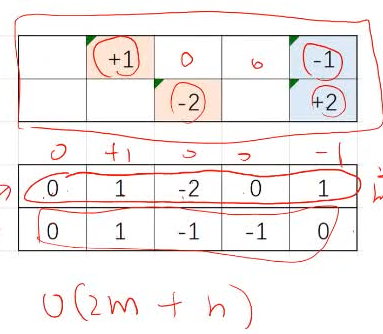

### 实战例题

- 1109. 航班预订统计，https://leetcode-cn.com/problems/corporate-flight-bookings/ ， ==**老师给的模板**==，https://shimo.im/docs/IuXdO0ink38n0gqv/read

#### !! 1109. 航班预订统计[medium]

Question:


Answer:

Python code:

```python
class Solution:
    def corpFlightBookings(self, bookings: List[List[int]], n: int) -> List[int]:
        # 构造差分数组，delta, 0~n+1
        delta = [0]*(n+2) # Need extra one for s[i-1], and another extra space for delta[r+1]
        for booking in bookings:
            first = booking[0]
            last = booking[1]
            seats = booking[2]
            delta[first] += seats
            delta[last+1] -= seats

        """
            航班编号        1   2   3   4   5   ?
            预订记录 1 ：   10      -10
            预订记录 2 ：       20     -20
            预订记录 3 ：       25              (-25)

            delta =    [0   10, 45, -10, -20, 0, -25]
            因此，answer =  [10, 55, 45,  25, 25]

            总座位数：      10  55  45  25  25
        """
        # 用前缀和来计算结果
        ans = [0]*(n+1) # 1~n+1
        for i in range(1, n+1): 
            ans[i] = ans[i-1] + delta[i]

        return ans[1:]
```

C++ code


#### 53 最大子序和[easy]

- 53 最大子序和， https://leetcode-cn.com/problems/maximum-subarray/

Question


Idea:

- 方法1:前缀 + 前缀最小值 pre_min

  - 求出前缀和数组S，枚举右点i, 需要找到i之前的一个j是的区间 (S[i] - S[j])最大。也就是固定S[i], 找最小的S[j]，再维护一个S的前缀最小值即可

  - 关键的是比较`ans = max(ans, s[i] - pre_min[i - 1]);` ==》你可以想象成前缀和就是原来数组的integration，你第一步要找的就是这个curve里的global min(每个pre_mins[i]的值，就是当前为止sum里的最小值) ==> 然后就可以遍历sum，找出 max(ans, sum[i]-pre_mins[i-1])
  - 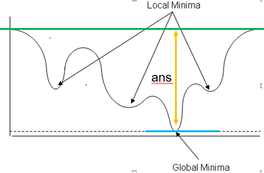
  - 做完这题你会发现，<u>“前缀和”的算法不只局限于求和，也可以扩展到前缀最小值，和最大值</u>。

- 方法2:动态规划

Answer:

Python code:

```python
class Solution:
    def maxSubArray(self, nums: List[int]) -> int:
        """
            方法一：前缀和+最小前缀和
			nums = [0, -2,  1, -3, 4, -1, 2, 1, -5, 4]
			sums = [0, -2, -1, -4, 0, -1, 1, 2, -3, 1]
        	pres = [0, -2, -2, -4, -4, -4, -4, -4, -4, -4]
        	ans = -1e10 ==> -2 ==> 1==> 4 ==> 5 ==> 6
        """
        nums = [0]+nums         #nums： 0, 1~n
        sums = [0]*len(nums)    #sums:  0,  1~n
        for i in range(1, len(nums)):	# 1~n
            sums[i] = sums[i-1] + nums[i]

        # Now, compute the 前缀最小值数组(前i个数的最小值, global min)
       	pre_mins = [0]*len(sums)
        pre_mins[0] = sums[0]
        for i in range(1, len(sums)):
            pre_mins[i] = min(pre_mins[i-1], sums[i])
        
        # Compute the final result
        ans = -1e10
        for i in range(1, len(nums)):
            ans = max(ans, sums[i] - pre_mins[i-1])
        return ans
    
    	# Note: 其实，这里不需要新建一个pre数组的，里面存的东西也都没用到。把注释的地方unfreeze掉，你会发现可以用一个prefix_min跟着ans一起跟新. 具体如下：
		ans = -1e10
        prefix_min = sums[0] 
        for i in range(1, len(nums)):
            ans = max(ans, sums[i] - prefix_min)
            prefix_min = min(prefix_min, sums[i])   # 跟新prefix_min
        
        """
            方法二：贪心算法
                Idea：只要“和”是正的，就不断向右扩展。一旦发现“和”是负的，就立即舍弃。
        """
```

C++ code:


### 思考：

- 差分这些操作对解决题目的影响是什么？why work?
  - Intuition: Because we are making some option on a subarray, from index l to r. 可以看到这些操作都是重复的，差分的作用就像是压缩信息，将这一系列的操作用一种简单的方法记录下来，and carry over to the end。最后通过求前缀和的方法将最终的影响累加起来，作为output。
  - 如如下矩阵，第一组的影响
    - 


## 3. 双指针扫描，滑动窗口
### 3.1 双指针扫描
用于解决一类**基于“子段”的统计问题**
子段：数组中连续的一段（下标范围可以用一个闭区间来表示）

这类题目的朴素做法都是两重循环的枚举，枚举左端点$l$，右端点$r(l<r)$
优化手法都是找到枚举中的冗余部分，将其去除

**优化策略通常有：**
- 固定右端点，看左端点的取值范围
  - 例如左端点的取值范围是一个前缀，可以用“前缀和”等算法维护前缀信息
- **移动一个断点，看另一个端点的变化情况**
  - 例如一个端点跟随另一个端点单调移动，类似与滑动窗口
    - 此时考虑”双指针“扫描
  - 或者左右端点相向/背驰移动

### 实战例题：

**一定要记得判断越界**:

```python
if (i>start and nums[i]==nums[i-1]) continue
```

- 167 两数之和II-输入有序数组[easy], https://leetcode-cn.com/problems/two-sum-ii-input-array-is-sorted/ ==**老师给的模板**== https://shimo.im/docs/i47HkK5OXbQmvloN/read

### !! 167 两数之和II-输入有序数组[easy]

Question:


Idea:

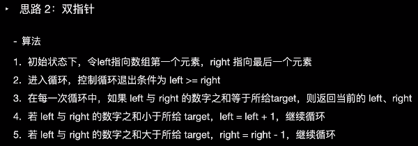

– Refers to, https://leetcode-cn.com/problems/two-sum-ii-input-array-is-sorted/solution/liang-shu-zhi-he-ii-shu-ru-you-xu-shu-zu-by-leet-2/

Python code:

```python
class Solution:
    def twoSum(self, numbers: List[int], target: int) -> List[int]:
        """
            方法二：双指针夹逼扫描
                Idea： 移动i，看j怎么变。就是for loop 一遍，固定i, 找到j使得 numbers[j] = target - numbers[i]。 因为给定的数组是按递增顺序排列的，所以可以从后往前移动j，来寻找target。两个指针就会往中间移动。Note: 返回的下表的下标要求从 1 开始计数。
                为什么只需要循环一次？==》因为1）数组是按递增顺序排列的，2）用双指针维护当前取值的范围，即通过调整i,j位置来确保numbers[i]+numbers[j]>target
                复杂度分析：
                    O(n) #==> 只遍历的数组一遍
        """
        j = len(numbers)-1 # j从右端开始，往中间移动
        for i in range(len(numbers)):
            while i<j and numbers[i]+numbers[j]>target: 
                j-=1
            if i<j and numbers[i]+numbers[j]==target:
                return [i+1, j+1]
        return []

    # Some good reference: https://leetcode-cn.com/problems/two-sum-ii-input-array-is-sorted/solution/liang-shu-zhi-he-ii-shu-ru-you-xu-shu-zu-by-leet-2/
```


C++ code:


## 4. 单调栈、单调队列
单调栈：
**思路**
- 确定递增递减——关键在于考虑“前面不能影响到后面”的条件
- 求最大面积的题中若`h[i-1] > h[i]`，则`h[i-1]`这个高度就无法影响到更后面，可单独计算

单调队列：

- 单调队列维护的是一个候选集合，前面的比较旧，后面的比较新（**时间的单调性**）
- 候选项的某个**属性也具有单调性**
- 确定递增递减的方法——考虑任意两个候选项$j_1<j_2$，写出$j_1$比$j_2$优的条件

==排除冗余的关键：若$j_1$比$j_2$差，$j_1$的生命周期还比$j_2$短，那$j_1$就没作用==


**代码套路**


- For 每个元素

  - (1)while（队头过期）队头出队 ==》检查合法性
  - (2)判断合法性，取队头为最佳选项，计算答案  ==》去答案
  - (3)while（队尾与新元素不满足单调性）队尾出队
  - (3)新元素入队

  （2）（3）的顺序取决于i是不是候选项


## 5.算法对比

**思考**

1. 为什么求“子段和”（窗口求和）可以用前缀和“
2. 为什么求”滑动窗口最大值“要用单调队列
3. 遇到一道跟”子段“（窗口）有关的题，什么时候用前缀和，什么时候用双指针扫描，什么时候用单调队列？

维护的信息是关于一个点的，还是一整个候选集合（多个点）的

- 前者用双指针扫描，后者单调队列

==区间减法性质==

- 指的是`[l,r]`的信息可以由`[1,r]`和`[1,l-1]`的信息导出
- 满足区间减法，可以用前缀和


思考

- 什么时候用前缀和？双指针？单调栈？
  - 维护的信息是只关于两个点的？==》双指针
  - 还是和一整个集合(多个点)都有关？==》单调队列? or 前缀和？
    - ==》如果有区间减法性质（指的是，一个区间的信息可以有两个端点的前缀和导出，即[l, r]的信息可以由[1, r] and [1, l-1]的信息推导出来) ==>这就可以使用前缀和


## 实战

### 1 两数之和-输入无序数组

https://leetcode-cn.com/problems/two-sum/

Question:


Idea:

- 新开二元组记录每个数和对应下标
- 排序——用上一题的模板，返回两个数
- 通过两个数去二元组插下标

Code:

```python
class Solution:
    def twoSum(self, numbers: List[int], target: int) -> List[int]:
        """
            方法一：暴力求解
                for i = 0~n-1
                    for j = i+1 ~ n-1
                        if(numbers[i] + numbers[j] == target)
                        return
                复杂度分析：
                    O(n^2)

            方法二：双指针夹逼扫描
                Idea： 移动i，看j怎么变。就是for loop 一遍，固定i, 找到j使得 numbers[j] = target - numbers[i]。 因为给定的数组是按递增顺序排列的，所以可以从后往前移动j，来寻找target。两个指针就会往中间移动。Note: 返回的下表的下标要求从 1 开始计数。
                为什么只需要循环一次？==》因为1）数组是按递增顺序排列的，2）用双指针维护当前取值的范围，即通过调整i,j位置来确保numbers[i]+numbers[j]>target
                复杂度分析：
                    O(n) #==> 只遍历的数组一遍
        """

        j = len(numbers)-1 # j从右端开始，往中间移动
        for i in range(len(numbers)):
            # 什么时候减小j？==》只要二者还没有相遇，且两者之后比target大，那就要试探性减小j，来找合适的[i，j]。
            # 什么时候停止减小j？==》发现两者之和已经减小到比target小了，但还没有正确结果，那说明，左边的i不对，这并没有对应的j来和它相加，使得结果等于target。这时就可以继续循环到下一个i，来寻找对应的j。
            # 注意：增大i ==》increase numbers[i], decrese j ==> decrease numbers[j] as well.
            while i<j and numbers[i]+numbers[j]>target: 
                j-=1
            # 什么时候返回？==》当i和j都还没相遇，且两者之和刚好等于target
            if i<j and numbers[i]+numbers[j]==target:
                return [i+1, j+1]

        return []   # 这题指定了肯定有解，所以shouldn't reach this line

    # Some good reference: https://leetcode-cn.com/problems/two-sum-ii-input-array-is-sorted/solution/liang-shu-zhi-he-ii-shu-ru-you-xu-shu-zu-by-leet-2/
```


### 15 三数之和

https://leetcode-cn.com/problems/3sum/

- 两数之和等于-i
- 一定要注意，题目要求不能重复
- 因此固定i调用两数只和的时候，要注意顺序`i<l<j`才可以；
- 这一题要求返回所有的数组，所以两数和定义`vector<vector<int>>`
- 注意对最后的输出去重，因为可能输入数组又重复元素

Code:

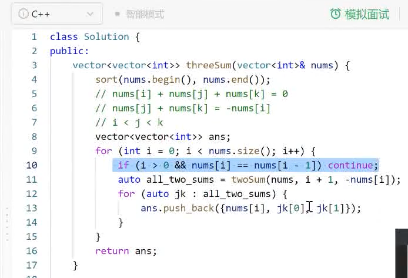

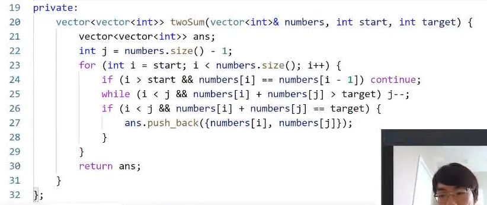

### !! 11 盛最多水的容器

https://leetcode-cn.com/problems/container-with-most-water/

**Question**

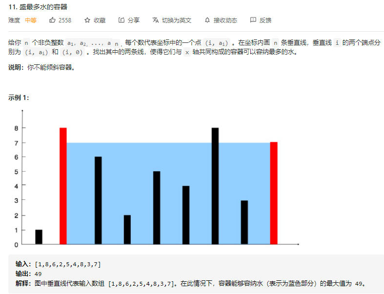

**Idea:**


**方法一：Brute Force**

```python
i<j
for i = 0~n-1
	for j=i+1 ~ n-1
    	ans = max(ans, i,j盛水)
        # ==> 找冗余来优化：
```

**方法二：双指针夹逼**

- initialize两个指针：i=0, and j = len(height)-1

- 通过比较height[i] and height[j]的长度来找冗余，进行优化：
  - 如果height[i]<height[j], 那对于i来说，j已经是最好的了，那就把这答案和ans比，然后存起来，然后i++，往里面找是否有更好的结果。
  - 对于j也一样，如果height[j]<height[i]，那对于j来说，i是当前最好的，j就没用了，就j- -, 继续把指针往里面移，找最好的答案

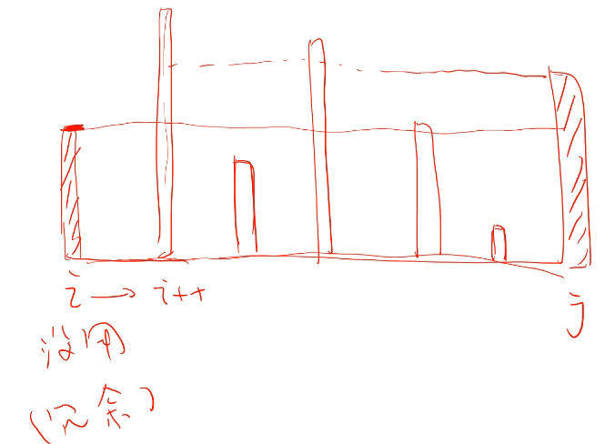

**Python Code:**

```python
class Solution:
    def maxArea(self, height: List[int]) -> int:
        """
        方法一：Brute Force
            i<j
            for i = 0~n-1
                for j=i+1 ~ n-1
                    ans = max(ans, i,j盛水)
        方法二：双指针
            ==> 找冗余来优化：
        """
        # 初始化两个指针的位置
        i, j  = 0, len(height)-1
        ans = 0
        while(i<j):
            ans = max(ans, min(height[i], height[j])*(j-i))
            if(height[i]<height[j]):
                i+=1
            else:
                j-=1
        return ans

    # Why min(height[i],  height[j]) ==>水桶的取水量是取决于长度最短的木桶的边
    # Why max(ans, min(...)) ==> 取容水量最大的最为最终答案
    # 如果有两个板具有相等长度，可以一起移嘛？(that is, can we do 'if(height[i]==height[j]) i++, j--;' ?) ==> yes, 相等的话，就说明这两都没用了(或者说用过的信息)，那就都往前移就好了。
```

C++Code:

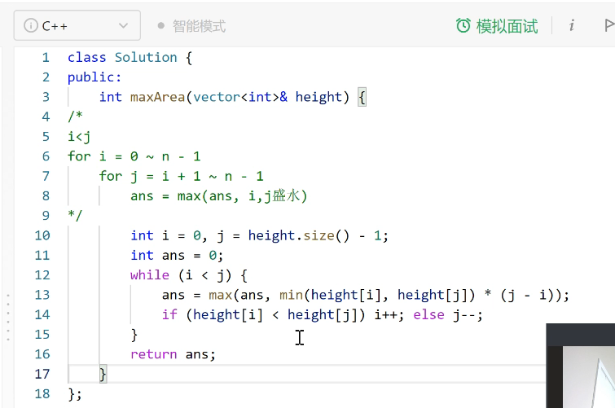


### 84 模板题-柱状图中最大的矩形–hard

- 84 模板题-柱状图中最大的矩形https://leetcode-cn.com/problems/largest-rectangle-in-histogram/

Question:

Idea:

先考虑下面这个模型

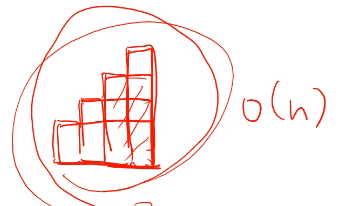

然后考虑如果向右还有一块板？如果更高那计算使用的高度会如何变化？如果更低呢？


- 观察到，向右延伸时，如果有一个比自己更矮的板块，那自己就会没用了，于是焦点转移. (就是前面比后面的板高的话，就没法向后延伸，那那块板就没用了，可以去掉) ==》就是始终要维持一个高度递增的趋势，如果有一个更低的，就把高度下价格到更低的那块。
- i前面如果有比i高的，他们如果想跨过i，那他们的高度就会变得和i一样（他们跨不过去).
-  1）update ans, 2)update conditional variable, 是否转移焦点位置？
- i什么时候会没用？

​    

- 新建栈
- 在数组最后添加0，在全部递增的情况下帮助弹栈
- for 每个元素
  - while（栈顶（上个元素）比新元素更高）{累加“宽度”，更新答案，弹栈}
  - 递增 入栈

Idea:

Code:


C++ Code:

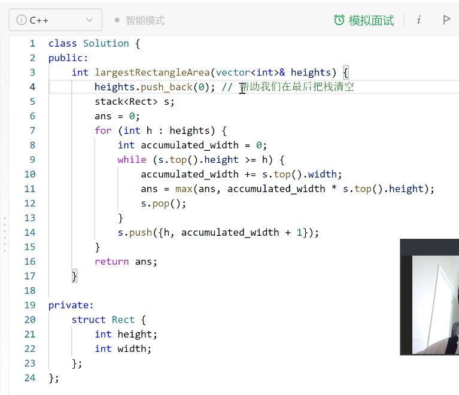

### 239 模板题-滑动窗口最大值–hard

239 模板题-滑动窗口最大值https://leetcode-cn.com/problems/sliding-window-maximum/

Question:

Idea:


Code：


- 双端队列，存下标（时间）
