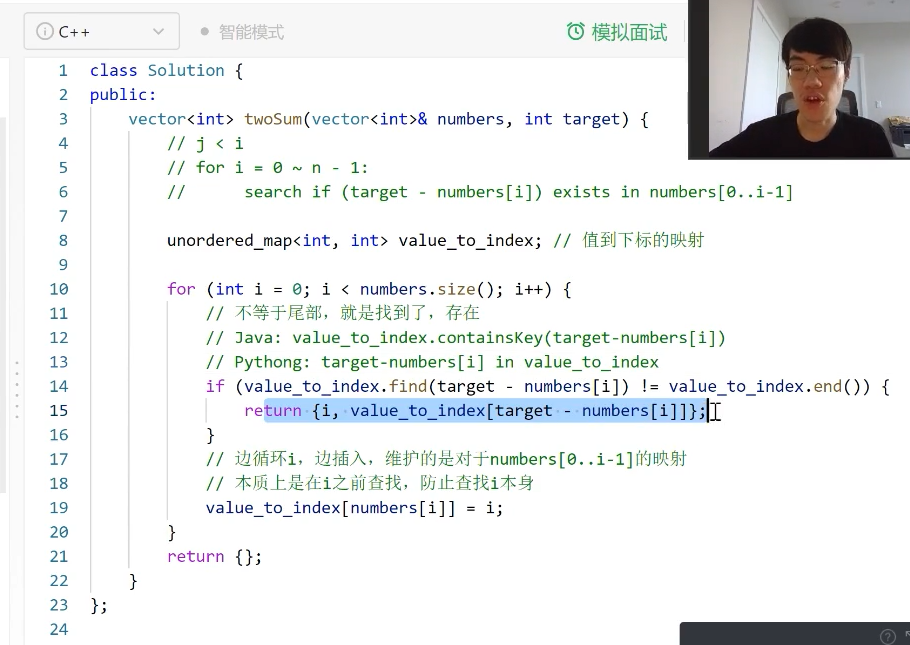
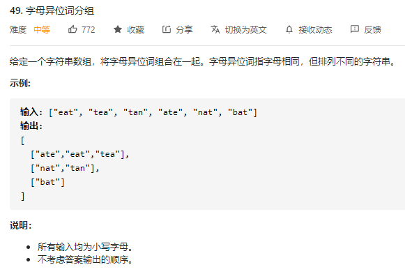
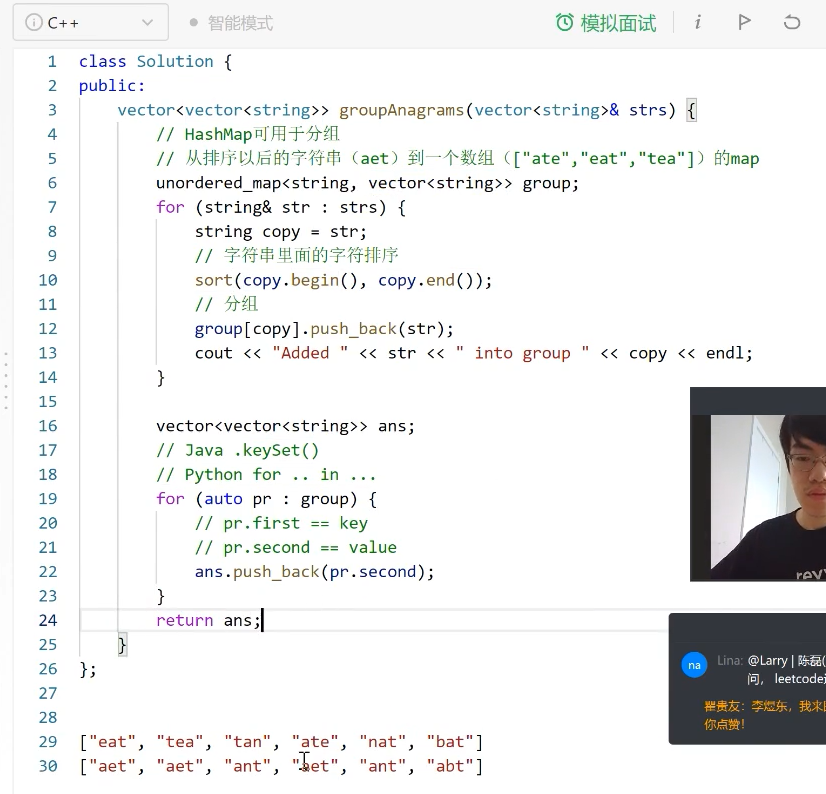
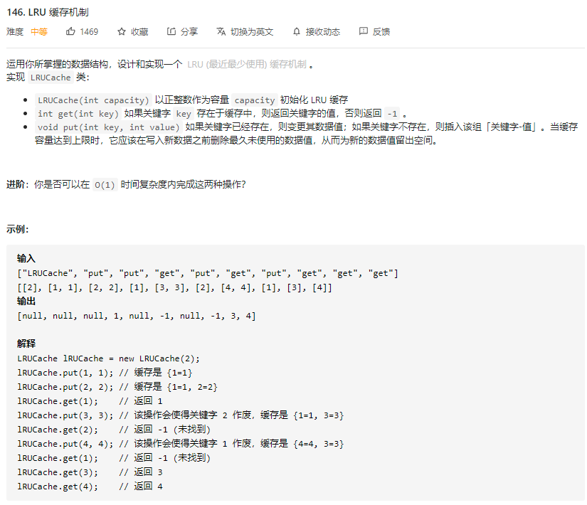

[TOC]

## 1. 哈希表

### 基本知识

哈希表(hash table)又称散列表，是一种可以通过“关键码”(key)直接进行访问的数据结构。哈希表由两部分组成: 1) **一个数据结构**: 通常是链表、数组， 2）**hash函数**: 输入“关键码”(key)，返回数据结构的索引


**例子：**如何hash一个字符串？==》 最简单的就是converting each char to its ASCII value, and sum up all their values, mod by certain value(depending on the buckets size). 


<u>Note: 面试一般就考你应用，实现的话理解就好了，很多语言都有对应的包可以用的。</u>

### **What make a good hash function?**

- Less Collision 
- Data are evenly distributed amount the buckets
- Fast running time

Note: 把复杂信息映射到小的值域，发生碰撞是不可避免的，好的hash函数可以减少碰撞发生的几率，让数组尽可能的均匀分布。The Hash collision is inevitable when mapping a large range of value into small set of buckets, but if all the data are putting into one bucket, then all other buckets are wasted. So, a good hash function can reduce the hash collision, and data are evently distributed amount the buckets. 

### Why mod a prime number?

一个数学问题 ==》overall, you will have less collision can happen.

### Chained Hash Tables(or 开散列, seperate chaining) vs Open-Addressed hashing:

**Chaining Method:** (出现碰撞，就用链表来解决。==》这样可以储存更多数据，不受HashTable size限制，但寻址时现需要一次内部的search, 数据如果分配均匀到还好，要是不均匀，最坏情况都在一个bucket, 那hashtable 也就成了个LinkedList)

Here the hash tables array maps to a linked list of items. This is efficient if the number of collision is fairly small. The worst case scenario is `O(n)` where n is the number of elements in the table.

**时间复杂度**

- 期望：插入、查询、删除O(1)
  - 数据分布比较均匀时
- 最坏：插入、查询、删除O(n)
  - 数据全部被映射为相同的hash值时

**Open Addressing with Linear Probe:** (遇到碰撞，就重新hash一次，直到找到下一个empty bucket，如果没有empty bucket, 就report error “hash table overflow”)

Here when the collision occurs, move on to the next index until we find an open spot. So, if the number of collision is low, this is very fast and space efficient. The limitation here is the total number of entries in the table is limited by the size of the array. This is not the case with chaining.


**Reference:**

- Stack Overflow, Chained Hash Tables vs. Open-Addressed Hash Tables, https://stackoverflow.com/questions/2556142/chained-hash-tables-vs-open-addressed-hash-tables
- 百度，开散列方法，https://baike.baidu.com/item/%E5%BC%80%E6%95%A3%E5%88%97%E6%96%B9%E6%B3%95
- GeeksforGeeks, https://www.geeksforgeeks.org/hashing-set-3-open-addressing/

### **开散列 ** – 其实就是chained hashing

- hash函数依然用于计算数组下标
- 数组的每个位置存储一个链表的表头指针（成为表头数组）
- 每个链表保存具有同样hash值的数据

形象描述：“挂链”——表头数组每个元素“挂”着一个链表。数组套链表

**开散列完整结构图**


### 工程应用

- 电话号码簿
- 用户信息表
- 缓存（LRU Cache）
- 键值对存储 (Redis)

## 2. 集合与映射

集合（set）存储不重复的元素

- 有序集合，遍历时按元素大小排列，一般用平衡二叉搜索树实现，O(logN)
- 无序集合，一般用hash实现，O(1)

映射（map）存储关键码（key）不重复的键值对（key-value pair）

- 有序集合，遍历时按照key大小排列，一般用平衡二叉搜索树实现，O(logN)
- 无序集合，一般用哈希表实现，O(1)

对于语言内置的类型（int , string），已经有默认的优秀的hash函数，可以直接放进set/map中使用


**C++ code**

set与unordered_set

- [文档](https://www.cplusplus.com/reference/unordered_set/unordered_set/)
- `Unordered_set<string> s;`
- `insert, find, erase, clear`等方法
- `multiset`

map与unordered_map

- [文档](https://www.cplusplus.com/reference/unordered_map/unordered_map/)
- `Unordered_map<string, int> h`
- `h[key] = value`
- `find(key), erase(key), clear`等方法
- `multimap`

Java Code:

Python Code:

- Set, https://www.runoob.com/python3/python3-set.html
  - `set = {'jack', 'selina', 'Andy'}`
- Dictionary/Map, https://www.runoob.com/python3/python3-dictionary.html
  - `map_a = {'Jack'=100, 'Candela'=90, '张三': 80}`

- Python Collection Library, https://docs.python.org/3/library/collections.html
- Python typing library, https://www.pythonsheets.com/notes/python-typing.html

## 实战

### 两数之和

1 两数之和, https://leetcode-cn.com/problems/two-sum/

Note: 之前我们用了two pointers 的方法，这次要用HashTable的方法 ==> 这个思路要比双指针更简单

**Question:**


**Idea:**

- 返回的index不在意顺序，所以可以不用管
- 储存和查询同时进行。

**Python Code:**

```python
 """
- 建立值到下标的映射
- 边循环查询，边插入，每次只查询i前面的映射
- 维护nums[0, i - 1]
- 防止查询到i本身
"""
    def twoSum(self, nums: List[int], target: int) -> List[int]:
        """
        方法二：HashTable
        """
        # j<i
        # for i = 0~n-1 # 枚举每一个 数字i
        #   search if (target - number[i]) exists in numbers[0..i-1]
        value_to_index = {} # 值与下标的映射
        # 便循环i，边插入，维护的是对于nums[0..i-1]的映射
        # 本质上是在i-1之前查找，防止查找到i本身
        for i in range(len(nums)):
            if (target-nums[i]) in value_to_index:
                return [i, value_to_index[target-nums[i]]]
            else:
                value_to_index[nums[i]] = i
```

C++ Code:




### !!! 模拟行走机器人–Easy

874 模拟行走机器人，https://leetcode-cn.com/problems/walking-robot-simulation/

```python
/*
- 可以用set或者map存储障碍物，从而快速判断一个格子里有没有障碍
- 利用方向数组简化实现(代替if)
*/
class Solution:
    def robotSim(self, commands: List[int], obstacles: List[List[int]]) -> int:
        """
            方法一：暴力
                - 因为the lenght of commands.length <= 10^4, and there are only 9 type of command, so the maximum length for command will just be pretty small. ==> So, it's find with brute force
                - 这题重点是判断一个格子是不是障碍物，以及如何处理，左转右转这些方向：1）第一个方案就是用集合或者映射(hash Table); 2) 第二个就是用方向数组来代替if。
                - 首先怎么知道一个格子是不是障碍物？==》 首先障碍物就是一些给定的坐标。==》 所以可以用a set of tuple to store those data points, e.g., {(x1, y1), (x2, y2)} ==> 
                - Ways to hash tuple: 
        """
        # 有些语言的库只支持对string or int做哈希，那怎么hash一个坐标点呢？==》 1) Conver to string, e.g., "-200, 30000"， 2）Convert to int, e.g., long long: (-200, 300) -->  (-200+30000, 300+30000) --> (-200+30000)*60000 + 300 + 30000 （这里就是自己定义一个hash function, 意在吧二位数组转化成一位unmutable integer。+30000 就是偏移量，因为hash value不能是负数。*60000是x,y的最大偏移量。然后把x,y的范围从 -30000<x, y<30000 ==> 改成 0<x, y<30000， 然后再做一次变化，使得==> (x+30000)*60000 +(y+30000) ==> 无所谓，不需要理解，就是个hash function，不喜欢自己改掉或者直接掉包都行
        blocker_dicts = set(map(tuple, obstacles))
        # for obs in obstacles:
        #     blocker_dicts.add((obs[0], obs[1]))
        print(blocker_dicts)

        # 定义方向数组 ==> 从北开始，顺时针方向
        #       N, E, S, W
        dir_x = [0, 1, 0, -1]
        dir_y = [1, 0, -1, 0]
        dir = 0     # indicate the direction code, where 0<dir<3
        x, y = 0, 0 # denote as robot's current position
        ans = 0     # denote as the largest euclidean distance
        for cmd in commands:
            if cmd>0:   # For moving command
                for i in range(cmd):
                    # 尝试走到nextx, nexty
                    # 想向dir走一步，就加dir方向一步的偏移量
                    nextx = x + dir_x[dir]
                    nexty = y + dir_y[dir]
                    # 如果踩到了有障碍物，就跳过
                    if (nextx, nexty) in blocker_dicts:
                        break
                    else:
                        x, y = nextx, nexty
                        ans = max(ans, x**2+y**2)
            elif cmd == -1: # 向右转90度
                dir = (dir+1) % 4   
                # N->E->S->W->N
                #  0->1->2->3->0 
            else: # 向左转90度,
                dir = (dir-1 + 4) % 4
                # 左转，避免负数，加一个mod数
        return ans

        # 复杂度分析
        #   时间复杂度：O(N + K)，其中 N, K 分别是 commands 和 obstacles 的长度。
        #   空间复杂度：O(K)，用于存储 obstacleSet 而使用的空间。
```


### 字母异位词分组

49 字母异位词分组，https://leetcode-cn.com/problems/group-anagrams/

Question:



Idea:

Python Code:

```python
class Solution:
    def groupAnagrams(self, strs: List[str]) -> List[List[str]]:
        """
            方法一：HashMap/Dict
            这题的关键就是用hashmap来分组。观察输入，与输出的实例，可以注意到，同一组的字符串就是顺序不一样。所以，经过排序后，相同顺序的字符串会在同一组。e.g., ["ate","eat","tea"] ==> "aet"
            ==> 因此可以定义一个从str 到 List[str]的映射，e.g., "aet"==>["ate","eat","tea"]
            ==> Implementation: 
                1) Iterate over the strs, to build a HashMap: str ==> List[str]
                2) Iterate over the HashMap, and store the data to a List[List[str]] 
            
            方法二：用长度为26的计数数组，来统计每个字符串中每个字母出现的次数，然后作为key来存, map<array<26, int>, group>, python 里就是 key: tuple => value: list[str] 
        """
        str_group = collections.defaultdict(list)
        for str in strs:
            key = ''.join(sorted(str))
            str_group[key].append(str) 
            print(f"Added str: {str} into group: {key}")
        
        ans = []
        for group in str_group:
            ans.append(str_group[group])
        return ans

# ===============下面是别人的高解
"""
        mp = collections.defaultdict(list)
        for st in strs:
            key = "".join(sorted(st))
            mp[key].append(st)
        
        # Return the HashMap as a list of list   
        return list(mp.values())

# 作者：LeetCode-Solution
# 链接：https://leetcode-cn.com/problems/group-anagrams/solution/zi-mu-yi-wei-ci-fen-zu-by-leetcode-solut-gyoc/

"""
```


C++ Code:




### 串联所有单词的子串–Hard

30 串联所有单词的子串，https://leetcode-cn.com/problems/substring-with-concatenation-of-all-words/

Question:


Idea:

这题和前一天很相似。前一题是不管char的顺序，然后对一串char进行排序。==》 而这题一串word的顺序，然后对一串单词进行排序

Python Code:

```python
from collections import Counter
class Solution:
    """
    方法一：枚举字串里的所有起始位置
        ==》 O（len(s)*len(one_word) )
    """
    # 不要把所有的code都放到一个function里，要学会modularize（模块化)
    def findSubstring(self, s: str, words: List[str]) -> List[int]:
        ans = []
        # 这题解法的重点就是要用HashTable + 统计思想 + 滑窗 ==》 所以先把正确的map打出来：correct_map<word: str, count: int>
        correct_map = {x:words.count(x) for x in words}
        # print(correct_map)
        # 枚举开始位置，考虑所有可能的子串
        window_size = len(words[0])*len(words) # length_of_single word * # of words
        m = len(words[0])   #  每个单词的长度
        for i in range(len(s)-window_size+1):
            if(self.is_same(s[i:i+window_size], correct_map)):
                ans.append(i)
        return ans 

    # 想判断一个字符串是否由words拼成, 把字串分解成若干个单词，然后看跟给定的dict是否相同（顺序无关）, e.g., is "foobar" made of ["foo", "bar"]？
    def is_same(self, substr: str, correct_map: Dict[str, int]) -> bool:
        # return a dict<s: str, count: int>, e.g., ["foo", "bar"] ==> {"foo": 1, "bar": 2}
        cur_map = collections.defaultdict(int)
        m = len(list(correct_map.keys())[0])
        # 把t，每m个字符分解成一个单词, e.g., foothe 分解为 foo, the
        for i in range(0, len(substr), m):
            cur_map[substr[i:i+m]] += 1
        # print(f"cur_map: {cur_map}, correct_map: {correct_map}")
        return self.is_equal(cur_map, correct_map)

    # 判断两个map是否一样的方法:1) 先比较size，再看a是否是b的subset; 2) if a is subset of b and b is subset of a, then a == b
    # a.size() == b.size()
    # a里面有的b里全有，且值一样
    def is_equal(self, a: Dict[str, int], b: Dict[str, int]) -> bool:
        if len(a)!= len(b):
            return False
        for key in a.keys():
            if key not in b.keys() or a[key]!=b[key]:
                return False        
        return True


    """
    方法二：美剧部分起始位置+滑动窗口
        ==》 O（len(s)*len(one_word) )
    """
    def findSubstring2(self, s: str, words: List[str]) -> List[int]:
        ans = []
        # 这题解法的重点就是要用HashTable + 统计思想 + 滑窗 ==》 所以先把正确的map打出来：correct_map<word: str, count: int>
        correct_map = {x:words.count(x) for x in words}
        word_len = len(words[0])
        total_len = word_len * len(words)
        for i in range(word_len):
            if i+total_len>len(s):
                break
            # 搭建current substring's word map
            s_map = collections.defaultdict(int)
            cur = i
            for i in range(len(words), word_len):
                s_map[s[i:i+m]]+=1

            start, end = i, cur
            while(start+total_le n<=n):

                start+=m
                end+=m

    # 想判断一个字符串是否由words拼成, 把字串分解成若干个单词，然后看跟给定的dict是否相同（顺序无关）, e.g., is "foobar" made of ["foo", "bar"]？
    def is_same(self, substr: str, correct_map: Dict[str, int]) -> bool:
        # return a dict<s: str, count: int>, e.g., ["foo", "bar"] ==> {"foo": 1, "bar": 2}
        cur_map = collections.defaultdict(int)
        m = len(list(correct_map.keys())[0])
        # 把t，每m个字符分解成一个单词, e.g., foothe 分解为 foo, the
        for i in range(0, len(substr), m):
            cur_map[substr[i:i+m]] += 1
        # print(f"cur_map: {cur_map}, correct_map: {correct_map}")
        return self.is_equal(cur_map, correct_map)

    def is_equal(self, a: Dict[str, int], b: Dict[str, int]) -> bool:
        if len(a)!= len(b):
            return False
        for key in a.keys():
            if key not in b.keys() or a[key]!=b[key]:
                return False        
        return True
```


C++ Code:


### !!! 146. LRU 缓存机制–Medium-高频题

- 146. LRU 缓存机制， https://leetcode-cn.com/problems/lru-cache/， ==**老师给的模板**== https://shimo.im/docs/VrZCLACWhc8IoDTH/read

Code:

```python
class LRUCache(object): 
	def __init__(self, capacity): 
		self.dic = collections.OrderedDict() 
		self.remain = capacity

	def get(self, key): 
		if key not in self.dic: 
			return -1 
		v = self.dic.pop(key) 
		self.dic[key] = v   # key as the newest one 
		return v 

	def put(self, key, value): 
		if key in self.dic: 
			self.dic.pop(key) 
		else: 
			if self.remain > 0: 
				self.remain -= 1 
			else:   # self.dic is full
				self.dic.popitem(last=False) 
		self.dic[key] = value
```


## 作业

### !!! 146. LRU 缓存机制–Easy

- [146. LRU 缓存机制](https://leetcode-cn.com/problems/lru-cache/)

Question:



Code:

```python
class LRUCache(object):
    # 模板答案: 
    # 思路的重点就是找到一个“具有时间顺序的数据结构”，能够像Queue一样维持数据顺序，且能像Dict一样快速loopup, delete, and insert
    def __init__(self, capacity):
        self.dic = collections.OrderedDict()
        self.capacity = capacity
        
    def get(self, key):
        # If key doesn't exist
        if key not in self.dic:
            return -1 
        # Key exist
        v = self.dic.pop(key)
        self.dic[key] = v   # update key as the newest one 
        return v 

    def put(self, key, value): 
        # If key already exist
        if key in self.dic:
            self.dic.pop(key)
            self.dic[key] = value
        else:
            self.dic[key] = value
        if len(self.dic) > self.capacity:
            self.dic.popitem(last=False)   
        # Note: OrderedDict popitem removes the items in FIFO(like a queue) order. It accepts a boolean argument last, if it’s set to True then items are returned in LIFO order.

# 因为python里有一种collections.OrderDict()的dict可以维持时间顺序，所以不需要linked list
# ============下面是普通版本的解法
class LRUCache1:
    """
        Data Strcutre: Hashtable<key: int, value: Node>  + Doubly Linked List
        # Why Hashtable? ==> 主要用来实现一个从key to DLL's Node的映射. 另外，it supports O(1）for lookup, insert, delete
        # Why DLL? ==> Dict没有时间观念，所以要用DLL来维护时间顺序。另外，因为需要中间删除，所以要用双向链表，而不是单向的，或者栈这些数据结构
    """
    def __init__(self, capacity: int):
        # Initialize the capacity and the HashTable that use to store datas
        self.capacity = capacity
        self.map = {}   # map<value: int, node: Node>
        # Initialize 带有保护节点的双向链表
        self.head = Node()
        self.tail = Node()
        self.head.next = self.tail
        self.tail.pre = self.head
        
    # 就考虑两种情况：1）不存在；2）存在
    def get(self, key: int) -> int:
        if key not in self.map: # 不存在的情况 ==》题目要求，返回-1
            return -1
        # 存在的情况：直接从map里拿出啦，然后返回其value。因为我们选用了DLL来维护时间顺序，所以还用从把对应的Node移到最前面
        node = self.map[key]
        result = node.value
        self.remove_from_list(node)
        self.insert_to_list_head(node.key, node.value)
        return result
    
    # 一样的，考虑两种情况：1）存在，2）不存在
    def put(self, key: int, value: int) -> None:
        # 存在的情况：啥都不用改，直接update时间顺序就好了
        if key in self.map:
            node = self.map[key]
            self.remove_from_list(node)
            self.insert_to_list_head(key, value)
        else: # 不存在，就加入到map 和双链表里
            self.insert_to_list_head(key, value)
        
        if len(self.map)>self.capacity:
            self.remove_from_list(self.tail.pre)

    # 从DLL里移除一个node，就是直接把他pass掉就好了
    def remove_from_list(self, node):
        node.pre.next = node.next
        node.next.pre = node.pre
        del self.map[node.key]
        # self.map.pop(node.key)

    def insert_to_list_head(self, key, value):
        node = Node(key, value)
        # node 与 下一个点先建立关系
        node.next = self.head.next
        node.next.pre = node
        # node再与head建立关系
        node.pre = self.head 
        self.head.next = node
        # synchronize the map as well
        self.map[key] = node
        return node

class Node:
    def __init__(self, key=None, value=None, pre=None, next=None):
        self.key = key
        self.value = value
        self.pre = pre
        self.next = next


# Your LRUCache object will be instantiated and called as such:
# obj = LRUCache(capacity)
# param_1 = obj.get(key)
# obj.put(key,value)
```


### !!! 811. 子域名访问计数

- [811. 子域名访问计数](https://leetcode-cn.com/problems/subdomain-visit-count/)

  Question

  

  Code:

```python
class Solution:
    def subdomainVisits(self, cpdomains: List[str]) -> List[str]:
        """
            这题考察的有三个点：1）意识到要用HashTable的映射来解题；2）熟练掌握str和dict之间的转化；3)了解collections里可用的包
        """
        ans = {}    # Or ans = collections.Counter()
        for text in cpdomains:
            count, domain = text.split(' ') # "9001 discuss.leetcode.com" => "9001" and " discuss.leetcode.com"
            count = int(count)  # "9001" => 9001
            fragments = domain.split('.')   # "discuss.leetcode.com" => ['discuss', 'leetcode', 'com']
            for i in range(len(fragments)): # ['discuss', 'leetcode', 'com'] => {'discuss.leetcode.com': 9001, 'leetcode.com': 9001, 'com': 9001})
                key = '.'.join(fragments[i:])
                if key not in ans:
                    ans[key]=count
                else:
                    ans[key]+=count
                # ans[key] += count ==> Use this if you declared ans with collections.defaultdict(int)
        print(ans)
        return [f"{value} {key}" for key, value in ans.items()]

# 复杂度分析
# 时间复杂度：O(N)，其中 N 是数组 cpdomains 的长度，这里假设 cpdomains 中每个元素的长度都是常数级别的。
# 空间复杂度：O(N)，用于存储哈希映射。

```


## set、map的使用及其特性和区别

STL总共实现了两种不同结构的管理式容器：树型结构与哈希结构。树型结构的关联式容器主要有四种：set，map，multiset，multimap。下面介绍一下这四种容器的简单使用。

### 1.set
set里面每个元素只存有一个key值，它支持高效的关键字查询操作，比如检查一个关键字是否在set中。如果这个key值之前存在的话就不插入。

简单使用如下：
**插入：**
```C++
set<int> s;
	s.insert(2);
	s.insert(1);
	s.insert(4);
	s.insert(5);
	s.insert(3);
	s.insert(5);
	s.insert(5);
	s.insert(5);
	s.insert(5);
	s.insert(5);
	for (auto e : s)
	{
		cout << e << " ";
	}
	cout << endl;
```
插入如上数据之后，打印出来的值为1 2 3 4 5。set容器自动对以上数据进行了排序，并且实现了去重。但是不能对set里的值进行修改。

**查找：**
```C++
//时间复杂度：O(logN)----底层是搜索树
set<int>::iterator pos = s.find(3);
//时间复杂度：O(N)----需要遍历一遍（不建议使用）
//set<int>::iterator pos = find(s.begin(), s.end(), 3);
if (pos != s.end())
{
	cout << "找到了" << endl;
```
set容器中的find查找效率高，因为底层是一个二叉搜索树，比要查找的值小就去左子树查找，反之则去右子树查找。

**删除：**
```C++
//s.erase(3);
s.erase(pos);//找到了我就删，没找到要删的话会报错
```
采用s.erase(3);这种操作如果没有3并不会报错，如果有3则会删除这个结点。
找到pos位置，采用s.erase(pos);这种操作如果没有3则会报错，如果有3则会删除这个结点。

**交换：**
```C++
set<int> ss;
ss.insert(6);
ss.insert(9);
ss.insert(8);
ss.insert(7);
ss.insert(10);

ss.swap(s);//交换根节点的指针，效率高
```
两个set的交换的其实是交换结点的指针，效率高。

**清空：**
```C++
s.clear();//清掉所有数据
```
**遍历方法：**
```C++
//新式for循环
for (auto e : s)
{
	cout << e << " ";
}
cout << endl;

//迭代器遍历
set<int>::iterator sit = s.begin();
while (sit != s.end())
{
	cout << *sit << " ";
	sit++;
}
cout << endl;
```
推荐大家使用新式for循环~比较简单一些٩(๑❛ᴗ❛๑)۶

### 2. multiset
其实整体的接口和set都相同，但是multiset可以插入key相同的值。
```C++
multiset<int> ms;
ms.insert(2);
ms.insert(1);
ms.insert(4);
ms.insert(5);
ms.insert(3);
ms.insert(5);
ms.insert(5);
ms.insert(5);
ms.insert(5);
ms.insert(5);

for (auto e : ms)//可以重复插入相同key值
{
	cout << e << " ";
}
cout << endl;

auto pos = ms.find(5);
if (pos != ms.end())
{
	cout << "找到了" << endl;//找到的是中序的第一个5
	while (*pos == 5)//往后继续找可以找到后面所有的5
	{
		cout << *pos << endl;
		++pos;
		if (pos == ms.end())//pos指向最后一个的下一个
			break;
	}
}

--pos;//倒数第一个5
ms.erase(pos);

for (auto e : ms)//可以重复插入相同key值
{
	cout << e << " ";
}
cout << endl;
```
multiset允许key的冗余，如果用find查找key值时，找到的是中序遍历第一个，因此不断遍历下午可以找到这个multiset里所有的key值。

multiset和set一样不能够对数据进行修改。

### 3.map
有别于set的是，map是一种key(键),value(值)的形式，用来保存键和值组成的集合，键必须是唯一的，但值可以不唯一。里面的元素可以根据键进行自动排序，由于map是key_value的形式，所以map里的所有元素都是pair类型。pair里面的first被称为key(键），second被称为value(值）。

它可以通过关键字查找映射关联信息value，同时根据key值进行排序。

相关类型的返回值
```C++
//成员类型	含义
key_type	The first template parameter (Key)
mapped_type	The second template parameter (T)
value_type	pair<const key_type,mapped_type>
```
简单的使用如下：
**插入：**
```C++
map<string, string> dict;
dict.insert(pair<string, string>("string", "字符串"));//模板类型pair：构造了一个匿名对象插入到map
dict.insert(make_pair("apple", "苹果"));//模板函数make_pair：偷懒了，实际调的是pair
dict.insert({ "left", "左边" });
dict.insert({ "left", "剩余" });//插入不进去了，因为key值已经有了
```
插入有三种方法：

采用创建pair的形式插入pair<string, string>("string", "字符串")
采用make_pair的形式进行插入make_pair("apple", "苹果")
采用大括号的形式进行插入{ "left", "左边" }
**遍历方法：**
```C++
//新式for循环
for (const auto &e : dict)
{
	cout << e.first << ":" << e.second << endl;
}
cout << endl;

//迭代器遍历
map<string, string>::iterator mit = dict.begin();
while (mit != dict.end())
{
	cout << mit->first << ":" << mit->second << endl;
	cout << (*mit).first << ":" << (*mit).second << endl;
	mit++;
}
```
打印出来为：（根据key值进行了排序和key值的去重）

```C++
operator[ ]：
// operator[]可以通过key值找到对应的value值。并且还可以使用operator[]插入数据。

dict["banana"];
// 如上，插入一个pair，这个pair的key值为“banana”，value为空字符串(\0)

dict["key"] = "关键字";
// 如上，插入一个pair，这个pair的key值为“key”，value为“关键字”

dict["left"] = "剩余";
// 如上，因为本来map里“left”这个key值，所以operator[]找到了这个key值，将它的value改成“剩余”。
```

### 4.multimap
```C++
// multimap允许key值的冗余，因此key值相同也可以进行插入。

multimap<string, string> mmp;
mmp.insert(pair<string, string>("left", "左边"));
mmp.insert(make_pair("key","关键字"));
mmp.insert({ "map", "地图" });
mmp.insert({ "left", "剩余" });

for (const auto &e : mmp)
{
	cout << e.first << ":" << e.second << endl;
}
```


**set和map特性和区别**
set是一种关联式容器，其特性如下：

- set以RBTree作为底层容器
- 所得元素的只有key没有value，value就是key
- 不允许出现键值重复
- 所有的元素都会被自动排序
- 不能通过迭代器来改变set的值，因为set的值就是键
- map和set一样是关联式容器，它们的底层容器都是红黑树，区别就在于map的值不作为键，键和值是分开的。它的特性如下：

  - map以RBTree作为底层容器
  - 所有元素都是键+值存在
  - 不允许键重复
  - 所有元素是通过键进行自动排序的
  - map的键是不能修改的，但是其键对应的值是可以修改的