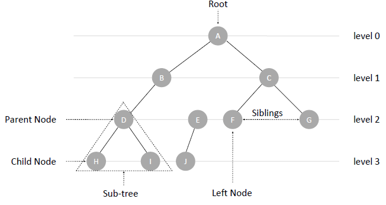
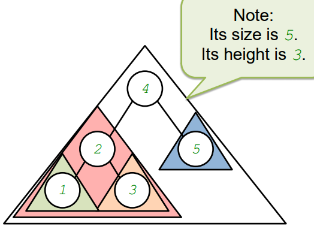
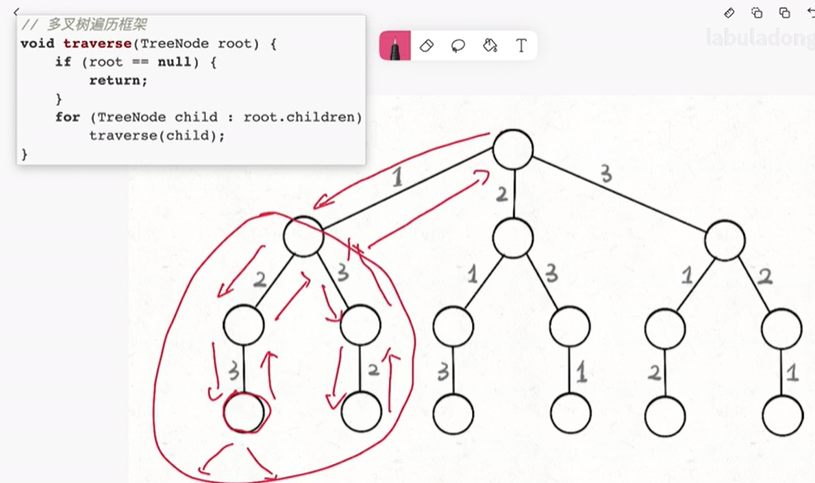
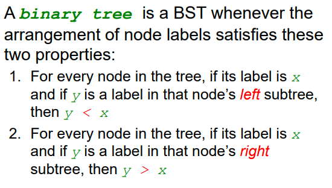
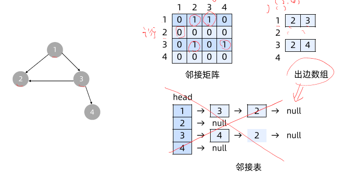
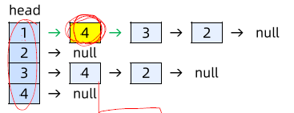
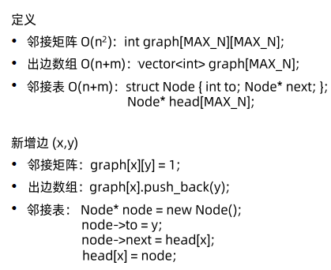
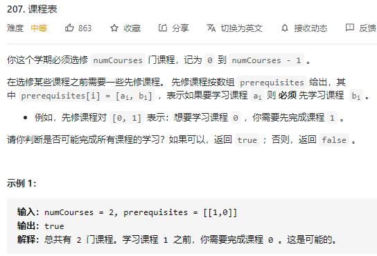
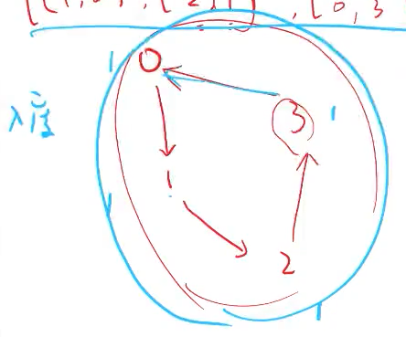
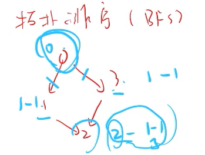

[TOC]
# 1. 树、二叉树、树的遍历、树的序列化


## 树

- Some common terminology: Root, Parent Node, Child Node, Sibling, Sub-tree, Left-Node



- How to define a TreeNode in different language?


## 二叉树 Binary Tree

基础知识点：

- Height of a Binary Tree: the height of a binary tree is <u>the number of node(有的题目会说是edge，要注意看题) on the longest path from the root to a leaf</u>.
  - 
- 完全二叉树(Complete Binary Tree) vs 近似完全二叉树(Nearly complete binary tree)：
  - A complete Binary Tree is a binary tree where 1) All the internal nodes have EXACTLY two children; 2)and all leaves are at the same distance from the root.
  - 
- 树如何遍历？遍历的重点就在于用递归的方式来实现
  - 下图就是多叉树的遍历。可以看到，从每一个叶子节点到根节点之间的路径，都是我们想要的全排列，也就是我们需要存储的东西。这个例子的结束条件是当 ‘root == None‘, 也就是当节点没有child node时。
  - 

Property of BST(Binary Search Tree)



- Example：
  - case1: Property 1 is violated, 2(left)>1
  - case2: Property 1 is violated, 4(left) > 3
  - case3: property 2 is violated, 3 < r(right)


http://web.cse.ohio-state.edu/software/2231/web-sw2/extras/slides/12.Binary-Search-Trees.pdf

## 树的遍历 

Binary Tree Traverse Order:

- **Pre-order:** root is visited **before** left and right
- **In-order:** root is visited **between** left and right
- **Post-order**: root is visited **after** left and rigth


二叉树（子节点<=2）；满二叉树；完全二叉树
**定义树的节点**

```C++
struct TreeNode{
    int val;
    TreeNode *left;
    TreeNode *right;
    TreeNode(int x)
        : val(x), left(nullptr), right(nullptr){}
}
```
**递归的本质**
- 自己调用自己，不要一直想着最后一层
- find(root) = root + find(left) + find(right)

**二叉树的遍历**
1. 前序遍历Pre-order: 根 - 左子树 - 右子数
2. 中序遍历In-order: 左子树 - 根 - 右子数
3. 后序遍历Post-order: 左子树 - 右子树 - 根
4. 层次序

**树的遍历**
- 先序、中序、后序一般用递归求
- 树的先序遍历又称树的深度优先遍历
- 层次序一般借助队列实现
- 树的层次序遍历又称树的广度优先遍历
  - 父节点出队，子节点入队
- 

# 2. 树的直径、最近公共祖先


# 3. 树的变形（基环树）

概念：基环树，就是像一棵树添加一条边，就形成了一个环。此时整个结构就被称为基环树(aka, pseudo tree / unicyclic graph)A


# 4. 图、图的遍历、拓扑排序
**链表、树、图的关系**


链表是特殊化的树, 树是特殊化的图

- N个点N-1条边的连通无向图——树
- N个点N条边的连通无向图——基环树


**图存储的三种方式**



1. 邻接矩阵`[i, j]`，空间复杂度`o(n^2)`
2. 出边数组`vector<vector>`，空间复杂度`o(点数+边数)`
3. 邻接表(知道就行了,一般不会用)

邻接表和出变数组差不多的，但也有些微笑

- insert：如果是在第一个位置加，那两个种方式都很快，都是O(1), 但如果在最后insert，邻接表就需要遍历到linked list的尾部，所以是O(n)
- delete: same as insert
- look_up: 出边数组是O(1)， and 邻接表是O(n)

总的来说出边数组就是用以个数组来记录每一个节点的children Node, and邻接表用的就是一个linked list. 但总的来说，出边数组操作速度会更快，所以一般首选出边数组。

Note: 出边数组和邻接表理念上是一样的, 就像OS里学的multi-index table 一样, 出边数组的每一个点points to another list, and 邻接表上的每一个点points to a linked list. 在添加新的node时,因为order doesn’t matter, so you can append to the end, or insert in front, whatever is convenient for the underlying data structure.

## 要注意的几个问题:

如何加边?

- 矩阵:改0成1
- 出边数组:在对应点的list上append那个新加的点
- 邻接表: 在对应的点的表头插入那个新加的点
- 

无向图如何存储呢?

- 把所有的的边都看作双向边来存 
- 

每一条边若都带有长度/距离信息的话,该怎么存呢?

- 矩阵: 每一格表示的binary value(0/1)的值域, 扩充到positive integer; 空间复杂度 ==> O(N^2)
- 出边数组: 原来每一个数组里的node.val: int 就改成 一个class, or tuple, of another list, that can contain a little bit more information; 空间复杂度 ==> O(N+ M), where n is the number of nodes, and M is the number of edges
- 邻接表: 同上; 空间复杂度 ==> O(N+ M), where n is the number of nodes, and M is the number of edges


如何判断一个图是否有环？==> 从一个点开始，最后有返回到了他自己. 

==> 注意，一个点可以被重复访问过，而且不成环

==> 那如何判断呢？

==> 父亲点可以被重复访问，但


- 

通过dfs，会产生一颗搜索树，如下图，


有权值的图

- 邻接矩阵直接存权值
- 出边数组存`{node, val}，pair<node, val>`


# Reference:

- OSU Glossary of Software Terms, http://web.cse.ohio-state.edu/~patel.2004/Glossary/HTML_Files/leaf_node.html
- MY KB, https://drago1234.github.io/Knowledge_Bank/docs/2019_fall/cse2331/scanned_file/09_binary_trees.pdf

# 实战
### 94 二叉树的中序遍历

94 二叉树的中序遍历, https://leetcode-cn.com/problems/binary-tree-inorder-traversal/

Questions

Idea:

Python Code:

```python
# Definition for a binary tree node.
# class TreeNode:
#     def __init__(self, val=0, left=None, right=None):
#         self.val = val
#         self.left = left
#         self.right = right
class Solution:
    def inorderTraversal(self, root: TreeNode) -> List[int]:
        self.ans = []
        self.traverse(root)
        return self.ans

    def traverse(self, root):
        if root == None:
            return
        
        self.traverse(root.left)
        self.ans.append(root.val)
        self.traverse(root.right)
```


### 589 N叉树的前序遍历

589 N叉树的前序遍历, https://leetcode-cn.com/problems/n-ary-tree-preorder-traversal/

Questions

Idea:

Code:

```python
class Solution:
    def preorder(self, root: 'Node') -> List[int]:
        ans = []
        stack = []
        stack.append(root)
        while stack:
            cur_node = stack.pop()
            # The base case
            if cur_node == None:
                return
            # Collect ans at cur_node
            ans.append(cur_node.val)
            # Take care childrens
            for i in range(len(cur_node.children), 0, -1):
                stack.append(cur_node.children[i-1])
            
        return ans
```


### 429 N叉树的层序遍历

429 N叉树的层序遍历, https://leetcode-cn.com/problems/n-ary-tree-level-order-traversal/

Questions

Idea:


Python Code:

```python
"""
# Definition for a Node.
class Node:
    def __init__(self, val=None, children=None):
        self.val = val
        self.children = children
"""
class Solution1:
    def levelOrder(self, root: 'Node') -> List[List[int]]:
        """
            方法一：
            用一个HashTable 来存一个点到深度的映射, e.g., {0: [1], 1: [3,2,4], 2: [5,6]}
        """
        self.ans = []
        self.hashTable = collections.defaultdict(list)
        self.traverse(root, 0)
        return list(self.hashTable.values())

    def traverse(self, root, depth: int):
        if root == None:
            return
        self.hashTable[depth].append(root.val)
        for child in root.children:
            print(f"child_val: {child.val}")
            self.traverse(child, depth+1)


class Solution2:
    def levelOrder(self, root: 'Node') -> List[List[int]]:
        '''
            方法二：BFS的思路
            遍历完一遍后，就建造出这样的东西，q = [[1, 0], [3, 1], [2, 1], [4, 1], [5, 2], [6, 2]], e.g., [1, 0]中，1是node.val, and 0就是这点所在的深度。
        '''
        # take care root为None的case
        if root == None:
            return

        ans = []    # a list of integer list, each elemnet match its depth in the tree, 这个就是要返回的东西。
        queue = collections.deque()  # 因为这里用的是广度优先搜索遍历的方法，所以需要用Queue的数据结构来维护进出的顺序. 这里用的是一个a list of pair/tuple 来存, e.g., list<pair<node_val: int, depth: int>>
        queue.append([root, 0]) # 为什么要存depth的信息？==》 1)因为ans是一个list of list, 这样我们知道何时需要添加新的list，2) 添加答案时，需要用depth 当作index来loop up.
        while queue:
            temp_pair = queue.popleft()
            cur_node = temp_pair[0]
            depth = temp_pair[1]
            # print(f"cur_node: {cur_node.val}, depth: {depth}")    # print 这行，可以看到每一个node depth的变化情况
            # 注意何时要添加新的一层，来存储节点
            if len(ans) <= depth:
                ans.append([])
            # 跟新此层的答案，继续迭代式遍历child node
            ans[depth].append(cur_node.val)
            for child in cur_node.children:
                queue.append([child, depth+1])

        return ans
# Note1： 这题的核心就是广度优先搜索，不是回溯
```


C++ Code:


### 297 二叉树的序列化与反序列化 hard

297 二叉树的序列化与反序列化 hard, https://leetcode-cn.com/problems/serialize-and-deserialize-binary-tree/

Questions:


Idea:


Python Code:

```python
    def serialize(self, root):
        self.seq = []
        self.traverse(root)
        print(f"self.seq: {self.seq}")
        str_seq = " ".join(self.seq)
        return str_seq

    def traverse(self, root):
        if root == None:
            self.seq.append("None")
            return

        self.seq.append(str(root.val))
        self.traverse(root.left)
        self.traverse(root.right)
        

    # Decodes your encoded data to tree.
    # Give "1 2 null null 3 4 null null 5 null null"
    def deserialize(self, data):
        """Decodes your encoded data to tree.
        """
        self.seq = data.split(" ")
        self.cur_index = 0
        root = self.decode()
        return root

    def decode(self):
        if self.seq[self.cur_index] == "None":
            self.cur_index += 1
            return None

        node = TreeNode()
        print(f"self.seq[self.cur_index]: {self.seq[self.cur_index]}")
        node.val = int(self.seq[self.cur_index])
        self.cur_index +=1

        node.left = self.decode()
        node.right = self.decode()

        return node
```


Java Code:

```java
/**
 * Definition for a binary tree node.
 * public class TreeNode {
 *     int val;
 *     TreeNode left;
 *     TreeNode right;
 *     TreeNode(int x) { val = x; }
 * }
 */
public class Codec {

    // Encodes a tree to a single string.
    // "1 2 null null 3 4 null null 5 null null"
    public String serialize(TreeNode root) {
        seq = new ArrayList<String>();
        traverse(root);
        return String.join(" ", seq);
    }

    // 先序：[1, 2, null, null, 3, 4, null, null, 5, null, null]
    private void traverse(TreeNode root) {
        if (root == null) {
            seq.add("null");
            return;
        }
        seq.add(Integer.toString(root.val));
        traverse(root.left);
        traverse(root.right);
    }

    // Decodes your encoded data to tree.
    // Give "1 2 null null 3 4 null null 5 null null"
    public TreeNode deserialize(String data) {
        seq = Arrays.asList(data.split(" "));
        curr = 0;
        return calc();
    }

    private TreeNode calc() {
        if (seq.get(curr).equals("null")) {
            curr++;
            return null;
        }
        // string to int
        TreeNode root = new TreeNode(Integer.parseInt(seq.get(curr)));
        curr++;
        root.left = calc();
        root.right = calc();
        return root;
    }

    // [1, 2, null, null, 3, 4, null, null, 5, null, null]
    private List<String> seq;
    //     
    private int curr;
}

// Your Codec object will be instantiated and called as such:
// Codec ser = new Codec();
// Codec deser = new Codec();
// TreeNode ans = deser.deserialize(ser.serialize(root));
```


### 105 从前序与中序遍历序列构造二叉树 Medium

105 从前序与中序遍历序列构造二叉树 hard, https://leetcode-cn.com/problems/construct-binary-tree-from-preorder-and-inorder-traversal/

Questions: 给两个序列，如何复原二叉树？为什么需要两端序列呢？==》因为，如果是没有给null的信息的话，你会发现，比如说，preorder = [3, 9, 20, 15, 7], 你知道3是root，但你不知道 9 是left node， or [9, 20], or [9, 20, 15] is left node


Idea:

Code:

```python
# Definition for a binary tree node.
# class TreeNode:
#     def __init__(self, val=0, left=None, right=None):
#         self.val = val
#         self.left = left
#         self.right = right
class Solution1:
    def buildTree(self, preorder: List[int], inorder: List[int]) -> TreeNode:
        """
            Understand the question:
            给两个序列，如何复原二叉树？
                // [3 | 9 | 20,15,7] 告诉我们root=3，不知道左右子树的大小
                // [9 | 3 | 15,20,7] 告诉我们左子树1个点，右子树3个点
                    l2  mid       r2

                [3]
                /    \
            [9]   [20,15,7]
            [9]   [15,20,7]

                ==> 通过前序，我们知道哪个是root，通过中序可以得到左右大小。==》然后就可以划分界线，用递归的方式来继续实现。
        
        """
        root = self.traverse(preorder, 0, len(preorder), inorder, 0, len(inorder))
        return root

    # 通过preorder[l1~r1]，inorder[l2~r2]复原
    def traverse(self, preorder, l1: int, r1: int, inorder, l2: int, r2: int):
        if (l1>=r1 or l2>=r2):
            return None
        root = TreeNode()
        # From preorder, we know the first one is root
        print(f"l1: {l1}")
        root.val = preorder[l1] 
        # Now, we use inorder to get the leftsize
        mid = l2 
        while inorder[mid] != root.val:
            mid+=1
        
        leftSize = mid - l2 
        rightSize = r2 - (mid+1)
        assert (rightSize == r2 - (l2+leftSize+1))

        root.left = self.traverse(preorder, l1+1, l1+1+leftSize ,inorder, l2, l2+leftSize )
        root.right = self.traverse(preorder, l1+1+leftSize, r1, inorder, l2+leftSize+1, r2)
        return root
```


### !!! ==236 二叉树的最近公共祖先==(med)

236 二叉树的最近公共祖先, https://leetcode-cn.com/problems/lowest-common-ancestor-of-a-binary-tree/

Questions

Idea:

Code:

```python
# Definition for a binary tree node.
# class TreeNode:
#     def __init__(self, x):
#         self.val = x
#         self.left = None
#         self.right = None
class Solution1:
    def lowestCommonAncestor(self, root: 'TreeNode', p: 'TreeNode', q: 'TreeNode') -> 'TreeNode':
        """
            方法一：向上标记法，暴力即可
            1) 首先遍历一遍，把每个Node的father node, 都用一个hashtable记录下来(除了root node以外).
            2) 接着，用一个set/queue(只要可以lookup的就行，e.g., set.contains(q), or q in set? )来当做marker。从p点开始，从底部往上走，一直到root，把中间所有经过的father node都“红标”起来。然后再从q点开始过一遍，第一个他们共同shared的node就是要返回的结果了。
        """
        # 搭建mapper
        self.father_map = {}    #  store the mapping for map<rootVal: int, father: TreeNode>, collections.defaultdict(TreeNode)
        self.build_mapper(root)

        # 记录红标
        redMarker = []     # list<val: int>, tracking all the father nodes from p to root
        while p.val != root.val:
            redMarker.append(p.val)
            p = self.father_map[p.val]
        redMarker.append(root.val)  # !!! Don't forget to add the root node itself
        
        # 找lowest common ancestor(LCA)
        while q.val not in redMarker:
            q = self.father_map[q.val]
        return q

    # Build a map, where map<rootVal: int, father: TreeNode>
    def build_mapper(self, root): 
        # DFS traversal
        if root == None:
            return 
        if root.left != None:
            self.father_map[root.left.val] = root
            self.build_mapper(root.left)
        if root.right != None:
            self.father_map[root.right.val] = root
            self.build_mapper(root.right)
# 时间复杂度： O(n), n is the number of node we have searched.
```


### [684. 冗余连接](https://leetcode-cn.com/problems/redundant-connection/description/)（Medium）

Questions

Idea:

Code:

```python
class Solution1:
    def findRedundantConnection(self, input: List[List[int]]) -> List[int]:
        # 这里面不知道有多少个节点，所以要循环一边来找
        # 出现过的最大的点就是n
        num_nodes = 0
        for edge in input:
            u = edge[0]
            v = edge[1]
            num_nodes = max(u, num_nodes)
            num_nodes = max(v, num_nodes)

        # 模板：出边数组初始化
        # 初态：n+1 个empty list, [[], [], ... []]
        self.edges = [[] for i in range(num_nodes+1)]   # Why 'range(num_nodes+1)'? ==> Because 节点值是从1,2,...,N, need extra spot for indexing N
        # 初态：n+1 个boolean, [False, False, ..., False]
        self.visited = [False for i in range(num_nodes+1)] 
        self.hasCycle = False

        # 搭建无向图的出边数组
        # 给无向图加边: 无向图里，每一条边都是双向的
        for edge in input:
            node1, node2 = edge[0], edge[1]
            self.addEdge(node1, node2)
            self.addEdge(node2, node1)
            # 每加一条边，check看看是否多了环
            self.dfs(node1, -1) # 从点1开始，-1是因为1是开始点，他没有父亲
            if self.hasCycle:
                return edge
        return []


    def addEdge(self, x: int, y: int):
        self.edges[x].append(y)

    # 通过深度遍历来找环: 从任意一个点出发去找环. 这需要一个visited 数组，来避免重新访问
    # 通过dfs，会产生一颗搜索树，
    def dfs(self, x: int, fa: int):
        # 第一步，标记已访问
        self.visited[x] = True
        # 第二步：遍历出所有边
        for y in self.edges[x]:
            # print(f"y: {y}")
            if y == fa:
                continue    # 碰到父亲点，不是环
            if self.visited[y]:
                self.hasCycle = True
            else:
                self.dfs(y, x)  # 递归找环，且定义x是y的father
        # 第三步，还原共享变量
        self.visited[x] = False

# Note1: 这题的重点有几个：1）知道如何用dfs在无向图里找环，2）知道如何用fa的关系判断终止条件 ==> 加fa点的意义就是限制dfs往回走，避免两个点互相成假环，3）知道edges, visited, and hasCycle 的作用 ==> edges用来构建无向图的出边数组；visited用来标记已经访问过的点，3）hasCycle用来确定环的出现
# Note2: 由于是无向图，所以严格来说我们访问了2M条边，但由于const doesn't matter in 时间复杂度的计算，所以这道题的复杂的还是O(N+M)

```


### ==[207. 课程表](https://leetcode-cn.com/problems/course-schedule/)==（Medium）

Questions：



Idea:

- 首先要了解“度数”的概念，什么是“入度”？
- 看上面的图，如果每个点的入度都是1就说明每一门口都有一个要求的先修课，因为没有入度为0的课 ==> 所以没法完成, 也就是说明了环的存在
  - 
- 再看下面的图：这0的入度是0，所以可以先学这门课，然后0-1 and 0-3的先修约束关系就可以被解除了，于是1 and 3的入度就都可以减为0了。
  - 


Code:

```python
class Solution1:
    def canFinish(self, numCourses: int, prerequisites: List[List[int]]) -> bool:
        """
            思路：
                把这题目转化成图。每一节课可看作为node，prerequisites的关系就是有向线段，e.g., prerequisites[i] = [ai, bi] ==> ai --> bi. 然后这题的题目就变成了，判断一个图是否有环存在。有环就说明没法finish all course, so return False; Otherwise return True.
            实现：
            - 图该怎么存？用什么数据结构？==> 用出边数组
            
        """
        self.edges = [[] for i in range(numCourses)]    # 用来搭建graph的
        self.inDeg = [0]*numCourses     # inDeg 记录的就是每一个节点的入度
        self.numCourses = numCourses

        # Build our graph
        for pre in prerequisites:
            ai, bi = pre[0], pre[1]
            self.addEdge(ai, bi)

        learned_num = self.topSort()
        return (learned_num==numCourses)    # if leanred_num > numCourse ==> there is circle, we cannot finish all the course


    def addEdge(self, ai, bi):
        self.edges[bi].append(ai)
        self.inDeg[ai] += 1

    # 这题的topSort指的是拓扑搜索，而非dfs or bfs, 是因为这题用的不是这两个searching algo. 这里用queue是与我们定义的inDeg增减的情况有关。一个点，每有一条pre相关关系的边，inDeg就++；开始搜索时，我们要从inDeg==0的那一个点开始（作为entry-level class)，学完一门课后，那这么可下一个level 的prerequisite 关系就解除了，因此与他想联系的点的inDeg就--；当一个点的inDeg为0时，这节课对现在的我们来说就是entry-level的课，就可以开始了。 
    def topSort(self):
        learned_num = 0 # number of courses we had learned

        queue = collections.deque()     # used to collected the entry-level course that we allow to learn
        for i in range(self.numCourses):
            if self.inDeg[i] == 0:
                queue.append(i)

        while queue:
            top_node = queue.popleft()
            learned_num += 1
            for y in self.edges[top_node]:
                self.inDeg[y] -= 1
                if self.inDeg[y] == 0:
                    queue.append(y)
        return learned_num
            
# Note1: 如果给的图是由多个独立树组成的，那这个算法还能用吗？ ==》 Yes，每个独立的tree都会遍历完的
# Note2: 如果是有环的话 learned_num will greater than numCourse ==> 这是结果就是false
```


#### [210. 课程表 II](https://leetcode-cn.com/problems/course-schedule-ii/) (207的变形)

