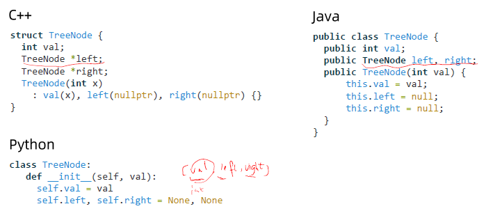

[TOC]
# 1. 树、二叉树、树的遍历、树的序列化


## 树

- Some common terminology: Root, Parent Node, Child Node, Sibling, Sub-tree, Left-Node


- How to define a TreeNode in different language?



## 二叉树 Binary Tree

基础知识点：

- Height of a Binary Tree: the height of a binary tree is the number of edges on the longest path from the root to a leaf.
  - 
- 完全二叉树(Complete Binary Tree) vs 近似完全二叉树(Nearly complete binary tree)：
  - A complete Binary Tree is a binary tree where 1) All the internal nodes have EXACTLY two children; 2)and all leaves are at the same distance from the root.
  - 
- 树如何遍历？遍历的重点就在于用递归的方式来实现
  - 下图就是多叉树的遍历。可以看到，从每一个叶子节点到根节点之间的路径，都是我们想要的全排列，也就是我们需要存储的东西。这个例子的结束条件是当 ‘root == None‘, 也就是当节点没有child node时。
  - 

Property of BST(Binary Search Tree)


- Example：
  - case1: Property 1 is violated, 2(left)>1
  - case2: Property 1 is violated, 4(left) > 3
  - case3: property 2 is violated, 3 < r(right)


http://web.cse.ohio-state.edu/software/2231/web-sw2/extras/slides/12.Binary-Search-Trees.pdf

## 树的遍历 

Binary Tree Traverse Order:

- **Pre-order:** root is visited **before** left and right
- **In-order:** root is visited **between** left and right
- **Post-order**: root is visited **after** left and rigth


二叉树（子节点<=2）；满二叉树；完全二叉树
**定义树的节点**

```C++
struct TreeNode{
    int val;
    TreeNode *left;
    TreeNode *right;
    TreeNode(int x)
        : val(x), left(nullptr), right(nullptr){}
}
```
**递归的本质**
- 自己调用自己，不要一直想着最后一层
- find(root) = root + find(left) + find(right)

**二叉树的遍历**
1. 前序遍历Pre-order: 根 - 左子树 - 右子数
2. 中序遍历In-order: 左子树 - 根 - 右子数
3. 后序遍历Post-order: 左子树 - 右子树 - 根
4. 层次序

**树的遍历**
- 先序、中序、后序一般用递归求
- 树的先序遍历又称树的深度优先遍历
- 层次序一般借助队列实现
- 树的层次序遍历又称树的广度优先遍历
  - 父节点出队，子节点入队
- 

# 2. 树的直径、最近公共祖先


# 3. 树的变形（基环树）

概念：基环树，就是像一棵树添加一条边，就形成了一个环。此时整个结构就被称为基环树(aka, pseudo tree / unicyclic graph)A


# 4. 图、图的遍历、拓扑排序
**链表、树、图的关系**


链表是特殊化的树, 树是特殊化的图

- N个点N-1条边的连通无向图——树
- N个点N条边的连通无向图——基环树


**图存储的三种方式**


1. 邻接矩阵`[i, j]`，空间复杂度`o(n^2)`

   - 

2. 出边数组`vector<vector>`，空间复杂度`o(点数+边数)`

   - 

3. 邻接表(知道就行了,但一般不会用)

   - 

   Note: 出边数组和邻接表理念上是一样的, 就像OS里学的multi-index table 一样, 出边数组的每一个点points to another list, and 邻接表上的每一个点points to a linked list. 在添加新的node时,因为order doesn’t matter, so you can append to the end, or insert in front, whatever is convenient for the underlying data structure.

## 要注意的几个问题:

如何加边?

- 矩阵:改0成1
- 出边数组:在对应点的list上append那个新加的点
- 邻接表: 在对应的点的表头插入那个新加的点
- 

无向图如何存储呢?

- 把所有的的边都看作双向边来存 
- 

每一条边若都带有长度/距离信息的话,该怎么存呢?

- 矩阵: 每一格表示的binary value(0/1)的值域, 扩充到positive integer; 空间复杂度 ==> O(N^2)
- 出边数组: 原来每一个数组里的node.val: int 就改成 一个class, or tuple, of another list, that can contain a little bit more information; 空间复杂度 ==> O(N+ M), where n is the number of nodes, and M is the number of edges
- 邻接表: 同上; 空间复杂度 ==> O(N+ M), where n is the number of nodes, and M is the number of edges


如何判断一个图是否有环？==> 从一个点开始，最后有返回到了他自己. 

==> 注意，一个点可以被重复访问过，而且不成环

==> 那如何判断呢？

==> 父亲点可以被重复访问，但


- 

通过dfs，会产生一颗搜索树，如下图，


有权值的图

- 邻接矩阵直接存权值
- 出边数组存`{node, val}，pair<node, val>`

# 实战
### 94 二叉树的中序遍历

94 二叉树的中序遍历, https://leetcode-cn.com/problems/binary-tree-inorder-traversal/

Questions

Idea:

Python Code:

```python
# Definition for a binary tree node.
# class TreeNode:
#     def __init__(self, val=0, left=None, right=None):
#         self.val = val
#         self.left = left
#         self.right = right
class Solution:
    def inorderTraversal(self, root: TreeNode) -> List[int]:
        self.ans = []
        self.traverse(root)
        return self.ans

    def traverse(self, root):
        if root == None:
            return
        
        self.traverse(root.left)
        self.ans.append(root.val)
        self.traverse(root.right)
```


### 589 N叉树的前序遍历

589 N叉树的前序遍历, https://leetcode-cn.com/problems/n-ary-tree-preorder-traversal/

Questions

Idea:

Code:

```python
class Solution:
    def preorder(self, root: 'Node') -> List[int]:
        ans = []
        stack = []
        stack.append(root)
        while stack:
            cur_node = stack.pop()
            # The base case
            if cur_node == None:
                return
            # Collect ans at cur_node
            ans.append(cur_node.val)
            # Take care childrens
            for i in range(len(cur_node.children), 0, -1):
                stack.append(cur_node.children[i-1])
            
        return ans
```


### 429 N叉树的层序遍历

429 N叉树的层序遍历, https://leetcode-cn.com/problems/n-ary-tree-level-order-traversal/

Questions

Idea:


Python Code:

```python
```


C++ Code:


### 297 二叉树的序列化与反序列化 hard

297 二叉树的序列化与反序列化 hard, https://leetcode-cn.com/problems/serialize-and-deserialize-binary-tree/

Questions:


Idea:


Python Code:

```python
    def serialize(self, root):
        self.seq = []
        self.traverse(root)
        print(f"self.seq: {self.seq}")
        str_seq = " ".join(self.seq)
        return str_seq

    def traverse(self, root):
        if root == None:
            self.seq.append("None")
            return

        self.seq.append(str(root.val))
        self.traverse(root.left)
        self.traverse(root.right)
        

    # Decodes your encoded data to tree.
    # Give "1 2 null null 3 4 null null 5 null null"
    def deserialize(self, data):
        """Decodes your encoded data to tree.
        """
        self.seq = data.split(" ")
        self.cur_index = 0
        root = self.decode()
        return root

    def decode(self):
        if self.seq[self.cur_index] == "None":
            self.cur_index += 1
            return None

        node = TreeNode()
        print(f"self.seq[self.cur_index]: {self.seq[self.cur_index]}")
        node.val = int(self.seq[self.cur_index])
        self.cur_index +=1

        node.left = self.decode()
        node.right = self.decode()

        return node
```


Java Code:

```java
/**
 * Definition for a binary tree node.
 * public class TreeNode {
 *     int val;
 *     TreeNode left;
 *     TreeNode right;
 *     TreeNode(int x) { val = x; }
 * }
 */
public class Codec {

    // Encodes a tree to a single string.
    // "1 2 null null 3 4 null null 5 null null"
    public String serialize(TreeNode root) {
        seq = new ArrayList<String>();
        traverse(root);
        return String.join(" ", seq);
    }

    // 先序：[1, 2, null, null, 3, 4, null, null, 5, null, null]
    private void traverse(TreeNode root) {
        if (root == null) {
            seq.add("null");
            return;
        }
        seq.add(Integer.toString(root.val));
        traverse(root.left);
        traverse(root.right);
    }

    // Decodes your encoded data to tree.
    // Give "1 2 null null 3 4 null null 5 null null"
    public TreeNode deserialize(String data) {
        seq = Arrays.asList(data.split(" "));
        curr = 0;
        return calc();
    }

    private TreeNode calc() {
        if (seq.get(curr).equals("null")) {
            curr++;
            return null;
        }
        // string to int
        TreeNode root = new TreeNode(Integer.parseInt(seq.get(curr)));
        curr++;
        root.left = calc();
        root.right = calc();
        return root;
    }

    // [1, 2, null, null, 3, 4, null, null, 5, null, null]
    private List<String> seq;
    //     
    private int curr;
}

// Your Codec object will be instantiated and called as such:
// Codec ser = new Codec();
// Codec deser = new Codec();
// TreeNode ans = deser.deserialize(ser.serialize(root));
```


### 105 从前序与中序遍历序列构造二叉树 Medium

105 从前序与中序遍历序列构造二叉树 hard, https://leetcode-cn.com/problems/construct-binary-tree-from-preorder-and-inorder-traversal/

Questions: 给两个序列，如何复原二叉树？为什么需要两端序列呢？==》因为，如果是没有给null的信息的话，你会发现，比如说，preorder = [3, 9, 20, 15, 7], 你知道3是root，但你不知道 9 是left node， or [9, 20], or [9, 20, 15] is left node


Idea:

Code:


### !!! 236 二叉树的最近公共祖先

236 二叉树的最近公共祖先, https://leetcode-cn.com/problems/lowest-common-ancestor-of-a-binary-tree/

Questions

Idea:

Code:


### [684. 冗余连接](https://leetcode-cn.com/problems/redundant-connection/description/)（Medium）

Questions

Idea:

Code:


### [207. 课程表](https://leetcode-cn.com/problems/course-schedule/)（Medium）

Questions

Idea:

Code:
