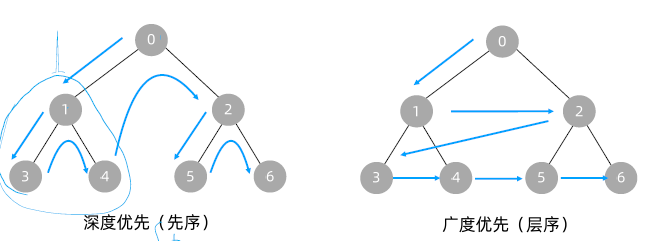

[TOC]
# 本科重点

- 第一次归纳总结状态、状态空间和把问题抽象为树或图的方法
- **搜索是解决一切问题的万金油算法**，众多没有多项式时间解法的问题都需要靠搜索求解
- 学会**定义搜索框架**，将极大地帮助学习**动态规划**和**图论**算法
- 搜索是训练**代码能力**最有效的题目类别
- 图的时间复杂度：O(N+M), where N == 点数, M == 边数
- 


# 1. 状态与状态空间

**什么是状态？**
- 状态就是程序维护的所有动态数据结构的集合
- 题目中涉及的所有数学信息
- 你在纸上人力计算时，关注的所有数据
- 一个函数访问的所有变量

例如最简单的计票问题
- 给n个名字，统计每个名字出现的次数

在纸上画"正"数统计的时候，关注了哪些数据？
- 名字（n个字符串）
- 统计到哪个名字了（第1<=i<=n个名字）
- 画的“正”字（一个用于计数的数据结构，例如hash map）

```C++
// 只关注其中动态变化的数据: i 和 count
for (int i = 0; i < n; i++){
    count[name[i]]++;
}
```
**状态空间->图**
所有可能状态构成的集合就是一个问题的状态空间

把状态作为点，如果一个状态可以达到另一个状态，就连一条边
这样就把整个状态空间抽象为了一张有向图
对问题的求解，就是对这张图的遍历

计票问题的状态空间由n个状态组成
可以看作一张n个点，n-1条边的有向图
整张图是一条链，自然就可以用一维循环解决了

**状态的简化**
把可以由其他数据决定的信息从状态中排除，得到最简状态决定了问题的复杂度

**指数型状态空间（子集）**


# 2. 深度优先搜索(DFS)的实现与应用

## 什么是图的深度优先遍历？

Note: 需要画图来理解


# 3. 广度优先搜索(BFS)的实现与应用


# 4. DFS与BFS的对比




# 实战案例

## DFS、BFS

- [电话号码的字母组合](https://leetcode-cn.com/problems/letter-combinations-of-a-phone-number/)（Medium）
- [ N 皇后](https://leetcode-cn.com/problems/n-queens/)（Hard）

Question:


Idea:

这题的核心思路就是用回溯递归树搜索的算法，每一行里每一格的位置都遍历一遍，

Python Code

```python
```


- [岛屿数量](https://leetcode-cn.com/problems/number-of-islands/)（Medium）
- [最小基因变化](https://leetcode-cn.com/problems/minimum-genetic-mutation/)（Medium）
- [矩阵中的最长递增路径](https://leetcode-cn.com/problems/longest-increasing-path-in-a-matrix/)（Hard）
