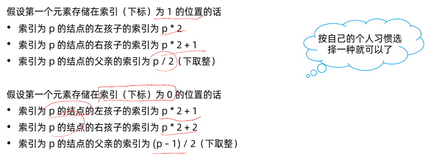

[TOC]
# class7 二叉堆、二叉搜索树

1. 二叉堆的原理，实现与应用
2. 二叉搜索树的原理，实现与应用


堆 Heap:


二叉堆


MaxHeap:


Implementation of Heap:

- often can be implemented with an array
- 


How to insert a new element?


Some Heap Implementation trick in Python:

- How to quickly inverse a minHeap to maxHeap? 

  if you are dealing with a list, you can do this:

  ```python
  # Just add a negative sign in front of each element
  nums = [-n for n in nums]	
  # Referemce: Max Heap in Python, https://leetcode.com/problems/sliding-window-maximum/discuss/1140917/Max-Heap-in-Python
  ```

  If you are dealing with an object:

  ```python
  setattr(ListNode, "__lt__", lambda self, other: self.val <= other.val)
  # Reference: “heapq python how to use comparator” Code Answer, https://www.codegrepper.com/code-examples/python/heapq+python+how+to+use+comparator
  - 
  ```

  

Reference: 

- OSU 2331 resource, [Heaps and Heapsort](http://web.cse.ohio-state.edu/software/2231/web-sw2/extras/slides/14.Heaps-Heapsort.pdf)
- GeeksforGeek, Heapq with custom predicate in Python, https://www.geeksforgeeks.org/heapq-with-custom-predicate-in-python/
  - Min Heap in Python, https://www.geeksforgeeks.org/heap-queue-or-heapq-in-python/
- Python heapq, https://docs.python.org/3/library/heapq.html

## 实战例题

#### 二叉堆

- [合并 K 个升序链表](https://leetcode-cn.com/problems/merge-k-sorted-lists/)（Hard）

```python
class BinaryHeap:
    def __init__(self):
        self.heap = []

    def empty(self):
        return len(self.heap) == 0

    def push(self, node):
        self.heap.append(node)
        i = len(self.heap) - 1
        while i > 0:
            fa = (i-1)//2
            if self.heap[i].key < self.heap[fa].key:
                self.heap[i], self.heap[fa] = self.heap[fa], self.heap[i]
                i = fa
            else:
                break

    def swap(self, heap, x, y):
        temp = heap[x]
        heap[x] = heap[y]
        heap[y] = temp
    
    def pop(self):
        ans = self.heap[0]
        self.heap[0] = self.heap[-1]
        self.heap.pop()
        self.heapify()
        return ans

    def heapify(self):
        flagDone = False
        j = 0
        while flagDone != True:
            L = 2*j + 1
            R = 2*j + 2
            smallest = j
            if L < len(self.heap) and self.heap[L].key < self.heap[smallest].key:
                smallest = L
            if R < len(self.heap) and self.heap[R].key < self.heap[smallest].key:
                smallest = R
            if smallest != j:
                self.heap[j], self.heap[smallest] = self.heap[smallest], self.heap[j]
            else:
                flagDone = True
            j = smallest

# 可以先用python提供的包来实现，然后用自己实现的binary heap来测试一遍
from collections import namedtuple
# 堆结点（key用于比较的关键码，listNode可以是任意的附带信息）
Node = namedtuple('Node', ['key', 'listNode'])
class Solution:
    def mergeKLists(self, lists: List[ListNode]) -> ListNode:
        # O(元素个数*logK)
        # O(total*logK)
        q = BinaryHeap()
        for listNode in lists:
            if listNode != None:
                q.push(Node(listNode.val, listNode))
                # print(f"listNode.val: {listNode.val}")

        protect_node = ListNode()
        tail = protect_node
        while not q.empty():
            # 取出k个指针指向的最小元素
            node = q.pop()
            # 在答案链表的末尾插入
            tail.next = node.listNode
            tail = tail.next
            # 当最小被取出后，指针向后移动一位，可能需要插入新的元素
            p = node.listNode.next
            if p:
                q.push(Node(p.val, p))
        return protect_node.next

```


- [滑动窗口最大值](https://leetcode-cn.com/problems/sliding-window-maximum/)（Hard）

#### 二叉搜索树

- [二叉搜索树中的插入操作](https://leetcode-cn.com/problems/insert-into-a-binary-search-tree/)（Medium）
- [后继者](https://leetcode-cn.com/problems/successor-lcci/)（Medium）
- [删除二叉搜索树中的节点](https://leetcode-cn.com/problems/delete-node-in-a-bst/)（Medium）
- [把二叉搜索树转换为累加树](https://leetcode-cn.com/problems/convert-bst-to-greater-tree/)（Medium）

