## 二叉搜索树(Binary Search Tree)


### 性质

二叉搜索树是一颗满足如下性质（BST性质）的二叉树：

- 任意节点的key >= 它所有left Subtree node的key
- 任意节点的key <= 它所有right Subtree node的key

Note: 根据以上性质，二叉搜索树的中序遍历必然为一个有序序列


### BST建立：

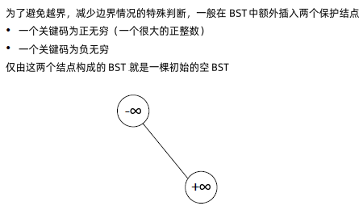


### BST检索：

- Idea

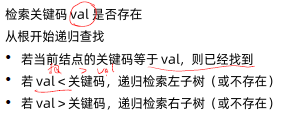


- psudocode：

Recursive Tree Search: 

Why x = nil? ==> That’s when we found nothing. So, we return when nothing found (at the leaf), or we found the key.

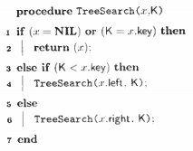

Iterative Tree Search:


Reference, file:///E:/Zhengqi%20Dong/Education/OSU/2019Fall/cse_2331_fnd2/cse2331_%E5%A4%A7%E7%A4%BC%E5%8C%85/Annotated%20Course%20Notes/btree.pdf 

### 二叉树的复杂度计算：

- 二叉树的时间复制度取决于树高，但它的高度是多少没有保证。如果是近乎平衡的二叉树，树高就是O(log(n)), 但最坏的情况，是所有的node都在一条线上的话树高就是O(n).


### 如果有重复的节点怎么办？

- ==> 二叉树不允许重复的key。每个节点的数值都必须是唯一的，所以这情况是不允许发生的。\=\=> 但如果一定要加的话该怎么办呢？\=\=> 可以在每个node上添加一个额外的信息，就是count，记录每个数字出现的次数。

- Note：注意一点，在删除时，你要查看下count的值，只有当节点的count为0时才能删除。


### 二叉树插入：

插入val和检索val的过程类似：

- 若发现存在相同的val，则放弃插入(或者把val对应节点的计算+1，看要求而定)
- 若没有相同val的节点存在, 这直接放到新节点应该在的地方

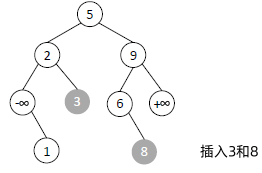


### 求BST的precursor(前驱) and successor(后继):


- Successor

Example:

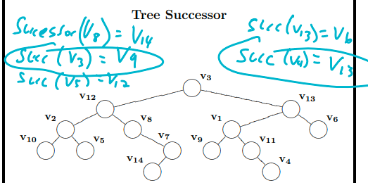

Definition: The Successor of node vi is the next node in the inorder sequence.

How to find the succesor of node v_i?

- 主题思路：

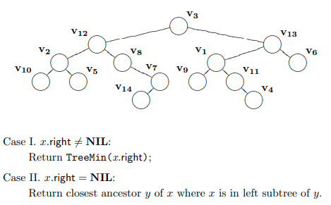

Case1：如果 right subtree exist, return TreeMin(x.right) – Right Subtree里最小的那个。因为BST里规定了  x_i < y < z_i, where y is root node, x_i is any node in the left subtree of y, and z_i is any node in the right subtree of y.

Case 2: If right subtree does’t exist. 那可以考虑下下图的情况：

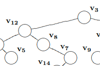

这是x = v7, 它的successor, or the smallest value that is greater than v7 is v3. 这种情况就是要一直网上走(因为BST里规定了every node in the right subtree is greater than it’s parent), 一直走到x 不再是y的right child了，那就make a sharp turn to the right. 这时的x就是y的leftChild, or y = x.Parent(), and we can just exist the while loop, and return y as answer.

- Psudocode


Time complexity, $T(n) = \theta(h)$ , where h = height of tree. Or $O(log(n)) < T(n)< O(n)$ in terms of n, where n = number of nodes in the tree. The worse case is O(n), because we need to consider ther worse case, where is doesn’t has right subtree, and all node is in a straightline.


### Report All Nodes:

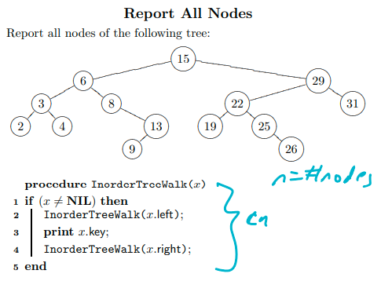


### Tree Minimum greater than or equal to:

Idea:

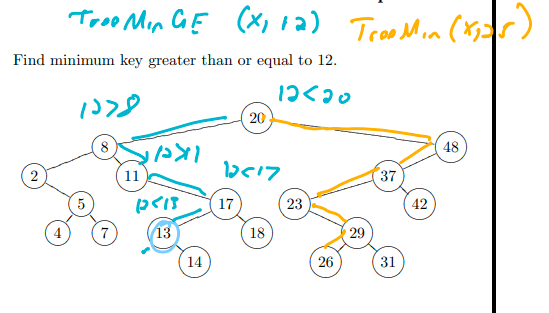

Pseudocode:

Note: within the while loop, we just keep making left or right turn, until K > v.key or v  = None.


### Report in Range：

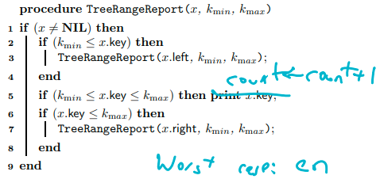

Note: This is the recusive version. If you want to transform it to the iterative approach, then you need to understand when the loop/iteration stop. In this algorithm, it stops until we reach the end of tree, so you need to use a while loop(or setting up a stoping condition) to replace those place where you made a recursive call.


Outline： 

二分查找，三分查找，二分答案–最优性问题转化为判定问题的基本技巧

# 二分查找

二分查找使用前提：

- 目标函数具有单调性
- 存在上下节（bounded）
- 能够通过索引访问(index accessible)

For example, 利用二分查找，查找一个单调递增的数组里的元素，可以把复杂度从O(n) 降到O(log(n)).

C++/Java 模板：

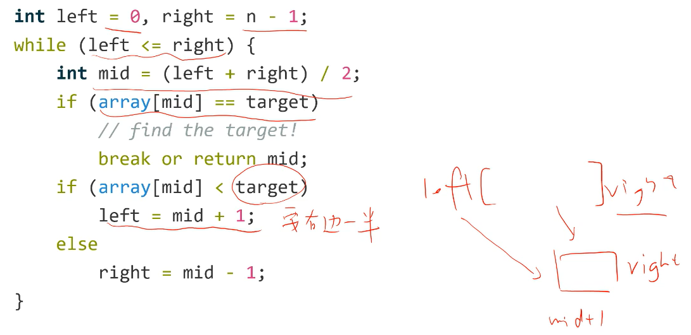

Note: 这是最基本的在一个给定的组数里查询一个数的下表

Note：二分查找时要注意些细节的问题：

- 给定的target不一定在数组中存在
- array[mid]即使不等与target，也可能就是最后的答案，所以不能随便把mid排除在外 ==》 所以在划分时要思考是否需要包含mid

### 二分1.1 模板： 查找第一个满足条件(>= target)的数,不存在返回 N ==> Lower bound

最严谨的划分：一侧包含mid，一侧不包含mid，终止与left == right。这样就能保证，合法的那个数一直在[left, right]这个范围内，比如

Ex1: 在单调递增的数组里`[10, 14, 19, 25, 27, 31, 33, 35, 42, 44]`, 查找第一个 >= target 的数(返回下标), 不存在的话，返回len(array) ==》 就是找lower_bound  ==》范围 (left, right] ==> [0, n-1] + [n 表示不存在]

```python
left, right = 0, n
while left < right:	# 什么时候终止
    mid = (left + right)//2
    # 这里我们要找lower bound(the smallest element amount all that is >= target). 因为我们直到中间这是满足条件的，那比mid右半边肯定也都是符合条件的，就没有必要再看了。我们要做的时缩小那个范围，找到所有满足条件的数里，最小的那个。
    if array[mid] >= target:	# 具体根据题目条件来决定
        right = mid
	else:
        left = mid + 1
return right
```

when initialize n for right?  would that get out of range? ==> no; if the target doesn’t exist, we will have left \== right \=\= n at the end ==> it’s kind like we are moving left heading to right index, if nothing found, they will end up the same number, and the loop will stop at N

Note：如果要找的是upper bound的话，就改为`array[mid] > target`, 就是所有符合条件的范围里面找最大的。

### 二分1.2模板 – 查找最后一个满足条件(<=target)的数, 不存在返回-1 ==> Upper Bound

Ex 2: 查找最后一个满足条件(<=target)的数，不存在返回-1

```python
left, right = -1, n-1	# index range is 0~n-1, the -1 is for the case that the target doesn't exist
while left < right:
    mid = (left + right + 1) //2 # [3, 4), ==> if you dont
    if array[mid] <= target:
        left = mid
	else:
        right = mid - 1
return left
```

What is the difference between template 1.1 and 1.2? ==> 1) 1.1 是往左走/收缩,找右边的lower bound；而1.2是往右走，找左边的upper bound；2) 1.1 return n for the case that target doesn’t exist, but 1.2 returns -1 if target doesn’t exist, 3) In template 1.1, we use `(left + right) // 2` when computing mid, but we use `(left + right + 1) // 2` for template 1.2

Why we need an extra 1 when computing mid index? ==> So that we won’t get into non-stopping loop. For example, if we have index like [3, 4), then next iteration if we satisfy the conditon, left index will still remain in 3 ==> infinte loop starts… ==> In template 1.1, since we have boundary on right, (3, 4], and we are using floor operator, so we don’t have this problem.

Why we have -1 and n-1 here, but use 0 and n in previous template? ==> 1) Because the question ask to return -1 if no target exist. So, if the target doesn’t exist, the right index will stop when right\==left\=\=-1, so it actually doesn’t whether we are returning right or left at the end; 2) the idea is same as in template 1.1, where we use an extra n for invalid result(when target doesnt’ exist, and here we use -1 for left for an invalid result, when target doesn’t exist.

Wouldn’t that be a problem when computing the mid? ==> No, because we are using (left + right + 1), so the edge case will be (-1 + 0 + 1=0)

总结：

- 步骤：第一个决定when condition is satified and we should start to shrink our range，第二步决定left and right的取值范围
- 1.1 + 1.2模板是不需要任何额外检查的，最高效的模板，而且保证终止于left==right, 而且还能处理那种不存在，要求返回-1的情况。但需要你注意多考虑些细节上的处理：1）reassign left/right的条件是什么？2）缩小的范围？（就是往左还是往右走？）3）是否要返回-1？使用1.2时，计算mid位置需要补+1；

二分搜索之所以能从O(n)减小的O(log(n))的原因是，利用数组的顺序，每一次把数组分成两半，通过一个点的数值，来少考虑对另一半的查找。


# 实体案例


## Binary Search Tree/二叉搜索树

### 二叉搜索树中的插入操作（Medium)

- [二叉搜索树中的插入操作](https://leetcode-cn.com/problems/insert-into-a-binary-search-tree/)（Medium）半年内出题频次：

| Amazon |
| :----: |
|   3    |

```python
# Definition for a binary tree node.
# class TreeNode:
#     def __init__(self, val=0, left=None, right=None):
#         self.val = val
#         self.left = left
#         self.right = right
class Solution1:
    def insertIntoBST(self, root: TreeNode, val: int) -> TreeNode:
        """ 
            方法1(Iterative approach): Iteratively going down the tree, and find the parent of the future node that we want to allocate.
        """
        # Base case: Has no child
        if root == None:
            root = TreeNode(val=val)
            return root

        # Looping Condition
        x = root    # x是用来迭代
        y = x       # y是用来存储答案的，y找的是要插入点的父亲节点
        while x!= None:
            y = x 
            if x.val > val:
                x = x.left
            else:
                x = x.right

        if y.val > val:
            y.left = TreeNode(val=val)
        else:
            y.right = TreeNode(val=val)
        return root


class Solution2:
    def insertIntoBST(self, root: TreeNode, val: int) -> TreeNode:
        """ 
            方法2(Recursive version): 
        """
        # Base case: 还要考虑，当root为空，即没有任何child的时候，这是就直接新建一个TreeNode, 然后把值插入进去就可以返回了
        if root == None:
            return TreeNode(val=val)
        # Recursive call: 要考虑每一步该如何走，该怎么走（往那个方向走），在何处停？==> 如果查了，当前root点的值要大于val，那么说明新插入的点应该在当前点的左边，我们就可以用recursion的方式insertIntoBST(root.left, val)来继续查询root的左侧，否则就要是要查询其右侧insertIntoBST(root.right, val)。到了下一层的话，如果那个点为空，那就碰到了我们的base case--创建一个新TreeNode, and then return，如果不为空则继续recursive call. 因为题目要求返回整个subtree，所以还需要存起来。
        # 注意base case和最后返回的不是用一个东西。因为，base case is where the program reach the bottom, we want our function to create and return a new node, but at the end we need to return the whole tree.
        if root.val > val:
            root.left = self.insertIntoBST(root.left, val)
        else:
            root.right = self.insertIntoBST(root.right, val)
        return root


```

### 后继者（Medium）

- [后继者](https://leetcode-cn.com/problems/successor-lcci/)（Medium）半年内出题频次：

| 字节跳动 |
| :------: |
|    2     |

Question

Idea:

Python Code:

```python
class Solution:
    def inorderSuccessor(self, root: TreeNode, p: TreeNode) -> TreeNode:
        # 因为这里TreeNode没有connection to its ancestor, 所以学校老师给的那方法就不work了
        # 但我们知道，要找的那个点一定是p的ancestor，因此不管是用递归，还是迭代的方式，都要想办法把ancestor nodes给记录下来
        # 1) 如果用的是递归：那就要定义一个全局变量，没经过一个点查看一下，然后看是否需要更新下信息，到了最后，看下是否需要
        # if(root.val > p.val) ans = min(ans, root.val)
        # 2) 用非递归的方式：其实这题考的就是看你会不会搜索Binary Tree，然后就是在搜索过程中，把要求的successor给保存下来

        curr = root
        ans = None  # 如果ans不存在，也就是走到头了也没找到，那最后就会返回一个None

        # 只要当前点不为空，那我们就要更新一下全局变量，然后就继续往下走，或往下查找
        while curr != None:
            # Case1: 如果一个点查询到了，且他有右子树，那successor就是右子树里最小的那一个。也就是在right subtree里一直向左走，找到TreeMin(curr.right)
            if curr.val == p.val and curr.right != None:
                curr = curr.right 
                while curr.left != None:
                    curr = curr.left 
                return curr 

            # Case 2：右子树不存在，要找的节点p在左边，那么p点的successor一定是p点的ancestors，也就是在检索过程中的某一点. 也就是在所有经过的点里面，找一个比要查的值大的最小点（就像是求min）
            if curr.val > p.val:
                if ans == None or ans.val > curr.val:
                    ans = curr	# 这个只有在发现比当前答案更小的答案是，才会执行
            
            # 正常的检索的模板：
            if curr.val > p.val:   # 如果cur.val 比要找的值大，说明这个要找的节点在cur.node的左边
                curr = curr.left
            else:
                curr = curr.right

        return ans
```


Java code:

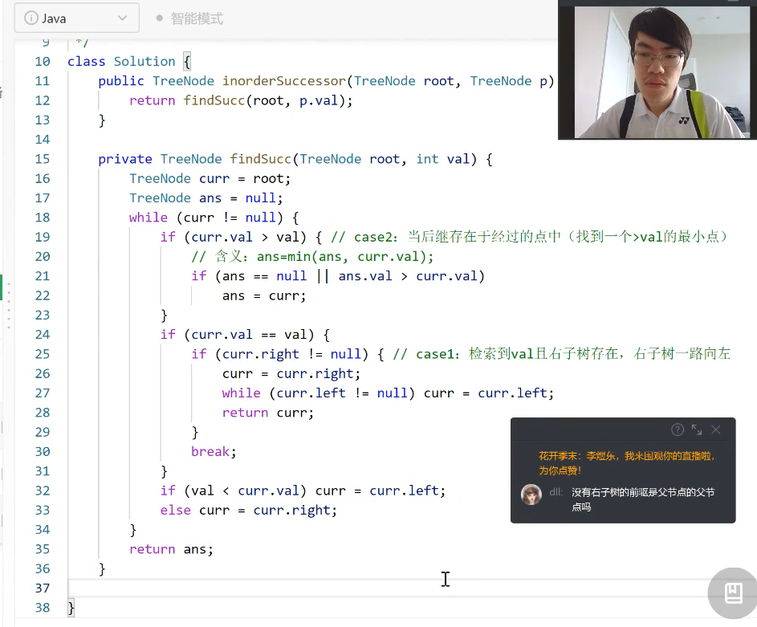

### 删除二叉搜索树中的节点（Medium）

- [删除二叉搜索树中的节点](https://leetcode-cn.com/problems/delete-node-in-a-bst/)（Medium）半年内出题频次：

| 字节跳动 | 微软 | Amazon | Bloomberg |
| :------: | :--: | :----: | :-------: |
|    3     |  4   |   2    |     3     |

| eBay | LinkedIn |
| :--: | :------: |
|  2   |    2     |

Question:

Idea:

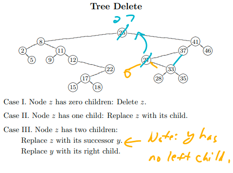

Python Code:

```python
# Definition for a binary tree node.
# class TreeNode:
#     def __init__(self, val=0, left=None, right=None):
#         self.val = val
#         self.left = left
#         self.right = right
class Solution:
    def deleteNode(self, root: TreeNode, key: int) -> TreeNode:

        # 思考1：如果要删掉的是root怎么办？ ==》 用其succesor 来代替它原来的位置。因为，如实例，如果root(5)没了，那其succesor(6)就是所有right subtree里最小的，这样就能保证二叉搜索树的性质不变。
        # 思考2：那successor的位置用谁来代替呢？==》 不需要人来代替，因为right subtree 里他是最小的，肯定就没有left subtree了，所有直接将其 fa.left = curr.right
        """
        主题思路：
            从BST中删除关键点为key的节点，其实考察的就是key的检索/搜索，还有如何找一个点的successor
            Case 1: node z has zero children ==> delete that node z
            Case 2: node z has one children ==> Replcae node z with its child
            Case 3: node z has two children ==> Replace z with its successor y, and then replace successor y with its right child
        """
        if root == None:
            return None

        if root.val == key:
            if root.left == None:   # 2.1 如果没有左子树，那就让右子树成为新的根，返回
                return root.right
            
            if root.right == None:  # 2.2 如果没有右子树，那就让左子树成为新的根，返回
                return root.left
            
            # 3. 如果左右子树都有，那就找root's successor（一路向左)
            next = root.right   
            while next.left != None:
                next = next.left
            root.val = next.val     # Replace root with its succesor
            root.right = self.deleteNode(root.right, next.val)  # Use recursive call to delete its successor node. 这个递归只会做一次, 因为its successor doesn't have left subtree. ==》 你也可以用存一个father节点的方式，来replace its successor, but that will add more lines of code, so it's more convenience to just make a recursive call.
            return root
        
        if root.val > key:
            root.left = self.deleteNode(root.left, key)
        else:
            root.right = self.deleteNode(root.right, key)

        return root
# 看不懂的话，就复习ppt里的图/实例。
```

### 把二叉搜索树转换为累加树（Medium）

- [把二叉搜索树转换为累加树](https://leetcode-cn.com/problems/convert-bst-to-greater-tree/)（Medium）半年内出题频次：

| 字节跳动 | Facebook | 微软 |
| :------: | :------: | :--: |
|    2     |    2     |  2   |


## 二分查找

### [二分查找](https://leetcode-cn.com/problems/binary-search/)（Easy)

- [二分查找](https://leetcode-cn.com/problems/binary-search/)（Easy）半年内出题频次：

| Facebook | 字节跳动 | 微软 | Amazon |
| :------: | :------: | :--: | :----: |
|    2     |    8     |  3   |   4    |

| Google | Apple |
| :----: | :---: |
|   2    |   2   |

Question:

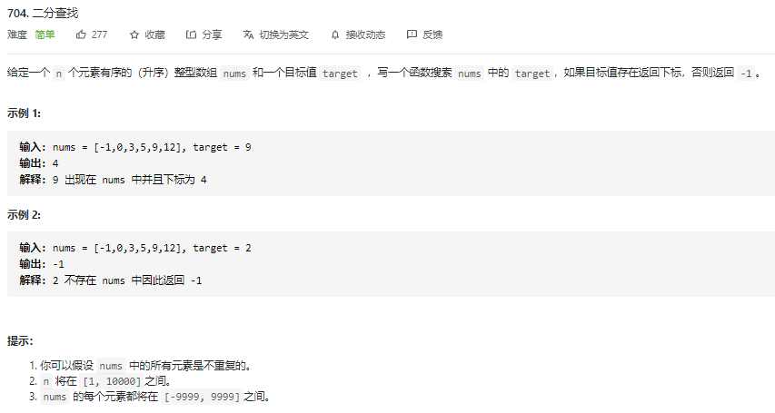

Python Code:

```python
class Solution:
    def search(self, nums: List[int], target: int) -> int:
        # Condition: find the last index that is >= target 9, (left, right]
        # Range 
        left, right = 0, len(nums) - 1
        ans = -1
        while left <= right:
            mid = (left + right ) // 2   # 
            # [left, right)
            if nums[mid] == target:
                ans = mid
            if nums[mid] < target:    # everything in the left must < target as well, so moving to uppse side
                left = mid + 1
            else:
                right = mid - 1
        return ans

# For edge case:[]
# ==>(left + right + 1) // 2 ==>  (-1 + 0 + 1)//2 = 0

# For case: [1] target 9
# ==> -1
```


### !!! [在排序数组中查找元素的第一个和最后一个位置](https://leetcode-cn.com/problems/find-first-and-last-position-of-element-in-sorted-array/)（Medium)

- [在排序数组中查找元素的第一个和最后一个位置](https://leetcode-cn.com/problems/find-first-and-last-position-of-element-in-sorted-array/)（Medium）半年内出题频次：

| Facebook | 字节跳动 | 微软 | Amazon |
| :------: | :------: | :--: | :----: |
|    29    |    11    |  4   |   4    |

| Google | Apple | LinkedIn | Twitter |
| :----: | :---: | :------: | :-----: |
|   2    |   2   |    6     |    2    |

| Bloomberg | 华为 |
| :-------: | :--: |
|     3     |  2   |

Question:


Python Code:

```python
class Solution1:
    def searchRange(self, nums: List[int], target: int) -> List[int]:
        ans = []

        # Condition(条件）: 查询第一个>=target的index ==> 一直向左(lower side)移动, 保持right index要么不存在(right==n)，or要么就一直是第一个>=target的数
        # Range(范围）: [0..n-1] + [n表示不存在]
        left, right = 0, len(nums)  # 满足条件的这个数可能不存在，如果不存在那就返回n
        while left < right:
            mid = (left + right) //2 
            # print(f"mid: {mid}, left: {left}, right: {right}")
            if nums[mid] >= target: # Step 1: Write down the Condition
                right = mid         # Step2: 满足条件了，该往哪走？ ==》 左边，因为要的是第一个满足条件的
            else:
                left = mid + 1

        ans.append(right)

        # Condition(条件）: 查询最后一个 <= target的index ==> 一直向右(uppse side)移动, 保持left index要么不存在(left==-1)，要么就一直是最后那个<=target的数
        # Range(范围）: [-1表示不存在] + [0..n-1]
        left, right = -1, len(nums)-1
        while left < right:
            # print(f"mid: {mid}, left: {left}, right: {right}")
            mid = (left + right + 1) //2 
            if nums[mid] <= target: # Step1： Our condition
                left = mid          # Step2: 满足条件了，该往哪走？ ==》 右边，因为要的是最后一个
            else:
                right = mid - 1
        ans.append(left)

        # 如果target不存在，那么最后的结果就不会在[ans[0], ans[1]]这个范围内，或者说ans[0] > ans[1]是，就表示target不存在。比如实例2中，我们的结果会是 [1, 0], 这是因为6 is between 5 and 7, 但并没有6，因此在最后要处理一下这种情况
        if ans[0] > ans[1]:
            return [-1, -1]
            
        return ans

# Find the first element that is >= target(8)
# [5,7,7, -> 8,8,10] ==> [0, 0, 0, | 1 1 1] ==> Return the index of first 1

# (left = 0, right = 6)
# mid = (0+6) // 2 = 6 // 2 = 3 
# nums[3] = 8 >= 8 ==> satisfy ==> that means everything on the right will also satisfy ==> right = mid = 3
# ==> (left=0, right=3)
# mid = (0+3)//2 = 3//2 = 1
# nums[1] = 7 >= 8 ==> not satisfy ==> means everything on the left will not satisfy ==> left = mid + 1 = 2 
# ==> (left = 2, right = 3)
# mid = (2+3)//2 = 5//2 = 2 
# nums[2] = 7 >= 8 ==> Not satisfy ==> means everything on the left will also not satisfy ==> left = mid + 1 = 3 
# ==> (left = 3, right = 3) 
# left == right ==> Break the loop
# ==> return left (or right)

# Find the last element that is <= target(8)
# [5,7,7, 8,8 <-,10] ==> [1 1 1 1 1 | 0] ==> Return the index of last 1

# (left = -1, right = 5)
# mid = (-1 + 5 + 1) //2 = 2
# nums[2] = 7 <= 8 ==> satisfy ==> that means everything on the left will also be satisfy ==> left = mid = 2
# (left = 2, right = 5)
# mid = (2+5+1)//2 = 4
# nums[4] = 8 <= 8 ==> satisfy ===> That means everything on the left will also be satisfy ==> left = mid = 4
# (left=4, right = 5)
# mid = (4 + 5 + 1) // 2 = 10 //2 = 5
# nums[5] = 10 <= 8 ==> Not satisfy ==> tjat means every thing on the right will also not satisfy ==> right = mid - 1= 4
# left == right == 4 
# ==> Break the loop ==> return left (or right)


# Output：
# mid: 3, left: 0, right: 6
# mid: 1, left: 0, right: 3
# mid: 2, left: 2, right: 3
# mid: 2, left: -1, right: 5
# mid: 2, left: 2, right: 5
# mid: 4, left: 4, right: 5
# Q： What is the difference between template 1.1 and 1.2? ==> 1) 1.1 是往左走/收缩,找右边的lower bound；而1.2是往右走，找左边的upper bound
```


### [ x 的平方根](https://leetcode-cn.com/problems/sqrtx/)（Easy）

- [ x 的平方根](https://leetcode-cn.com/problems/sqrtx/)（Easy）半年内出题频次：

| Bloomberg | 字节跳动 | 微软 | Amazon |
| :-------: | :------: | :--: | :----: |
|     4     |    20    |  5   |   4    |

| Google | Apple | LinkedIn | 美团 |
| :----: | :---: | :------: | :--: |
|   2    |   2   |    5     |  3   |


### [搜索二维矩阵](https://leetcode-cn.com/problems/search-a-2d-matrix/)（Medium）

- [搜索二维矩阵](https://leetcode-cn.com/problems/search-a-2d-matrix/)（Medium）半年内出题频次：

| Facebook | 字节跳动 | 微软 | Amazon |
| :------: | :------: | :--: | :----: |
|    4     |    8     |  5   |   7    |

| Google | Apple | Bloomberg | 快手 |
| :----: | :---: | :-------: | :--: |
|   3    |   3   |     2     |  2   |


### [寻找旋转排序数组中的最小值](https://leetcode-cn.com/problems/find-minimum-in-rotated-sorted-array/)（Medium）

- [寻找旋转排序数组中的最小值](https://leetcode-cn.com/problems/find-minimum-in-rotated-sorted-array/)（Medium）半年内出题频次：

| Facebook | 字节跳动 | 微软 | Amazon |
| :------: | :------: | :--: | :----: |
|    5     |    4     |  8   |   9    |

| 高盛集团 | Apple |
| :------: | :---: |
|    4     |   2   |


## 三分查找

### [寻找峰值](https://leetcode-cn.com/problems/find-peak-element/)（Medium）

- [寻找峰值](https://leetcode-cn.com/problems/find-peak-element/)（Medium）半年内出题频次：

| Facebook | 字节跳动 | 微软 | Amazon |
| :------: | :------: | :--: | :----: |
|    17    |    4     |  8   |   7    |

| Google | Apple | Bloomberg |
| :----: | :---: | :-------: |
|   6    |   3   |     2     |


### [猜数字大小](https://leetcode-cn.com/problems/guess-number-higher-or-lower/)（Easy）

- [猜数字大小](https://leetcode-cn.com/problems/guess-number-higher-or-lower/)（Easy）半年内出题频次：

| Google | Apple |
| :----: | :---: |
|   3    |   2   |


### [分割数组的最大值](https://leetcode-cn.com/problems/split-array-largest-sum/)（Hard)

- [分割数组的最大值](https://leetcode-cn.com/problems/split-array-largest-sum/)（Hard）半年内出题频次：

| Google | 字节跳动 | 华为 | Amazon |
| :----: | :------: | :--: | :----: |
|   8    |    3     |  4   |   5    |

| 美团 |
| :--: |
|  5   |


### [制作 m 束花所需的最少天数](https://leetcode-cn.com/problems/minimum-number-of-days-to-make-m-bouquets/)（Medium）

- [制作 m 束花所需的最少天数](https://leetcode-cn.com/problems/minimum-number-of-days-to-make-m-bouquets/)（Medium） 2 年内出过此题：

| Facebook |  VMware  | Bloomberg | Salesforce |
| :------: | :------: | :-------: | :--------: |
|  Google  | 字节跳动 |   Adobe   |   Apple    |


