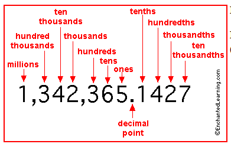

[TOC]

# Outline:


1. 基于比较的各类排序算法

- 基于比较的排序：通过比较大小来决定元素间的相对次序。可以证明这类排序算法的时间复杂度下届为O(log(N)) – 不可能更快了的
- 非比较类排序：本质就是不通过比较元素的大小来决定排列的顺序，而是通过？？？？ 因此时间复杂度受多种因素影响，不单取决于N元素数量N

2. 其它类型的排序算法，不同排序算法的适用场景


2. 第K大的数，中位数，逆序对等应用


# 

# 初级排序算法：选，插，冒

### 选择排序（Slelection Sort) 

**Idea：**

“该放那个数了？” ==》 每次扫描一遍序列，找到当前的min，然后放到新的序列末尾。 ==> 或者，为了省空间，你也可以不用开一个新的数组，就swap currnet index i 和当前的min


### 插入排序(Insertion Sort)

**Idea:**

“这个数该放哪儿？” ==》 就有点像打扑克牌，你抽牌的时候，要考虑新的一张牌应该放哪儿呢？–》 平均时间复杂度为O(N^2), 因为每一张牌都需要查询 – O(N)，和插入 – O(N)


### 冒泡排序(Bubble Sort)

**Idea:**

思路就是不断循环扫描，每次查看相邻的元素，如果你序列了，就交换他们的位置。Bubble Sort is the simplest sorting algorithm that works by repeatedly swapping the adjacent elements if they are in wrong order.  ==> 你如果从前往后扫描，那最大的元素就会被带到最后，打你如果从后往前扫描，那最小的元素就会被带到前面，思路都是一样的

**Example:** 
==> **First Pass:** we are starting from first to the end, so by the end of first round, the largest element will be carry to the end. 最大的数就像泡泡一样，会带到最后一位
( **5** **1** 4 2 8 ) –> ( **1** **5** 4 2 8 ), Here, algorithm compares the first two elements, and swaps since 5 > 1. 
( 1 **5** **4** 2 8 ) –> ( 1 **4** **5** 2 8 ), Swap since 5 > 4 
( 1 4 **5** **2** 8 ) –> ( 1 4 **2** **5** 8 ), Swap since 5 > 2 
( 1 4 2 **5** **8** ) –> ( 1 4 2 **5** **8** ), Now, since these elements are already in order (8 > 5), algorithm does not swap them.
==> **Second Pass:** The second largest element will be carry to the end
( **1** **4** 2 5 8 ) –> ( **1** **4** 2 5 8 ) 
( 1 **4** **2** 5 8 ) –> ( 1 **2** **4** 5 8 ), Swap since 4 > 2 
( 1 2 **4** **5** 8 ) –> ( 1 2 **4** **5** 8 ) 
( 1 2 4 **5** **8** ) –> ( 1 2 4 **5** **8** ) 
Now, the array is already sorted, but our algorithm does not know if it is completed. The algorithm needs one **whole** pass without **any** swap to know it is sorted.
==> **Third Pass:** 
( **1** **2** 4 5 8 ) –> ( **1** **2** 4 5 8 ) 
( 1 **2** **4** 5 8 ) –> ( 1 **2** **4** 5 8 ) 
( 1 2 **4** **5** 8 ) –> ( 1 2 **4** **5** 8 ) 
( 1 2 4 **5** **8** ) –> ( 1 2 4 **5** **8** ) 

```python
# Python program for implementation of Bubble Sort
def bubbleSort(arr):
    n = len(arr)
    # Traverse through all array elements
    for i in range(n):
        # Last i elements are already in place
        for j in range(0, n-i-1):
            # traverse the array from 0 to n-i-1
            # Swap if the element found is greater
            # than the next element
            if arr[j] > arr[j+1] :
                arr[j], arr[j+1] = arr[j+1], arr[j]
 
# Driver code to test above
arr = [64, 34, 25, 12, 22, 11, 90]
bubbleSort(arr)
print ("Sorted array is:")
for i in range(len(arr)):
    print ("%d" %arr[i]),
```

- Reference: GeeksforGeeks, Bubble Sort， https://www.geeksforgeeks.org/bubble-sort/


## 快排（QuickSort)

First we need to know QuickSort is a great algorithm, it’s not stable, but it gurantee the time complexity is O(log(N)). It’s very effective

**Idea:** 

Step1：Parition the list – moving all element smaller than pivot to left side, and all lelements greater than pivot to right side. 

Pick a pivot p, and instantiate two pointer, left and right. ==> The process is similar to two pointers algorithm, and the goal is to filter all elements, nums[i] < nums[p], to the left side of pivot number, and put all elements greater than pivot to the right side of pivot. 

```python

while left < right:
        # For left index: When this stop moving, we know there is a number should be move to right side of pivot
    while nums[left] < nums[pivot]:
        left += 1
    # For Right index: When this stop moving, we know there is a number should be move to left side
    while nums[right] > nums[pivot]:
        right -= 1
    # When they both stop, moving, we need to make a swap. And Notive, we always need to check whether the index is accessible
    if left < right:
        nums[left], nums[right] = nums[right], nums[left]
        left += 1
        right -= 1
```

==> Since each time, we need to go over the while list once, so this requires at O(N) time complexity.

Step 2:  

Use a while loop to tracking the position of left and right pointer.


## 排序算法的稳定性问题


## 非比较类排序算法

### 计数排序(Counting Sort)

**使用要求：**

计数排序要求输入的数据必须是有确定范围的整数。

需要用到Map，Or HashTable

==》 适合小范围内的排序


**Idea:** 

将输入的数据作为key存储在额外的数组中，然后依次把计数大于1的填充回原数组。

For example; we have a list, nums = [3 3 5 4 1 2], and we know 1< nums[i] < 1000

Then we need to make a counter for each value, such than we have things like

```python
counter = [0 1 1 2 1 1]	# counter[i] represent the number of time a element occurred
		   0 1 2 3 4 5	
```


Then we first can creat a map, with 1000 bucket on it. Traverse through nums, and each time we just need to increment the counter for corresponding value, e.g.,

```python
counter = [0] * len(nums)
# 开始计数
for i in range(len(nums)):
    counter[i] += 1
# T(N) = O(N), where N is len(nums)

result = []
for i in range(len(counter)):
    if i != 0:
        result += [i * counter[i]]
# T(N) = O(M), where M is the range of nums[i]   
```


**Time Complexity:**

O(N+M), N is the number of elements, and M is the range of value, or it’s domain.


### 桶排序(Bucket Sort)

**使用要求：**


**Idea:**

桶排序假设输入数据服从均匀分布，将数据分到有限数量的桶里，每个桶再分别排序(有可能使用别的排序算法，或是以递归方式继续使用桶排序)

桶排序就是一个思想，不用管的

**Time Complexity:** O(N) ~ O(N^2)


### 基数排序（Radix Sort):

**使用要求：**


**Idea:** 

基数排序把数据切割成一位位数字(0-9), 从低位到高位，对每一位分别进行计数排序

就是 比如, we have a list, nums = [125479, 234217, 126814]

We start compairing the least significant number(lst), or last digit, then we have things like 

nums = [126814, 234217, 125479]

==> Then comparing the tens digit for each element, then we should have things like:

nums = [126814, 234217, 125479]

==> And then all the way to its left



```text
126814, 234217, 125479

按个位

按百位
```

什么叫保持相对顺序的排？比如当千位排好了，那在排万位时就，如果两个数相同，那就要按照千位的顺序来排，就是不要动它就行了。

**Time Complexity:** O(NK), K 为数字位数


Summary：

这三个非比较累排序算法里，都大概了解思路就行了，唯一可能会用到的就是计数排序(counting sort), 因为在数字比较小的时候，它的效率还是很乐观的。


